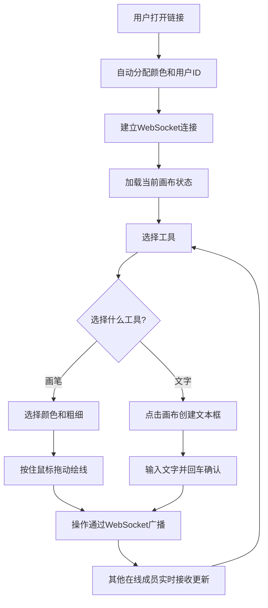

## 1. 产品概述

CollabWhiteboard 是一个浏览器端实时协作白板应用，让小团队无需注册即可通过链接共享画布，用不同颜色画笔绘制线条、图形和文字，所有操作自动同步给在线成员，解决团队通过截图工具传阅设计稿的不便。

- 目标用户：小型设计/开发团队（2-6人），需要快速实时协作绘图
- 核心价值：零门槛打开即用，实时同步比截图传阅更高效

## 2. 核心功能

### 2.1 用户角色

| 角色 | 注册方式 | 核心权限 |
|------|----------|----------|
| 协作者 | 无需注册，打开链接即可加入 | 绘制线条、添加文字、撤回/重做、清空画布 |

### 2.2 功能模块

1. **白板页面**：画布主区域、工具栏、在线用户头像、颜色选择器、画笔粗细选择、清空按钮

### 2.3 页面详情

| 页面名称 | 模块名称 | 功能描述 |
|----------|----------|----------|
| 白板页面 | 画布主区域 | 占满屏幕（除工具栏30px），浅米色#f5f0e8背景，支持鼠标拖动绘线、文字输入 |
| 白板页面 | 工具栏 | 深灰#2c3e50背景，左侧在线人数+绿色圆点头像（36px圆角），右侧颜色选择器+清空按钮 |
| 白板页面 | 颜色选择器 | 预设12种颜色，点击切换画笔颜色，选中颜色加粗边框+放大至32px |
| 白板页面 | 清空按钮 | 红色按钮，悬停变深红 |
| 白板页面 | 画笔粗细 | 5种预设（1px/3px/6px/12px/24px），按住左键拖动画线，松开停止，尾部渐隐，每帧最多3个点 |
| 白板页面 | 文字工具 | 点击后出现可拖动+缩放文本框（8个控制点），回车确认，sans-serif 16px黑色，半透明白色背景 |
| 白板页面 | 撤回/重做 | Ctrl+Z撤回，Ctrl+Shift+Z重做，最多30步历史，撤回附带0.3秒淡入动画 |

## 3. 核心流程

用户打开链接 → 自动分配颜色和用户ID → WebSocket连接建立 → 看到画布和其他在线成员 → 选择工具（画笔/文字）→ 绘制或输入 → 操作实时广播给其他成员 → 其他成员看到实时更新

## 4. 用户界面设计

### 4.1 设计风格

- 主色：深灰#2c3e50（工具栏）、浅米色#f5f0e8（画布）
- 辅助色：红色（清空按钮）、12种预设画笔颜色
- 按钮风格：4px圆角，极简几何风格
- 字体：sans-serif，16px为默认文字大小
- 布局：全屏画布 + 顶部工具栏
- 交互反馈：按钮50ms缩放回弹动画，颜色选择滑动动画，撤回0.3秒淡入

### 4.2 页面设计概览

| 页面名称 | 模块名称 | UI元素 |
|----------|----------|--------|
| 白板页面 | 工具栏 | 深灰背景，白色图标文字，左侧绿色圆点头像，右侧颜色圆点+清空按钮 |
| 白板页面 | 画布 | 浅米色背景，全屏占满，绘制线条带尾部渐隐效果 |
| 白板页面 | 文字框 | 半透明白色背景，8个控制点，可拖动缩放 |

### 4.3 响应式适配

- 桌面优先设计
- 手机竖屏：工具栏高度缩为40px，颜色选择器收起为折叠菜单
- 触屏支持：触摸绘制和文字输入

### 4.4 性能要求

- 画笔绘制60fps流畅
- 单次同时在线最多6人
- 每帧最多记录3个采样点
- 最多保留30步操作历史
