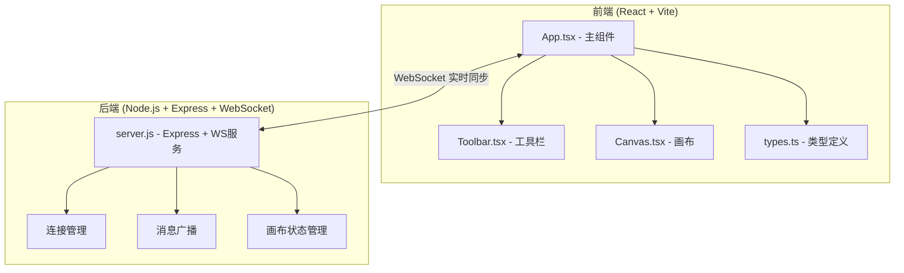
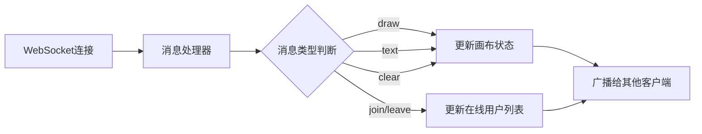

## 1. 架构设计



## 2. 技术说明

- 前端：React@18 + TypeScript + Vite（不使用Tailwind，纯CSS实现极简风格）
- 初始化工具：vite-init（react-ts模板）
- 后端：Node.js + Express@4 + ws（WebSocket库）
- 状态管理：Zustand
- 数据存储：内存存储（无数据库，画布状态保存在服务端内存中）
- 实时通信：WebSocket（ws库），端口3001

## 3. 路由定义

| 路由 | 用途 |
|------|------|
| / | 白板主页，全屏画布+工具栏 |

## 4. API定义

### 4.1 WebSocket 消息类型

```typescript
type WSMessage =
  | { type: 'join'; userId: string; color: string }
  | { type: 'leave'; userId: string }
  | { type: 'draw-start'; userId: string; color: string; width: number; x: number; y: number }
  | { type: 'draw-move'; userId: string; points: Array<{x: number; y: number}> }
  | { type: 'draw-end'; userId: string }
  | { type: 'text-add'; userId: string; id: string; x: number; y: number; content: string; color: string }
  | { type: 'text-move'; userId: string; id: string; x: number; y: number }
  | { type: 'text-resize'; userId: string; id: string; width: number; height: number }
  | { type: 'text-update'; userId: string; id: string; content: string }
  | { type: 'undo'; userId: string }
  | { type: 'redo'; userId: string }
  | { type: 'clear'; userId: string }
  | { type: 'sync'; operations: Operation[]; users: OnlineUser[] }
```

### 4.2 数据类型定义

```typescript
interface Point {
  x: number;
  y: number;
}

interface Stroke {
  id: string;
  userId: string;
  color: string;
  width: number;
  points: Point[];
}

interface TextObject {
  id: string;
  userId: string;
  x: number;
  y: number;
  width: number;
  height: number;
  content: string;
  color: string;
  fontSize: number;
}

interface OnlineUser {
  userId: string;
  color: string;
}

type Operation =
  | { type: 'stroke'; data: Stroke }
  | { type: 'text'; data: TextObject }
  | { type: 'clear' }
```

## 5. 服务端架构图



## 6. 数据模型

### 6.1 内存数据结构

```typescript
interface ServerState {
  operations: Operation[];
  onlineUsers: Map<string, OnlineUser>;
}
```

### 6.2 文件结构

```
├── package.json
├── index.html
├── tsconfig.json
├── vite.config.ts
├── server.js
└── src/
    ├── App.tsx
    ├── Toolbar.tsx
    ├── Canvas.tsx
    ├── types.ts
    ├── main.tsx
    └── index.css
```
