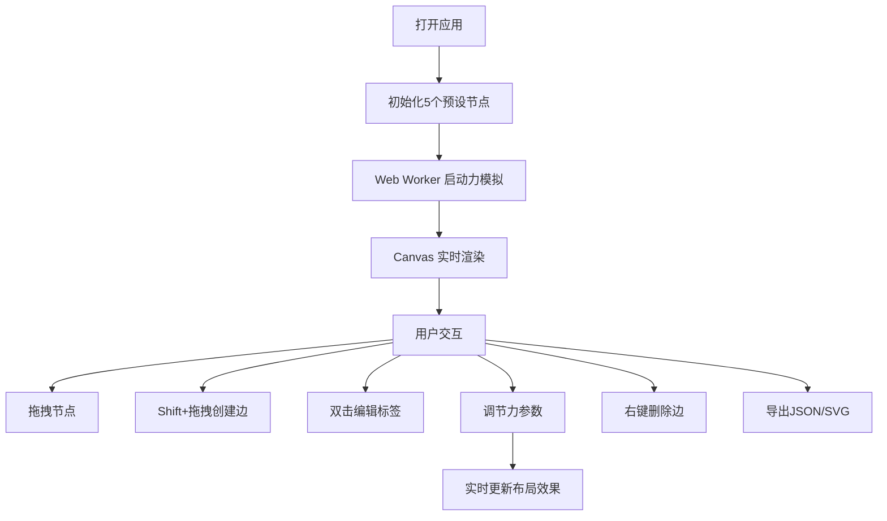

## 1. 产品概述

PivotGraph 是一款交互式力导向关系图编辑与导出应用，用户可以通过拖拽、连线和布局算法在画布上创建和编辑由节点与边构成的关系网络。支持自定义节点大小、颜色和标签，实时力模拟布局并导出为 JSON 或 SVG 格式。主要面向需要可视化复杂关系网络的设计师、数据分析师和开发者。

## 2. 核心功能

### 2.1 用户角色

| 角色 | 注册方式 | 核心权限 |
|------|---------|---------|
| 普通用户 | 无需注册，直接使用 | 完整的节点编辑、布局调节、导出功能 |

### 2.2 功能模块

1. **主画布页面**：Canvas 力导向图渲染、节点交互、边创建与删除
2. **右侧控制面板**：节点添加、力参数调节、颜色选择、导出功能

### 2.3 页面详情

| 页面名称 | 模块名称 | 功能描述 |
|---------|---------|---------|
| 主画布页面 | Canvas 渲染模块 | 使用渐变圆形绘制节点，贝塞尔曲线绘制边，支持 requestAnimationFrame 60FPS 渲染 |
| 主画布页面 | 节点交互模块 | 点击选中（虚线环高亮）、双击编辑标签、拖拽移动（暂停力模拟）、悬停放大效果 |
| 主画布页面 | 边管理模块 | Shift+拖拽创建有向边、右键删除边（淡出动画）、箭头标记显示 |
| 主画布页面 | 力模拟模块 | Web Worker 后台计算物理模拟，节点质量动态调整（基于边数）、ease-out 缓动效果 |
| 控制面板 | 节点管理模块 | 添加新节点按钮、颜色选择器（12色调色板） |
| 控制面板 | 参数调节模块 | 链接距离滑块（20-300）、斥力强度滑块（50-2000），实时更新布局 |
| 控制面板 | 导出模块 | 导出 JSON（节点和边数据）、导出 SVG（矢量图形），响应时间 < 500ms |

## 3. 核心流程

用户打开应用 → 看到5个预设节点自动进行力导向布局 → 拖拽调整节点位置 → 按住 Shift 从节点拖拽到另一节点创建边 → 双击节点编辑标签 → 在右侧面板调节力参数 → 点击导出按钮保存成果。

## 4. 用户界面设计

### 4.1 设计风格
- **主题**：深色科技风，背景 `#121212`，面板背景 `#1e1e1e` 带毛玻璃效果
- **主色调**：节点从12色调色板随机分配，选中高亮色 `#00e5ff`，边半透明 `#888`（0.6透明度）
- **按钮样式**：圆角设计，毛玻璃背景，hover 时有轻微发光效果
- **字体**：system-ui，标签字号 12px，数字标签 14px，颜色 `#e0e0e0`
- **布局风格**：Canvas 占 85% 屏幕宽度、100vh 高度，右侧面板固定 280px 宽度，圆角 16px

### 4.2 页面设计概述

| 页面名称 | 模块名称 | UI 元素 |
|---------|---------|---------|
| 主画布 | 节点渲染 | 渐变圆形（中心亮边缘暗）、直径 40-60px、虚线选中环、悬停 1.2 倍放大（0.2s transition） |
| 主画布 | 边渲染 | 贝塞尔曲线、线宽 2px、半透明 `#888`、末端箭头标记、删除时 300ms 淡出动画 |
| 主画布 | 标签 | 内联输入框（最多10字符）、白色 `#e0e0e0`、12px |
| 控制面板 | 滑块控件 | 范围滑块 + 右侧数字标签（14px，text-secondary 颜色） |
| 控制面板 | 操作按钮 | 添加节点、导出 JSON、导出 SVG，垂直布局，间距适中 |
| 控制面板 | 颜色选择器 | 12色调色板网格，点击切换节点颜色 |

### 4.3 响应式
- **桌面优先**：1920px 以上为标准布局
- **平板适配**（<768px）：面板宽度缩小至 200px，画布自动扩展
- **手机适配**（<480px）：面板叠放于底部，高度 150px，内部可滚动
- **触摸优化**：增大节点热区，支持触摸拖拽

### 4.4 动效设计
- 节点悬停：scale 1.2，0.2s ease-in-out 过渡
- 节点拖拽：弹性跟随效果
- 边删除：opacity 渐变到 0，300ms 动画
- 节点释放：ease-out 惯性缓冲动画
- 整体加载：节点从画布中心渐入
