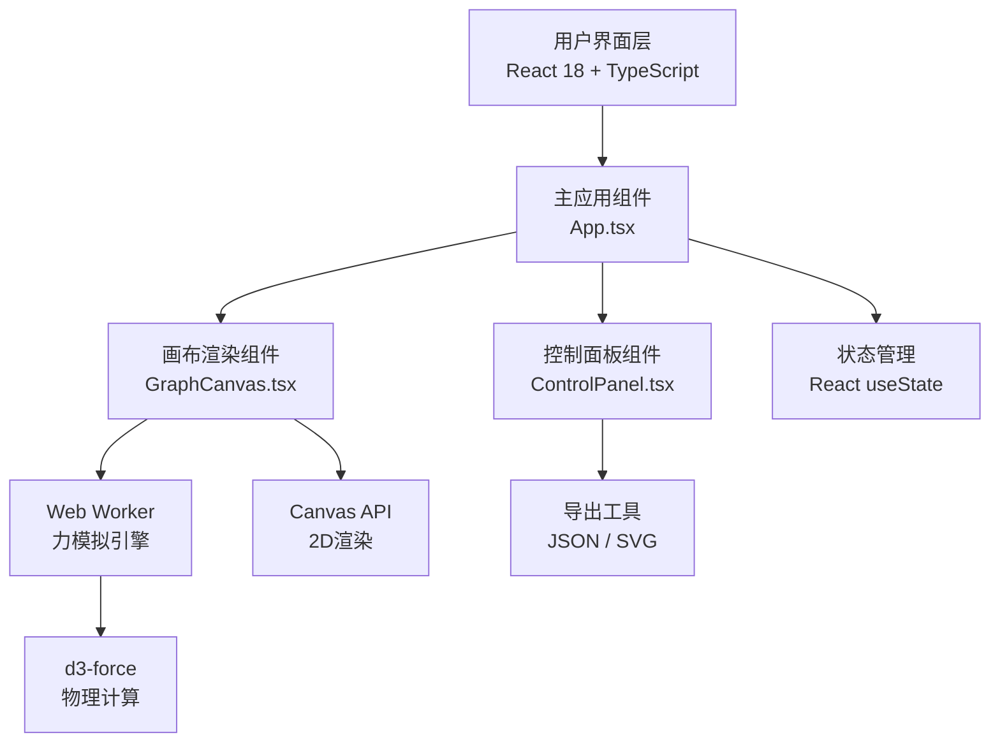
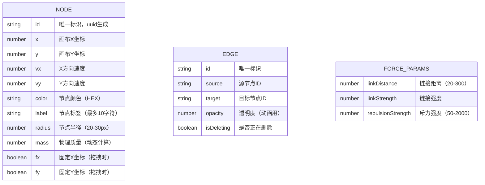

## 1. 架构设计



## 2. 技术描述

- **前端框架**：React@18 + TypeScript@5 + Vite@5
- **构建工具**：Vite@5 + @vitejs/plugin-react
- **力导向布局引擎**：d3-force@3
- **唯一ID生成**：uuid@9
- **状态管理**：React useState（轻量级，无需额外状态管理库）
- **后台计算**：Web Worker（分离力模拟计算，避免阻塞主线程）
- **渲染技术**：HTML5 Canvas 2D API + requestAnimationFrame
- **样式方案**：原生 CSS + CSS 变量（无需 Tailwind，精细控制 Canvas 样式）

### 项目结构

```
auto143/
├── package.json
├── index.html
├── vite.config.js
├── tsconfig.json
└── src/
    ├── App.tsx              # 主组件，状态管理，协调子组件
    ├── GraphCanvas.tsx      # Canvas渲染，交互事件处理
    ├── ControlPanel.tsx     # 右侧控制面板
    ├── types.ts             # TypeScript 类型定义
    ├── force.worker.ts      # Web Worker 力模拟引擎
    ├── exportUtils.ts       # JSON/SVG 导出工具
    └── constants.ts         # 常量（调色板、默认参数）
```

## 3. 路由定义

| 路由 | 用途 |
|-----|------|
| / | 单页应用，无路由需求，主画布 + 控制面板 |

## 4. 数据模型

### 4.1 数据模型定义



### 4.2 TypeScript 类型定义

```typescript
// types.ts
export interface GraphNode {
  id: string;
  x: number;
  y: number;
  vx?: number;
  vy?: number;
  color: string;
  label: string;
  radius: number;
  mass: number;
  fx?: number | null;
  fy?: number | null;
}

export interface GraphEdge {
  id: string;
  source: string;
  target: string;
  opacity: number;
  isDeleting: boolean;
}

export interface ForceParams {
  linkDistance: number;
  linkStrength: number;
  repulsionStrength: number;
}

export type ExportNode = Pick<GraphNode, 'id' | 'x' | 'y' | 'color' | 'label'>;
export type ExportEdge = Pick<GraphEdge, 'source' | 'target'>;

export interface ExportData {
  nodes: ExportNode[];
  edges: ExportEdge[];
}
```

## 5. 性能优化策略

### 5.1 渲染性能
- 使用 `requestAnimationFrame` 驱动渲染循环，确保 60FPS
- Web Worker 分离 d3-force 物理计算，主线程仅负责渲染
- 离屏 Canvas 优化复杂渐变绘制
- 节点质量根据边数动态计算，减少重复遍历

### 5.2 交互性能
- 拖拽期间暂停力模拟（设置 `fx`/`fy` 固定节点）
- 鼠标事件节流，避免高频计算
- 边删除动画使用 CSS opacity 过渡，避免重排

### 5.3 导出性能
- SVG 导出使用字符串拼接，避免 DOM 操作
- JSON 导出使用原生 `JSON.stringify`
- 导出操作限制在 500ms 内完成，支持 100 节点 + 200 边规模

## 6. Web Worker 通信协议

```typescript
// 主线程 → Worker
type WorkerMessage =
  | { type: 'INIT'; nodes: GraphNode[]; edges: GraphEdge[]; params: ForceParams }
  | { type: 'UPDATE_NODES'; nodes: GraphNode[] }
  | { type: 'UPDATE_EDGES'; edges: GraphEdge[] }
  | { type: 'UPDATE_PARAMS'; params: ForceParams }
  | { type: 'DRAG_START'; nodeId: string }
  | { type: 'DRAG_MOVE'; nodeId: string; x: number; y: number }
  | { type: 'DRAG_END'; nodeId: string }
  | { type: 'TICK' };

// Worker → 主线程
type WorkerResponse = {
  type: 'TICK';
  nodes: GraphNode[];
};
```
