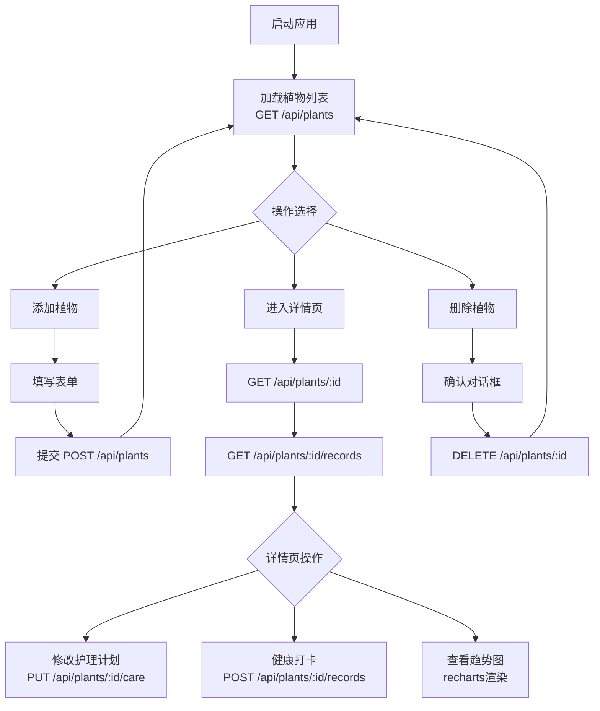

## 1. 产品概述
PlantPulse是一款面向家庭用户的室内植物养护管理Web应用，帮助用户系统化管理多盆植物的护理计划、记录生长状态并追踪健康趋势。
- 解决家庭植物养护混乱、忘记浇水施肥、植物状态异常难以及时发现的痛点
- 目标市场：都市养花新手、植物爱好者，通过数字化养护降低植物死亡率

## 2. 核心功能

### 2.1 用户角色
| 角色 | 注册方式 | 核心权限 |
|------|---------|----------|
| 家庭用户 | 无需注册（本地数据） | 添加/删除植物、设置护理计划、每日健康打卡、查看趋势图 |

### 2.2 功能模块
1. **植物列表页**：植物卡片网格展示、添加植物弹窗、删除确认、响应式布局
2. **植物详情页**：护理计划编辑区、每日健康打卡区、近7天健康趋势图、最近打卡记录列表

### 2.3 页面详情
| 页面名称 | 模块名称 | 功能描述 |
|---------|---------|----------|
| 植物列表页 | 顶部导航栏 | 左侧显示应用名称PlantPulse，右侧秒级更新当前时间，固定高度56px |
| 植物列表页 | 添加植物按钮 | 悬浮固定位置，点击弹出表单（名称、品种、照片URL、位置），提交后新植物插入列表最前并带淡入动画 |
| 植物列表页 | 植物卡片网格 | 响应式栅格（桌面4列/平板3列/手机2列），卡片3:2宽高比，含缩略图、名称、品种、健康状态胶囊标签 |
| 植物列表页 | 删除功能 | 卡片右上角红色X按钮（悬停放大1.2倍），点击弹出确认对话框，确认后发送DELETE请求并移除卡片 |
| 植物详情页 | 护理计划区块 | 浅绿背景(#f1f8e9)，可编辑下拉选择器：浇水频率(天)、施肥频率(天)、光照需求(低/中/高)，修改立即PUT更新并显示2秒绿色Toast |
| 植物详情页 | 每日健康打卡 | 三个状态按钮：健康(绿叶)、缺水(蓝水滴)、光照不足(黄太阳)，选中放大并显示对勾，POST记录后立即插入打卡列表 |
| 植物详情页 | 健康趋势折线图 | recharts渲染近7天趋势，X轴MM-DD，Y轴状态值(健康3/缺水2/光照不足1)，彩色圆点标记，平滑连线，背景#f8f9fa高度200px |
| 植物详情页 | 最近打卡列表 | 显示最近打卡记录，与趋势图联动 |

## 3. 核心流程
用户打开应用→浏览植物列表→点击添加植物→填写表单提交→列表顶部出现新卡片→点击某植物进入详情页→查看/修改护理计划→选择今日健康状态打卡→查看7天趋势图

## 4. 用户界面设计

### 4.1 设计风格
- **主色调**：柔和绿色系，主色#e8f5e9，强调色#4caf50，深绿#2e7d32，文字深灰
- **按钮样式**：圆角胶囊/圆角矩形，悬停0.2s平滑过渡
- **字体**：现代无衬线字体，标题加粗，正文常规
- **布局风格**：卡片式布局，顶部固定导航栏，居中最大宽1200px最小320px
- **图标/emoji**：lucide-react图标库，植物/水滴/太阳等自然风格图标

### 4.2 页面设计概览
| 页面名称 | 模块名称 | UI元素 |
|---------|---------|--------|
| 植物列表页 | 顶部导航栏 | 固定56px，白底+柔和投影，左logo(#2e7d32加粗20px)，右动态时钟 |
| 植物列表页 | 卡片网格 | 卡片白底圆角12px，4px淡绿阴影(#c8e6c9)，悬停阴影扩至8px上移3px |
| 植物列表页 | 健康标签 | 圆角胶囊8px内边距，健康#4caf50白字/缺水#2196f3白字/光照不足#ff9800白字 |
| 植物详情页 | 护理计划 | 浅绿#f1f8e9圆角8px内边距16px，三列布局，下拉选择器风格统一 |
| 植物详情页 | 打卡按钮 | 大图标+文字按钮，选中状态放大+对勾图标，背景色对应状态色 |
| 植物详情页 | 趋势图 | 背景#f8f9fa，上下15px内边距，数据点彩色圆点(绿/蓝/黄)，平滑曲线 |

### 4.3 响应式设计
桌面端优先(4列栅格)→平板3列→手机2列，最小宽度320px，所有组件自适应。卡片缩略图始终占卡片宽度50%。列表项悬停和按钮过渡动画在移动端保留touch反馈。

### 4.4 动画与过渡
- 新卡片添加：0.5s淡入动画，从透明度0到1并轻微上移
- 页面切换：0.3s左右滑入滑出
- 按钮/卡片悬停：0.2s ease-in-out颜色和阴影过渡
- Toast提示：2秒后淡出消失
- 删除按钮：悬停放大1.2倍
