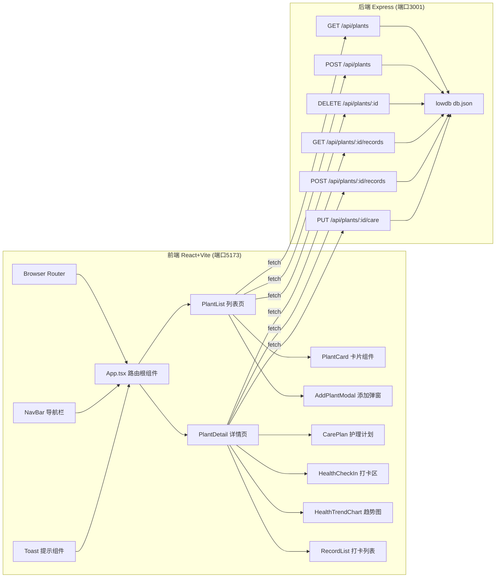
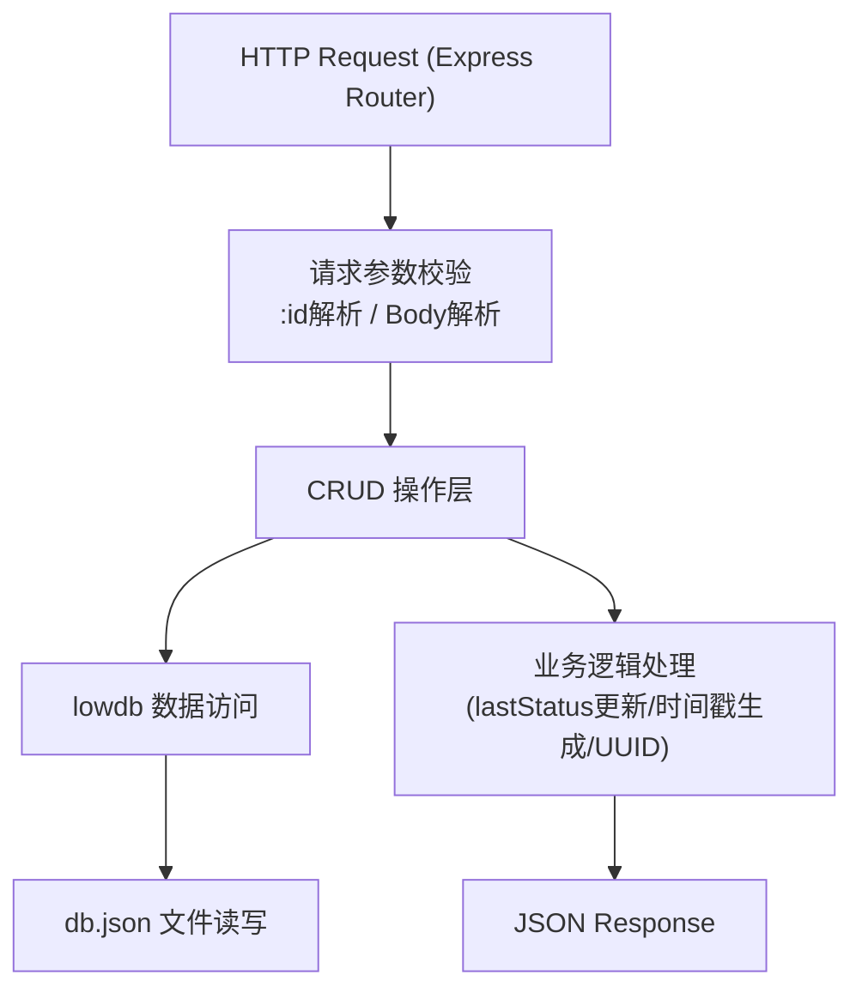
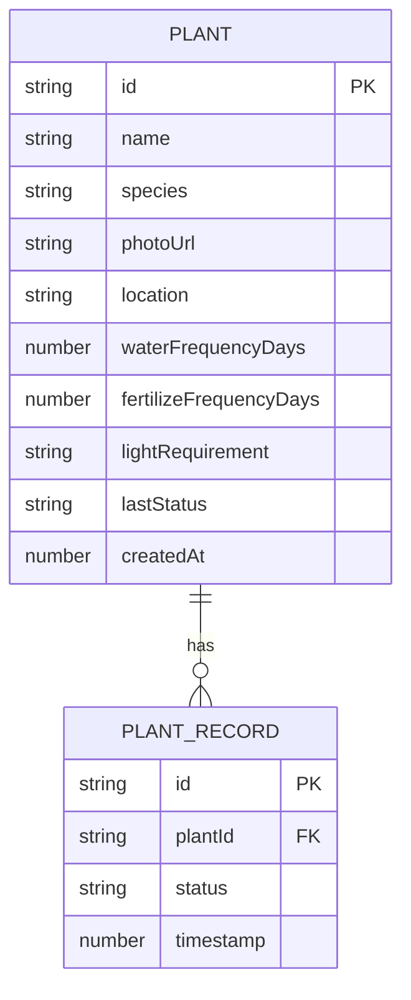

## 1. 架构设计



## 2. 技术选型说明
- **前端框架**：React@18 + TypeScript + Vite，组件化开发，TS严格模式
- **构建工具**：Vite@5 + @vitejs/plugin-react，配置API代理到localhost:3001
- **路由**：React Router v6，双页面路由(列表/详情)
- **图表**：recharts@2，折线图渲染健康趋势
- **状态管理**：React useState/useEffect组件级管理，无需全局状态库
- **图标**：lucide-react，植物/水滴/太阳等自然图标
- **后端**：Express@4 + TypeScript，轻量RESTful API
- **数据库**：lowdb@3 + JSON文件持久化，启动时自动创建示范数据
- **跨域**：开发环境Vite代理 + cors中间件双保险
- **UUID**：uuid@9生成植物ID和打卡记录ID

## 3. 路由定义
| 路由 | 页面组件 | 用途 |
|------|---------|------|
| / | PlantList | 植物列表首页，卡片网格展示+添加/删除植物 |
| /plant/:id | PlantDetail | 单植物详情页，护理计划/打卡/趋势图 |

## 4. API 端点定义

```typescript
// 植物类型
interface Plant {
  id: string;
  name: string;
  species: string;
  photoUrl: string;
  location: string;
  carePlan: {
    waterFrequencyDays: number;
    fertilizeFrequencyDays: number;
    lightRequirement: 'low' | 'medium' | 'high';
  };
  lastStatus?: 'healthy' | 'thirsty' | 'lowLight' | 'pest';
  createdAt: number;
}

// 打卡记录类型
interface PlantRecord {
  id: string;
  plantId: string;
  status: 'healthy' | 'thirsty' | 'lowLight' | 'pest';
  timestamp: number;
}
```

| 方法 | 路径 | 请求体 | 响应 | 说明 |
|------|------|--------|------|------|
| GET | /api/plants | - | Plant[] | 获取所有植物列表，按创建时间倒序 |
| POST | /api/plants | {name, species, photoUrl, location} | Plant | 新增植物，自动生成默认护理计划 |
| DELETE | /api/plants/:id | - | {success: true} | 删除指定植物及其所有打卡记录 |
| GET | /api/plants/:id/records | - | PlantRecord[] | 获取指定植物的所有打卡记录，按时戳倒序 |
| POST | /api/plants/:id/records | {status} | PlantRecord | 新增健康打卡记录，自动更新plant.lastStatus |
| PUT | /api/plants/:id/care | {waterFrequencyDays, fertilizeFrequencyDays, lightRequirement} | Plant | 更新植物的护理计划 |

## 5. 服务端架构图



## 6. 数据模型

### 6.1 ER 图


### 6.2 db.json 结构
```json
{
  "plants": [
    {
      "id": "uuid-xxx",
      "name": "绿萝",
      "species": "Epipremnum aureum",
      "photoUrl": "https://images.unsplash.com/...",
      "location": "客厅",
      "carePlan": {
        "waterFrequencyDays": 3,
        "fertilizeFrequencyDays": 30,
        "lightRequirement": "low"
      },
      "lastStatus": "healthy",
      "createdAt": 1718123456789
    }
  ],
  "records": [
    {
      "id": "uuid-yyy",
      "plantId": "uuid-xxx",
      "status": "healthy",
      "timestamp": 1718123456789
    }
  ]
}
```

### 6.3 示范数据
后端启动时自动创建3盆默认植物：绿萝、多肉、龟背竹，每盆5条模拟打卡记录覆盖近7天不同状态，用于展示趋势图效果。
