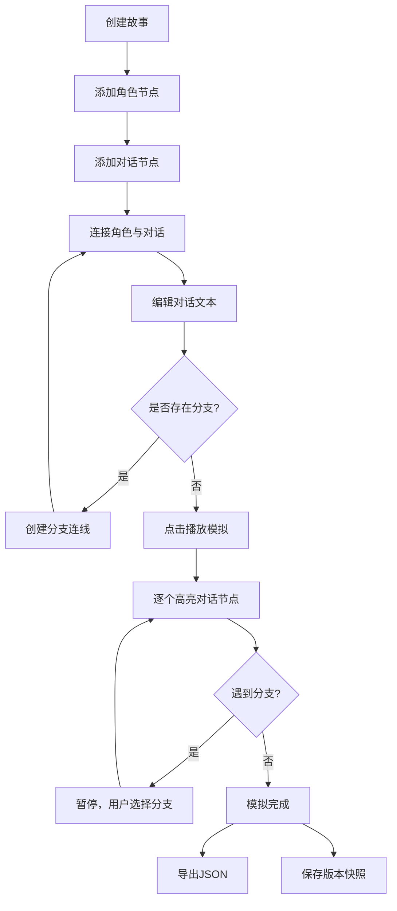

## 1. 产品概述

动态多人交互式故事脚本编排与模拟工具，帮助游戏文案策划和外包作者在可视化画布上构建分支对话脚本，直观验证角色关系与对话路径的逻辑一致性。

- 目标用户：游戏文案策划、外包脚本作者、叙事设计师
- 核心价值：将静态表格推演变为可视化动态模拟，减少分支逻辑错误，提升多人交互剧情的创作效率

## 2. 核心功能

### 2.1 用户角色

| 角色 | 使用方式 | 核心权限 |
|------|----------|----------|
| 创作者 | 直接使用 | 创建/编辑故事、添加节点与连线、模拟分支、导出JSON、版本管理 |

### 2.2 功能模块

1. **故事编辑画布**：角色节点（圆形60px，色相区分）、对话节点（圆角矩形120x50px）、带箭头曲线连接、双击编辑对话文本、自由拖拽、控制点调整
2. **分支模拟器**：播放按钮启动模拟、逐个高亮对话节点、打字机效果（50ms/字）、分支暂停选择、角色头像框显示
3. **导出功能**：一键序列化故事结构为JSON并自动下载
4. **版本管理**：保存版本快照（最多10个）、历史版本列表、点击回滚、自动替换当前版本

### 2.3 页面详情

| 页面名称 | 模块名称 | 功能描述 |
|----------|----------|----------|
| 主编辑页 | 顶部工具栏 | 播放按钮（绿色#38a169）、导出按钮（蓝色#3182ce）、保存按钮（浅绿#48bb78），按钮间距12px，悬停0.2s过渡+微缩放1.05 |
| 主编辑页 | 左侧面板(280px) | 故事创建（标题+简介）、角色添加、对话节点添加、历史版本列表 |
| 主编辑页 | 右侧画布区 | SVG画布渲染节点与连线、拖拽交互（放大1.1倍+阴影）、连线实时更新、模拟动画（脉动光环1.2s周期） |

## 3. 核心流程

用户创建故事 → 在画布上添加角色节点和对话节点 → 用带箭头曲线连接角色与对话 → 双击编辑对话文本 → 遇到分支时创建多条连线 → 点击播放进入模拟模式 → 系统按连线路径逐个高亮对话节点并播放文本 → 遇到分支暂停让用户选择 → 模拟完成后可导出JSON → 保存版本快照到历史

## 4. 用户界面设计

### 4.1 设计风格

- 主色调：深色主题（背景#1a202c，内容区#2d3748）
- 按钮风格：扁平圆角，带悬停颜色过渡和微缩放
- 字体：Inter（Google Fonts）
- 布局风格：左侧固定面板+右侧自适应画布
- 节点风格：角色圆形+色相区分，对话圆角矩形白色背景

### 4.2 页面设计概览

| 页面名称 | 模块名称 | UI元素 |
|----------|----------|--------|
| 主编辑页 | 顶部工具栏 | 高44px，背景#2d3748，按钮间距12px，0.2s ease悬停过渡，scale 1.05微缩放 |
| 主编辑页 | 左侧面板 | 宽280px，深色背景，故事列表、添加按钮、历史版本条目 |
| 主编辑页 | 画布区域 | SVG画布，角色圆形节点60px直径，对话矩形120x50px，带箭头曲线，拖拽时1.1倍放大+drop-shadow |
| 主编辑页 | 模拟状态 | 对话节点脉动光环(1.2s周期，透明→半透明白色)，角色头像框半透明，打字机效果文本 |

### 4.3 响应式适配

- 桌面优先设计
- 屏幕宽度<768px时，左侧面板折叠为顶部抽屉式菜单，展开动画0.3s ease-in-out
- 画布区域自适应剩余宽度

### 4.4 性能要求

- 40个节点时拖拽帧率≥45fps
- 模拟模式分支暂停响应延迟≤100ms
