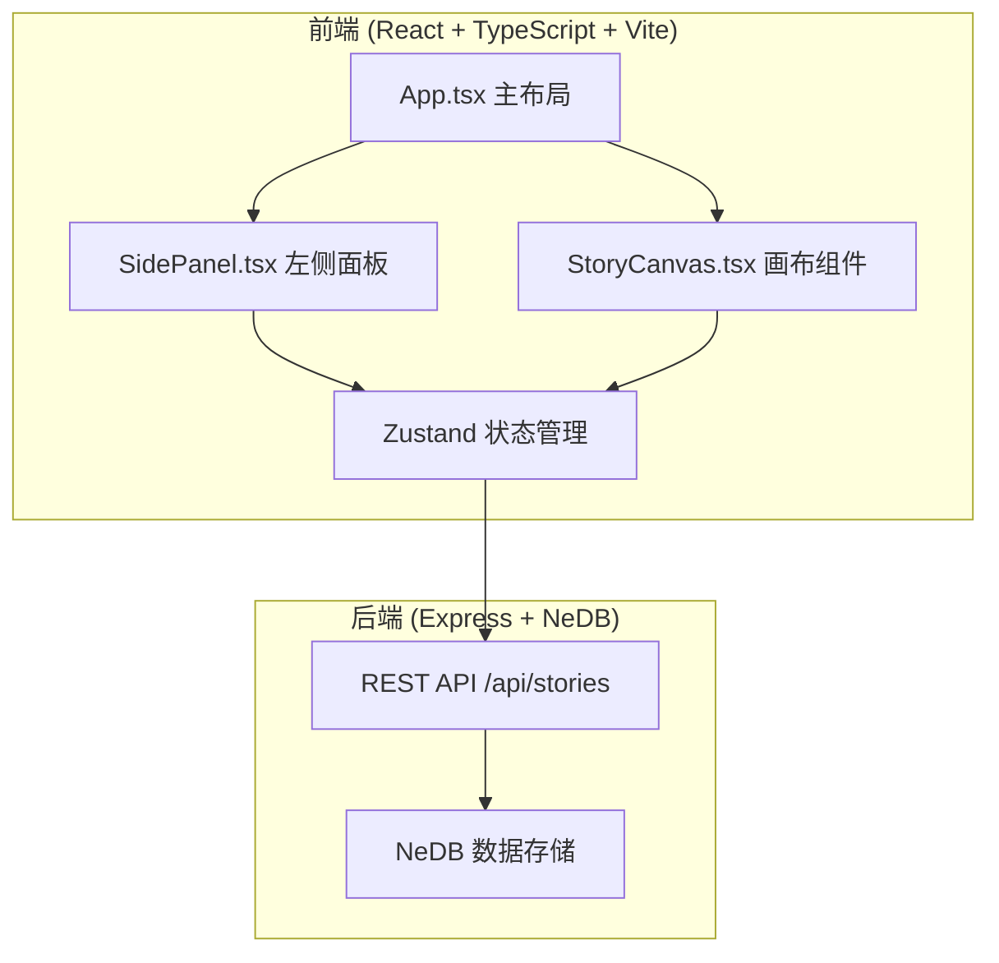
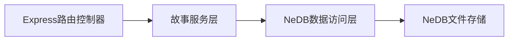
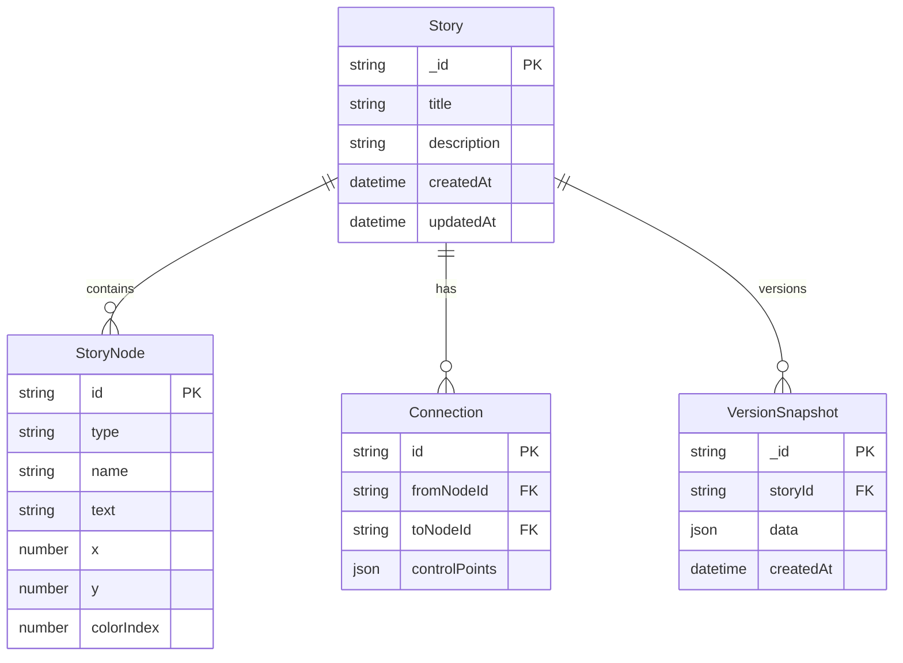

## 1. 架构设计



## 2. 技术说明

- 前端：React@18 + TypeScript + Vite + Zustand + 自定义SVG画布
- 初始化工具：vite-init (react-express-ts模板)
- 后端：Express@4 + nedb-promises
- 数据库：NeDB（嵌入式，文件存储）
- 样式：CSS-in-JS / 内联样式（深色主题）

## 3. 路由定义

| 路由 | 用途 |
|------|------|
| / | 主编辑页（故事画布+左侧面板+工具栏） |

## 4. API定义

### 4.1 故事CRUD

| 方法 | 路径 | 说明 |
|------|------|------|
| GET | /api/stories | 获取所有故事列表 |
| GET | /api/stories/:id | 获取单个故事详情 |
| POST | /api/stories | 创建新故事 |
| PUT | /api/stories/:id | 更新故事 |
| DELETE | /api/stories/:id | 删除故事 |

### 4.2 版本管理

| 方法 | 路径 | 说明 |
|------|------|------|
| GET | /api/stories/:id/versions | 获取故事版本列表 |
| POST | /api/stories/:id/versions | 保存当前状态为版本快照 |
| GET | /api/stories/:id/versions/:versionId | 获取指定版本 |
| POST | /api/stories/:id/versions/:versionId/rollback | 回滚到指定版本 |

### 4.3 TypeScript类型定义

```typescript
interface CharacterNode {
  id: string;
  type: 'character';
  name: string;
  x: number;
  y: number;
  colorIndex: number;
}

interface DialogueNode {
  id: string;
  type: 'dialogue';
  text: string;
  x: number;
  y: number;
}

type StoryNode = CharacterNode | DialogueNode;

interface Connection {
  id: string;
  fromNodeId: string;
  toNodeId: string;
  controlPoints: { x: number; y: number }[];
}

interface Story {
  _id: string;
  title: string;
  description: string;
  nodes: StoryNode[];
  connections: Connection[];
  createdAt: string;
  updatedAt: string;
}

interface VersionSnapshot {
  _id: string;
  storyId: string;
  data: Story;
  createdAt: string;
}
```

## 5. 服务端架构图



## 6. 数据模型

### 6.1 数据模型定义



### 6.2 数据存储

- NeDB使用文件存储：`data/stories.db` 和 `data/versions.db`
- 版本快照最多保留10个，超过时自动移除最早的
- 无需SQL DDL，NeDB为文档型存储
