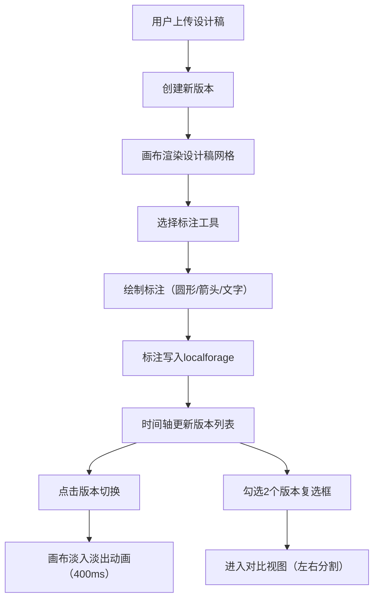

## 1. 产品概述
DesignGallery是面向公司内部设计团队的在线设计稿评审看板与版本回溯应用，解决设计评审时设计稿分散、反馈整理困难的问题。
- 核心价值：统一管理设计稿、按时间线回放版本、实时标注讨论，大幅提升设计评审效率
- 目标用户：公司内部设计团队成员、产品经理、前端开发者

## 2. 核心特性

### 2.1 用户角色
| 角色 | 注册方式 | 核心权限 |
|------|----------|----------|
| 团队成员 | 本地应用无需注册 | 上传设计稿、创建版本、添加标注、查看历史、版本对比 |

### 2.2 功能模块
1. **主画布区域**：设计稿网格/列表展示、缩放控制、标注绘制层、悬浮工具栏
2. **时间轴面板**：版本历史列表、版本缩略图、版本选择与对比、新建项目与上传
3. **标注系统**：圆形高亮标注、箭头指向标注、文字批注标注、标注持久化存储

### 2.3 页面详情
| 页面名称 | 模块名称 | 功能描述 |
|-----------|-------------|---------------------|
| 主界面 | 顶部工具栏 | 项目切换、视图模式切换（网格/列表）、缩放控制 |
| 主界面 | 时间轴面板 | 版本卡片列表（200x100px）、版本序号标签、复选框选中对比、新建项目按钮、上传按钮 |
| 主界面 | 画布区域 | 设计稿网格布局、自适应列数、卡片圆角阴影、悬停动画、SVG标注层叠加 |
| 主界面 | 浮动工具栏 | 删除按钮、标注模式切换（圆形/箭头/文字/无）、全屏查看按钮 |
| 主界面 | 版本对比视图 | 左右两等份画布、4px中间分割线、双版本并排渲染 |

## 3. 核心流程
用户上传设计稿图片→系统归入最新版本（或创建新版本）→在画布上以网格展示→用户选择标注工具进行自由标注→标注自动保存并关联设计稿→用户可通过时间轴面板切换历史版本→选择两个版本可并排对比差异

## 4. 用户界面设计

### 4.1 设计风格
- **主色调**：#4f46e5（靛蓝色，品牌主色），#ef4444（红色，圆形高亮），#3b82f6（蓝色，箭头），rgba(255,255,0,0.2)（黄色，文字批注背景）
- **中性色**：#f0f2f5（画布浅灰背景），#ffffff（面板白色），#e0e0e0（边框色），#333333（深色文字）
- **按钮风格**：圆角8px，主色填充，字体加粗
- **卡片风格**：圆角12px，默认shadow-sm，悬停过渡到shadow-md（200ms ease-out）
- **字体**：系统无衬线字体，标注文字14px，版本序号14px白色
- **布局**：桌面端左栏（280px时间轴）+ 右侧画布；移动端顶部横条（60px）+ 下方画布
- **图标风格**：简洁线性图标，32x32px浮动工具栏按钮

### 4.2 页面设计概览
| 页面名称 | 模块名称 | UI元素 |
|-----------|-------------|-------------|
| 主界面 | 时间轴面板 | 固定宽度280px、白色背景、右侧1px边框、顶部2个主色按钮、纵向版本卡片列表 |
| 主界面 | 版本卡片 | 200x100px缩略图、右上角半透明黑底圆角标签（白色版本号14px）、左侧30x30px复选框 |
| 主界面 | 设计稿卡片 | 最大宽度240px、自适应高度、圆角12px、悬停阴影过渡、顶部浮动半透明工具栏 |
| 主界面 | 标注样式 | 圆形：2px虚线#ef4444；箭头：3px实线#3b82f6；文字：背景rgba(255,255,0,0.2)、14px字号、颜色#333或#fff |
| 主界面 | 对比视图 | 左右各50%宽度、中间4px分割线、各自独立渲染版本内容 |

### 4.3 响应式
- 桌面端（≥768px）：左栏280px固定时间轴 + 右侧画布自适应宽度（3列网格）
- 移动端（<768px）：顶部60px高度横向可滚动时间轴条 + 画布占满宽度（1-2列网格）
- 画布滚轮缩放：范围0.5x~2x，标注保持相对位置和比例
- 版本切换：淡入淡出动画400ms平滑过渡

### 4.4 性能优化方向
- 图片懒加载与缓存
- SVG标注层虚拟化渲染（超过200标注时分片更新）
- CSS transform/opacity 动画确保不触发重排
- requestAnimationFrame 控制缩放与拖拽帧率≥30FPS
