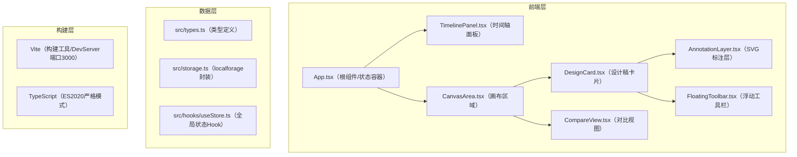

## 1. 架构设计



## 2. 技术说明
- **前端框架**：React 18 + TypeScript
- **构建工具**：Vite 5（@vitejs/plugin-react），开发服务器端口3000
- **本地存储**：localforage（IndexedDB封装，设计稿图片与标注持久化）
- **唯一ID**：uuid v4
- **状态管理**：React useState/useReducer + 自定义Hook（轻量场景无需引入额外库）
- **样式方案**：原生CSS + CSS变量（无第三方UI库，符合轻量约束）
- **初始化方式**：npm create vite-init@latest（react-ts模板）

## 3. 文件结构与调用关系
| 文件路径 | 职责 | 调用/被调用方 | 数据流向 |
|----------|------|--------------|----------|
| `package.json` | 依赖声明与启动脚本 | — | 入口：`npm run dev` |
| `index.html` | HTML入口，#root容器 + 全局CSS | 加载 `src/main.tsx` | — |
| `tsconfig.json` | TS配置：strict:true, target:ES2020 | — | — |
| `vite.config.js` | Vite配置：端口3000，React插件 | — | — |
| `src/types.ts` | 集中导出Project/Version/Design/Annotation/AnnotationType接口 | 被所有组件导入 | — |
| `src/storage.ts` | 封装localforage CRUD操作 | 被useStore调用 | 读写本地IndexedDB |
| `src/hooks/useStore.ts` | 全局状态Hook：当前项目、版本列表、选中版本、对比模式 | 被App/TimelinePanel/CanvasArea调用 | 双向数据流 |
| `src/App.tsx` | 根组件：分发状态给子面板 | 调用useStore；渲染TimelinePanel、CanvasArea | 用户操作→更新状态→子组件重渲染 |
| `src/TimelinePanel.tsx` | 左栏时间轴：版本列表、切换、对比勾选 | 从App接收projectId/versions；回调onSelectVersion/onToggleCompare | 读取→选择→回传选中ID |
| `src/CanvasArea.tsx` | 主画布：网格布局、缩放、对比视图 | 从App接收version/compare数据；回调onAddAnnotation | 接收设计稿→渲染→交互→写回标注 |
| `src/components/DesignCard.tsx` | 设计稿单张卡片：图片、悬停效果、工具栏 | 被CanvasArea调用；渲染AnnotationLayer和FloatingToolbar | — |
| `src/components/AnnotationLayer.tsx` | SVG标注层：绘制/编辑圆形/箭头/文字 | 被DesignCard调用；接收annotations；回调onChange | 用户绘制→生成新标注→回调保存 |
| `src/components/FloatingToolbar.tsx` | 卡片顶部悬浮工具栏：删除/标注模式/全屏 | 被DesignCard调用；回调onAction | 用户点击→触发父组件动作 |
| `src/components/UploadArea.tsx` | 拖拽/点击上传区域 | 被TimelinePanel/App调用；回调onFilesUploaded | 文件→Base64→创建新版本 |
| `src/styles/global.css` | 全局样式、CSS变量、动画keyframes | 被index.html引入 | — |

## 4. 数据模型

### 4.1 TypeScript类型定义
```typescript
export type AnnotationType = 'circle' | 'arrow' | 'text';

export interface BaseAnnotation {
  id: string;
  type: AnnotationType;
  x: number; // 相对图片左上角x坐标（0~1的百分比，适配缩放）
  y: number; // 相对图片左上角y坐标
}

export interface CircleAnnotation extends BaseAnnotation {
  type: 'circle';
  radius: number; // 相对宽度百分比（0~0.5）
}

export interface ArrowAnnotation extends BaseAnnotation {
  type: 'arrow';
  x2: number; // 终点相对坐标
  y2: number;
}

export interface TextAnnotation extends BaseAnnotation {
  type: 'text';
  content: string;
  color: '#333' | '#fff';
}

export type Annotation = CircleAnnotation | ArrowAnnotation | TextAnnotation;

export interface DesignImage {
  id: string;
  src: string; // Base64 DataURL（PNG/JPEG，单张≤10MB）
  name: string;
  width: number;
  height: number;
  annotations: Annotation[];
  uploadedAt: number;
}

export interface Version {
  id: string;
  projectId: string;
  versionNumber: number;
  thumbnail: string; // 第一张图缩略图（压缩DataURL）
  designs: DesignImage[];
  createdAt: number;
}

export interface Project {
  id: string;
  name: string;
  versions: string[]; // 版本ID有序列表
  createdAt: number;
  updatedAt: number;
}
```

### 4.2 localforage Key设计
| Key | 数据类型 | 说明 |
|-----|----------|------|
| `dg_projects` | `Project[]` | 项目列表 |
| `dg_version_{versionId}` | `Version` | 单版本详情 |
| `dg_design_{designId}` | `DesignImage` | 单设计稿+标注 |
| `dg_current_project_id` | `string` | 当前选中项目ID |
| `dg_current_version_id` | `string` | 当前选中版本ID |

## 5. 核心数据流向
1. **上传流程**：用户拖放文件→`UploadArea`读取为Base64→调用`storage.saveDesigns`存入→创建新`Version`（versionNumber自增）→写入`dg_version_xxx`→更新`Project.versions`→触发CanvasArea重新渲染（带400ms opacity过渡）
2. **标注流程**：用户在`AnnotationLayer`交互（mousedown→mousemove→mouseup）→计算相对坐标（百分比）→生成`Annotation`对象→调用`storage.updateAnnotations`写入`dg_design_xxx`→局部重渲染标注层
3. **版本切换**：点击`TimelinePanel`卡片→App更新`currentVersionId`→CanvasArea触发CSS class切换（opacity:0→delay 50ms→opacity:1，总400ms）→加载新版本设计稿
4. **对比模式**：勾选2个复选框→App状态`compareMode=true`+`compareVersionIds=[a,b]`→CanvasArea渲染`CompareView`（左右两个`DesignGrid`容器，中间4px边框）→各自独立渲染
5. **缩放流程**：CanvasArea监听wheel事件→更新`zoom`（0.5~2 clamp）→设计稿容器transform: scale(zoom)→标注层因使用百分比坐标，自动跟随缩放

## 6. 性能保障措施
- 图片压缩为DataURL时，生成100x75px缩略图用于时间轴卡片（减少内存占用）
- 标注层使用SVG + CSS transform，缩放/平移不触发重排
- 大量标注时（>200），`AnnotationLayer`内部按designId分片useMemo缓存
- 拖拽绘制使用requestAnimationFrame节流，确保≥30FPS
- 50张400x300px图片的首次渲染：懒加载（IntersectionObserver）+ CSS contain:layout paint
