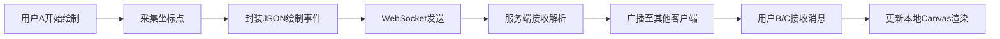

## 1. 产品概述

一款促进网站访问者互动的轻量级实时协作涂鸦工具，通过彩色涂鸦画布让多人在线协作创作，增强用户参与感和粘性。

- **核心目的**：提供实时多人画布协作体验，让用户能够自由绘画并即时看到他人的创作轨迹
- **目标用户**：网站访客、远程协作团队、教育场景师生、创意工作者
- **产品价值**：降低协作门槛，通过视觉化互动提升用户留存和社交互动性

## 2. 核心功能

### 2.1 用户角色

| 角色 | 进入方式 | 核心权限 |
|------|----------|----------|
| 普通用户 | 直接访问页面 | 绘制、选择颜色笔刷、撤销自己的笔触、查看在线人数 |
| 管理员（首个连接用户） | 第一个建立WebSocket连接 | 拥有普通用户所有权限 + 清除画布功能 |

### 2.2 功能模块

1. **主画布区**：Canvas 2D绘图画布、网格背景、画笔尾迹渐显效果、在线人数指示器
2. **左侧工具栏**：10色预设选择器、笔刷粗细滑块、撤销按钮、管理员专属清除按钮
3. **实时通信层**：WebSocket连接管理、绘制事件广播、在线人数同步、撤销/清除指令分发

### 2.3 页面详情

| 页面名称 | 模块名称 | 功能描述 |
|----------|----------|----------|
| 主页面 | 画布组件 | 支持自由绘制、接收广播数据实时渲染、显示网格背景、画笔轨迹渐显动画 |
| 主页面 | 工具栏组件 | 10种颜色选择（含选中放大动画）、1-20px笔刷滑块（渐变轨道）、撤销按钮（悬停旋转变色） |
| 主页面 | 在线人数指示器 | 画布左上角胶囊状显示、数字变化时背景淡入淡出过渡 |
| 主页面 | 清除画布功能 | 管理员专属、确认对话框、半透明遮罩+进度环动画 |

## 3. 核心流程

### 3.1 用户绘制同步流程

用户打开页面 → 建立WebSocket连接 → 服务端分配用户ID并广播在线人数 → 用户选择颜色/笔刷 → 鼠标/触摸按下开始绘制 → 每帧采集坐标点 → 封装绘制事件（颜色、粗细、坐标点数组）→ 通过WebSocket发送至服务端 → 服务端校验并广播给其他所有客户端 → 各客户端解析消息 → 在本地Canvas上渲染对应笔触

### 3.2 撤销操作流程

用户点击撤销按钮 → App层查找当前用户最新一条笔触记录 → 本地Canvas重绘（排除该笔触）→ 发送撤销消息（含用户ID和笔触ID）→ 服务端标记该笔触为已撤销 → 广播撤销指令 → 其他客户端重绘画布排除对应笔触

### 3.3 清除画布流程

管理员点击清除按钮 → 弹出确认对话框 → 用户确认 → 显示半透明遮罩+进度环动画 → 发送清除指令 → 服务端清空所有笔触记录 → 广播清除事件 → 所有客户端清空Canvas → 隐藏遮罩动画

## 4. 用户界面设计

### 4.1 设计风格

- **主题色系**：深色主题，主背景 `#1e1e2e`（深炭灰蓝），突出画布主体
- **配色方案**：
  - 工具栏背景：`rgba(255,255,255,0.08)` 半透明毛玻璃
  - 工具栏边框：`1px solid rgba(255,255,255,0.18)`
  - 网格线：`rgba(255,255,255,0.1)` 50px间距
  - 预设10色：红#ff4757、橙#ff7f50、黄#ffd93d、绿#6bcB77、青#4ecdc4、蓝#45b7d1、紫#a55eea、粉#fd79a8、白#f5f6fa、黑#2d3436
- **字体**：使用现代无衬线字体，如 Inter 或系统默认 sans-serif
- **按钮风格**：
  - 颜色块：28px圆角正方形，选中状态缩放至32px+轻微阴影
  - 撤销按钮：圆形图标，悬停旋转-45deg+变色
  - 清除按钮：危险红边框警告样式
- **整体氛围**：极简深色、聚焦创作、毛玻璃质感、流畅过渡动画

### 4.2 页面设计概览

| 页面 | 模块 | UI元素细节 |
|------|------|------------|
| 主页面 | 整体布局 | 左侧固定工具栏 + 右侧自适应画布 + 左上角胶囊指示器 |
| 主页面 | 工具栏 | 垂直排列，颜色块网格2行×5列，滑块带渐变视觉提示，图标按钮圆形 |
| 主页面 | 画布 | 占满剩余空间，浅灰网格底，绘制时尾迹从透明渐变为选定色 |
| 主页面 | 在线人数 | 圆形胶囊，绿色背景指示在线，数字跳动时背景平滑过渡 |
| 主页面 | 清除遮罩 | 全屏半透明黑色覆盖+居中圆环进度动画（旋转+填充过渡） |

### 4.3 响应式设计

- **桌面端（默认）**：工具栏宽度80px-120px，颜色块28px，滑块水平排列
- **平板端（≤768px）**：工具栏宽度60px，颜色块24px，滑块紧凑布局
- **移动端（≤480px）**：工具栏宽度40px，颜色块20px，滑块改为垂直排列，文字标签隐藏仅保留图标

### 4.4 动画与微交互

1. 颜色选中动画：`scale(1.0 → 1.14)` + `box-shadow` 弹出，过渡时长 200ms ease-out
2. 撤销按钮悬停：`rotate(0 → -45deg)` + 背景色从透明变为 `rgba(255,255,255,0.15)`，时长 250ms
3. 在线人数变化：`opacity(1 → 0 → 1)` 淡出淡入 + `backgroundColor` 平滑过渡
4. 画笔尾迹：`strokeStyle` 从 `rgba(r,g,b,0)` 线性过渡到目标色，通过逐点设置 alpha 值实现
5. 清除遮罩动画：`fadeIn 200ms` → 圆环 `spin 1.2s linear infinite` → 填充完成后 `fadeOut 300ms`

## 5. 性能约束与指标

- 绘制更新帧率：≤ 60次/秒（使用 requestAnimationFrame 节流）
- 单笔触点数上限：≤ 1000点（超出自动截断）
- WebSocket单条消息体：≤ 10KB
- 5并发用户下FPS：≥ 30
- 端到端同步延迟：≤ 200ms
