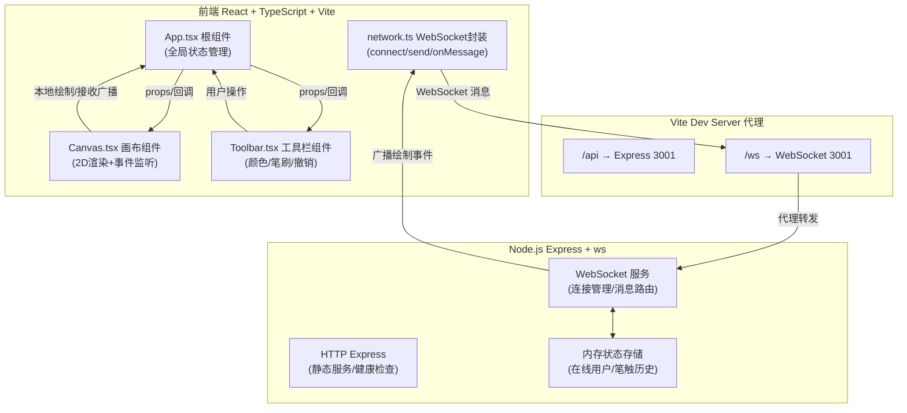
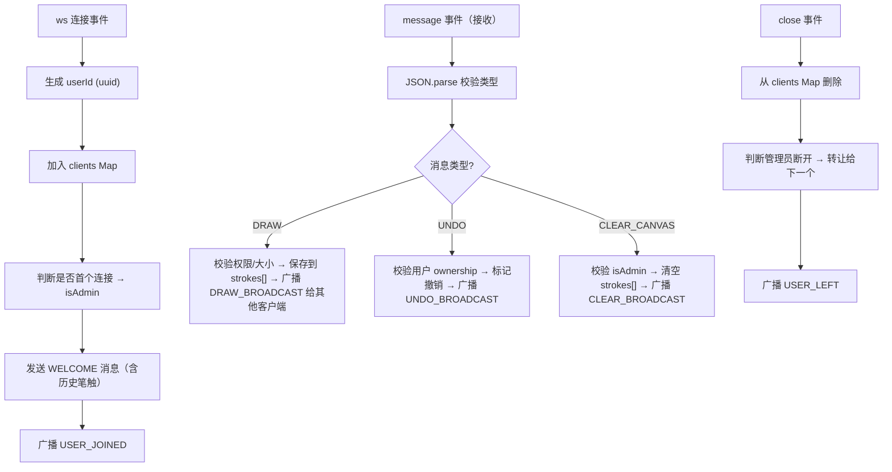

## 1. 架构设计



## 2. 技术描述

- **前端框架**：React 18 + TypeScript（严格模式）
- **构建工具**：Vite 5.x + @vitejs/plugin-react
- **画布技术**：HTML5 Canvas 2D Context
- **样式方案**：CSS Modules 内联 CSS-in-JS（style 属性 + 全局样式表）
- **HTTP服务**：Express 4.x（端口 3001）
- **实时通信**：ws 库（原生 WebSocket，端口共享 Express）
- **唯一ID**：uuid 库（v4）
- **启动方式**：`npm run dev` 同时启动 Vite（前端5173）和 ts-node（后端3001）

### 依赖清单

| 包名 | 用途 |
|------|------|
| react / react-dom | 前端UI框架 |
| express | 后端HTTP服务 |
| ws | WebSocket服务端与客户端通信 |
| uuid | 生成用户ID和笔触ID |
| typescript | 类型系统 |
| vite / @vitejs/plugin-react | 前端构建与热更新 |
| ts-node | TypeScript后端直接运行 |
| @types/express / @types/ws / @types/uuid | 类型定义 |

## 3. 文件结构与职责

```
auto15/
├── package.json              # 项目依赖与启动脚本
├── vite.config.js            # Vite 构建配置（代理 /api 和 /ws）
├── index.html                # HTML 入口，挂载 #root
├── tsconfig.json             # TypeScript 严格模式配置
├── server/
│   └── index.ts              # Express + WebSocket 服务端
└── src/
    ├── main.tsx              # React 应用入口，渲染 App
    ├── App.tsx               # 根组件，布局与全局状态
    ├── components/
    │   ├── Canvas.tsx        # 画布组件（绘制/监听/接收广播）
    │   └── Toolbar.tsx       # 工具栏组件（颜色/笔刷/撤销/清除）
    ├── utils/
    │   └── network.ts        # WebSocket 封装（connect/send/onMessage）
    └── styles/
        └── global.css        # 全局样式（深色主题、动画定义）
```

### 模块调用关系与数据流向

1. **App.tsx → Toolbar.tsx**：
   - Props 传入：`currentColor`、`brushSize`、`isAdmin`、`strokeCount`
   - 回调传出：`onColorChange(color)`、`onBrushSizeChange(size)`、`onUndo()`、`onClearCanvas()`

2. **App.tsx → Canvas.tsx**：
   - Props 传入：`currentColor`、`brushSize`、`userId`、`onlineCount`、`isClearing`
   - 回调传出：`onStrokeEnd(stroke)`（笔触完成时保存）

3. **Canvas.tsx / Toolbar.tsx → network.ts**：
   - `network.connect()`：建立连接，返回 userId
   - `network.send({ type, payload })`：发送绘制/撤销/清除消息
   - `network.onMessage(callback)`：注册消息接收回调

4. **数据流向详情**：
   ```
   用户绘制 → Canvas 采集点 → App 暂存笔触 → network.send(draw)
   → 后端 server/index.ts 解析 → 遍历其他 ws.clients 广播
   → 其他客户端 network.onMessage → Canvas 渲染到 2D Context
   ```

## 4. WebSocket 消息协议

### 4.1 客户端 → 服务端

```typescript
type ClientMessage =
  | { type: 'DRAW'; payload: DrawPayload }
  | { type: 'UNDO'; payload: UndoPayload }
  | { type: 'CLEAR_CANVAS'; payload: { userId: string } }

interface DrawPayload {
  strokeId: string
  userId: string
  color: string
  size: number
  points: { x: number; y: number }[]
}

interface UndoPayload {
  userId: string
  strokeId: string
}
```

### 4.2 服务端 → 客户端

```typescript
type ServerMessage =
  | { type: 'WELCOME'; payload: { userId: string; isAdmin: boolean; strokes: DrawPayload[] } }
  | { type: 'USER_JOINED'; payload: { userId: string; onlineCount: number } }
  | { type: 'USER_LEFT'; payload: { userId: string; onlineCount: number } }
  | { type: 'DRAW_BROADCAST'; payload: DrawPayload }
  | { type: 'UNDO_BROADCAST'; payload: UndoPayload }
  | { type: 'CLEAR_BROADCAST' }
  | { type: 'ERROR'; payload: { message: string } }
```

### 4.3 消息大小约束

- 单笔 DRAW 消息 `points.length ≤ 1000`，超出时前端截断
- 单条消息序列化后 JSON 字符串长度 `≤ 10240 bytes`（10KB），超出时拆分或丢弃

## 5. 服务端架构



**关键数据结构**（server/index.ts 内存中）：

```typescript
interface ConnectedClient {
  id: string
  ws: WebSocket
  isAdmin: boolean
}

const clients: Map<string, ConnectedClient> = new Map()
let adminId: string | null = null
const strokeHistory: DrawPayload[] = []
const undoneStrokes: Set<string> = new Set()
```

## 6. 性能优化策略

| 优化点 | 策略 |
|--------|------|
| 绘制节流 | Canvas 使用 `requestAnimationFrame` 批量提交，≤ 60fps |
| 坐标压缩 | 发送 points 时四舍五入到整数像素（`Math.round()`）减少字节 |
| 消息合并 | 连续 DRAW 事件在 rAF 帧内合并为一条（同 strokeId 则 append points） |
| 渲染分层 | 离屏 Canvas 缓存已完成笔触，新笔触在活动层绘制，完成后一次性 blit |
| 重绘范围 | 撤销时仅重绘受影响区域（最小外接矩形）而非全画布 |
| 内存上限 | strokeHistory 最多保留 5000 条笔触，超出 FIFO 淘汰最旧的 |

## 7. 启动配置说明

- **Vite 前端端口**：5173（默认）
- **后端端口**：3001
- **代理规则**（vite.config.js）：
  - `'/ws'` → `ws://localhost:3001`（WebSocket 升级）
  - `'/api'` → `http://localhost:3001`（HTTP 接口，用于健康检查）
- **启动脚本**：`npm run dev` 使用 `concurrently` 或自定义脚本同时启动 `vite` 与 `ts-node server/index.ts`
