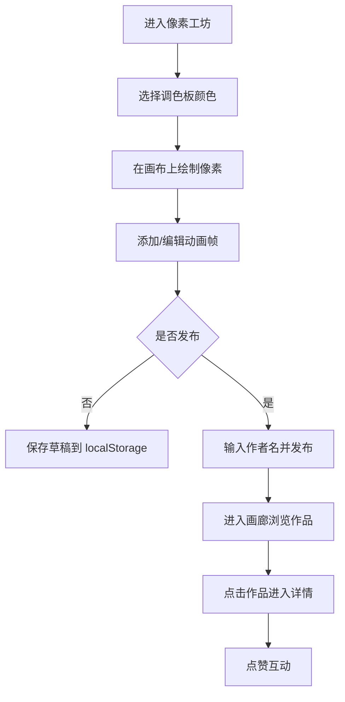

## 1. 产品概述

RetroPulse 是一个在线复古像素艺术工坊与画廊应用，用户可以在类 DOS 界面中绘制 16x16 像素精灵图，支持自定义色板和逐帧动画编辑，并可将作品发布到公共画廊供其他用户浏览和点赞。

- 目标用户：像素艺术爱好者、复古游戏开发者、独立创作者
- 产品价值：提供极简、沉浸式的像素艺术创作体验，连接创作者社区

## 2. 核心功能

### 2.1 功能模块

1. **像素工坊页**：像素画布编辑器、256 色调色板、动画帧时间轴、作品保存与发布
2. **画廊页**：作品网格展示、作品缩略图动画预览、点赞功能
3. **作品详情页**：作品完整展示、动画播放、作者信息、点赞功能

### 2.2 页面详情

| 页面名称 | 模块名称 | 功能描述 |
|-----------|-------------|---------------------|
| 像素工坊 | 像素画布 | 16x16 网格，左键绘制、右键擦除，B 键切换网格线 |
| 像素工坊 | 调色板 | 256 色 4x64 网格，点击选中，显示十六进制值 |
| 像素工坊 | 帧时间轴 | 最多 8 帧，拖拽重排，添加/删除帧，当前帧高亮 |
| 像素工坊 | 作品管理 | 保存草稿到 localStorage、发布到画廊、作者名输入 |
| 画廊 | 作品网格 | 4 列网格展示，悬停放大并播放动画，点击进入详情 |
| 画廊 | 点赞功能 | 心形图标点击点赞，实时更新，脉冲动画反馈 |
| 详情页 | 作品展示 | 320x320 完整像素图，自动循环播放动画 |
| 详情页 | 信息展示 | 作品名、作者、点赞数、返回按钮 |

## 3. 核心流程

用户进入像素工坊 → 选择颜色绘制像素 → 管理动画帧 → 保存草稿或发布作品 → 浏览画廊 → 查看作品详情 → 点赞互动

## 4. 用户界面设计

### 4.1 设计风格

- **主色调**：深色主题，背景色 `#0a0a0f`，导航栏 `#1a1a2e`
- **强调色**：浅蓝色 `#3b82f6`（当前帧高亮）、绿色 `#22c55e`（添加按钮/成功提示）、红色 `#ef4444`（删除按钮）、红色 `#ff4d4d`（点赞心）
- **按钮风格**：像素风格，极小 4px 圆角，半透明暗色背景，白色边框，悬停背景变亮
- **字体**：Press Start 2P 像素字体，营造复古 DOS 环境
- **布局**：顶部导航栏固定，画布居中，左侧调色板，上方帧时间轴
- **动画**：所有过渡 200ms ease-out，帧切换干脆，悬停放大流畅

### 4.2 页面设计概述

| 页面名称 | 模块名称 | UI 元素 |
|-----------|-------------|-------------|
| 像素工坊 | 像素画布 | 320x320px 画布，20px 每格，浅灰网格线 `#333`，每 4x4 深灰辅助线 `#555` |
| 像素工坊 | 调色板 | 320px 宽，5x5px 色块 64 列，选中 3px 白边，8px 自定义滚动条 |
| 像素工坊 | 帧时间轴 | 120px 高，60x60px 缩略图，2px 浅蓝当前帧边框，绿色+红色圆形按钮 |
| 像素工坊 | 底部控制栏 | 保存草稿按钮、发布按钮、作者名输入框（160px 宽）、Toast 提示 |
| 画廊 | 网格布局 | 4 列 16px 间距，200px 缩略图，悬停 scale(1.1)，作者名 12px，点赞心 16px→20px 脉冲 |
| 详情页 | 内容布局 | 320x320 像素图居中，18px 作品名，14px 浅灰作者，返回按钮半透明白 |

### 4.3 响应式设计

- 桌面优先，宽度 < 768px 时：
  - 调色板面板折叠到画布下方
  - 画廊网格变为 2 列
  - 触摸操作优化

### 4.4 性能要求

- 像素绘制操作 60FPS，Canvas 使用离屏缓冲
- 画廊列表首次加载 200ms 内完成接口请求和渲染
