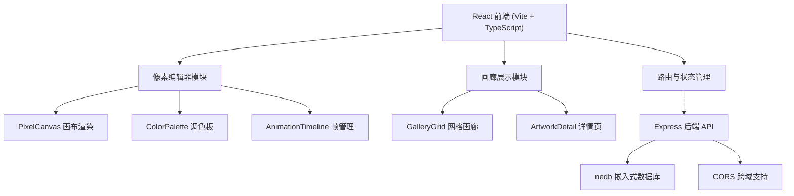
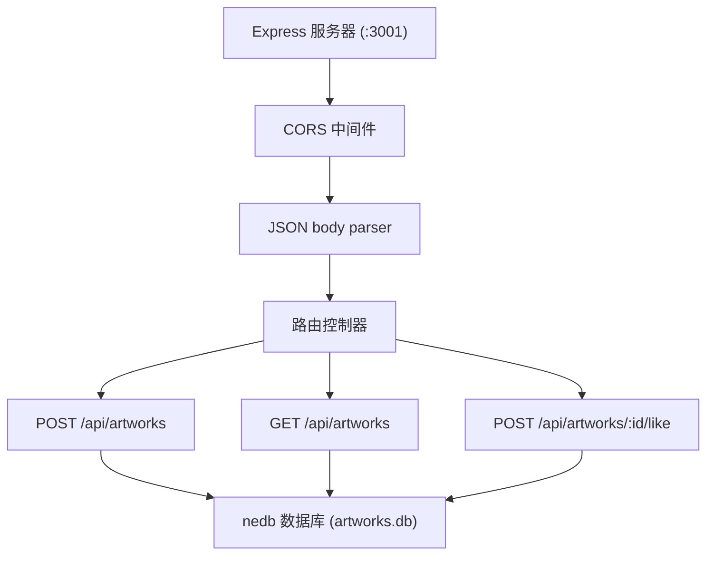
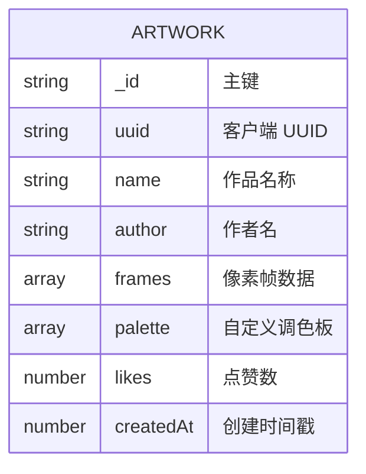

## 1. 架构设计



## 2. 技术说明

- **前端框架**：React 18 + TypeScript + Vite
- **状态管理**：React useState/useReducer（轻量级场景）
- **路由**：react-router-dom
- **后端**：Express 4 + TypeScript
- **数据库**：nedb-promises（嵌入式 NoSQL）
- **构建工具**：Vite
- **字体**：Google Fonts - Press Start 2P

## 3. 路由定义

| 路由 | 用途 |
|-------|---------|
| `/` | 像素工坊主页，包含画布编辑器 |
| `/gallery` | 公共画廊页面，网格展示所有作品 |
| `/gallery/:id` | 作品详情页，展示单幅作品完整信息 |

## 4. API 定义

### 4.1 TypeScript 类型定义

```typescript
// 单个像素帧：16x16 二维数组，存储颜色索引或透明值
type PixelFrame = (string | null)[][];  // 16x16，存储 hex 颜色或 null（透明）

// 作品数据结构
interface Artwork {
  _id?: string;
  uuid: string;
  name: string;
  author: string;
  frames: PixelFrame[];       // 最多 8 帧
  palette: string[];          // 用户选中的自定义调色板（最多 256 色）
  likes: number;
  createdAt: number;
}

// 创建作品请求
interface CreateArtworkRequest {
  uuid: string;
  name: string;
  author: string;
  frames: PixelFrame[];
  palette: string[];
}
```

### 4.2 REST API 接口

| 方法 | 路径 | 请求体 | 响应 | 用途 |
|------|------|--------|------|------|
| POST | `/api/artworks` | `CreateArtworkRequest` | `Artwork` | 保存/发布新作品 |
| GET | `/api/artworks` | - | `Artwork[]` | 获取所有作品列表 |
| POST | `/api/artworks/:id/like` | - | `{ likes: number }` | 为指定作品点赞 +1 |

## 5. 服务器架构



## 6. 数据模型

### 6.1 ER 图



### 6.2 数据库说明

- 使用 nedb 嵌入式数据库，无需额外安装
- 数据文件存储在项目根目录下 `data/artworks.db`
- `_id` 由 nedb 自动生成，作为唯一标识
- `uuid` 由客户端生成，用于草稿匹配

## 7. 项目文件结构

```
.
├── package.json
├── index.html
├── vite.config.js
├── tsconfig.json
├── server/
│   └── server.ts              # Express 后端 API
├── src/
│   ├── main.tsx               # React 入口
│   ├── App.tsx                # 根组件与路由
│   ├── index.css              # 全局样式（Press Start 2P、像素风）
│   ├── pixelengine/
│   │   ├── PixelCanvas.tsx    # 16x16 像素画布
│   │   ├── ColorPalette.tsx   # 256 色调色板
│   │   └── AnimationTimeline.tsx  # 帧时间轴
│   ├── gallery/
│   │   ├── GalleryGrid.tsx    # 画廊网格
│   │   └── ArtworkDetail.tsx  # 作品详情
│   ├── components/
│   │   └── Navbar.tsx         # 顶部导航
│   └── pages/
│       ├── Workshop.tsx       # 像素工坊页面
│       └── Gallery.tsx        # 画廊页面
└── data/                      # nedb 数据文件目录（运行时创建）
```
