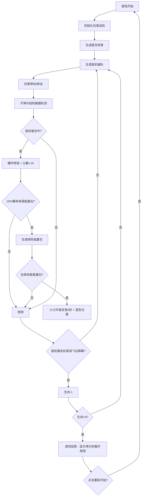

## 1. 产品概述

银河战机空战小游戏，玩家控制战机在星空背景中迎击敌机编队，通过击落敌机获取分数，挑战生存时间。

- 核心玩法：射击、躲避、收集能量包
- 目标用户：休闲游戏玩家，适合所有年龄段
- 产品价值：提供快速上手、紧张刺激的休闲游戏体验

## 2. 核心功能

### 2.1 用户角色
无需注册，单人单机游戏。

### 2.2 功能模块
1. **游戏主界面**：Canvas游戏画布、状态栏、触控控件（移动端）
2. **玩家战机系统**：移动控制、射击系统、生命系统、火力升级
3. **敌机系统**：编队生成、V字/一字形排列、俯冲移动、碰撞检测
4. **道具系统**：能量包掉落、火力增强、特效展示
5. **粒子特效系统**：爆炸效果、子弹尾迹、光晕特效
6. **UI系统**：分数显示、生命图标、火力等级、游戏结束界面

### 2.3 功能详情

| 功能模块 | 子功能 | 详细描述 |
|---------|--------|---------|
| 玩家控制 | 移动 | WASD按键控制上下左右移动，移动端虚拟摇杆 |
| 玩家控制 | 射击 | 空格键或鼠标点击开火，移动端射击按钮 |
| 战斗系统 | 子弹 | 固定速度向上飞行，击中敌机爆炸得分+10 |
| 战斗系统 | 敌机 | 每波3-5架，V字形或一字形编队，随机速度俯冲 |
| 战斗系统 | 碰撞 | 敌机飞出屏幕或撞击玩家，玩家损失1条生命 |
| 道具系统 | 能量包 | 15%概率掉落绿色能量包，获得后火力升级为双发5秒 |
| 特效系统 | 爆炸 | 敌机被击中产生粒子碎片动画 |
| 特效系统 | 光晕 | 火力升级时战机周围闪烁蓝色光晕 |
| UI系统 | 状态栏 | 底部半透明栏显示分数、红色心形生命、星形火力等级 |
| UI系统 | 结束界面 | 生命耗尽显示最终得分和重新开始按钮 |

## 3. 核心流程

## 4. 用户界面设计

### 4.1 设计风格
- **主色调**：深邃星空蓝到紫色渐变背景
- **点缀色**：红色（生命/爆炸）、绿色（能量包）、蓝色（光晕/子弹）、黄色（分数/星星）
- **字体**：科技感无衬线字体，适合游戏场景
- **视觉风格**：深空科幻主题，粒子效果丰富

### 4.2 界面元素

| 界面区域 | 元素 | 样式描述 |
|---------|------|---------|
| 背景 | 星空 | 深蓝到紫色垂直渐变，散布闪烁白色小星星 |
| 玩家战机 | 战机 | 流线型科幻战机，机身主体浅灰色，引擎尾焰蓝色 |
| 敌机 | 敌机 | 暗红色三角编队战机，不同尺寸区分 |
| 能量包 | 道具 | 绿色发光旋转立方体 |
| 状态栏 | 底部栏 | 黑色半透明 (rgba(0,0,0,0.7))，圆角顶部 |
| 状态栏 | 分数 | 黄色大号字体，左侧显示 |
| 状态栏 | 生命 | 红色心形图标 ×3，中间显示 |
| 状态栏 | 火力 | 星形图标 ×1~2，右侧显示 |
| 移动端 | 虚拟摇杆 | 左下角半透明圆盘，可拖动控制方向 |
| 移动端 | 射击按钮 | 右下角圆形红色按钮，点击射击 |
| 结束界面 | 弹窗 | 居中半透明黑色背景，白色文字显示最终得分 |
| 结束界面 | 重开按钮 | 蓝色圆角按钮，悬停发光效果 |

### 4.3 响应式设计
- **桌面端**：全屏Canvas，键盘WASD+空格/鼠标控制
- **移动端**：自动检测屏幕尺寸，适配Canvas大小，显示虚拟摇杆和射击按钮
- **自适应**：游戏元素位置根据Canvas尺寸动态调整

### 4.4 动效设计
- **星星闪烁**：随机时间间隔改变透明度
- **爆炸粒子**：20~30个碎片向四周扩散，逐渐消失
- **能量包旋转**：3D旋转效果，绿色光晕脉动
- **蓝色光晕**：火力升级时战机周围圆形光环脉动闪烁
- **按钮悬停**：结束界面按钮悬停时缩放和发光

## 5. 性能要求

- 帧率：普通配置机器不低于40FPS
- 内存管理：子弹和敌机超出屏幕后及时销毁
- 响应式：支持窗口大小变化，游戏区域自动适配
