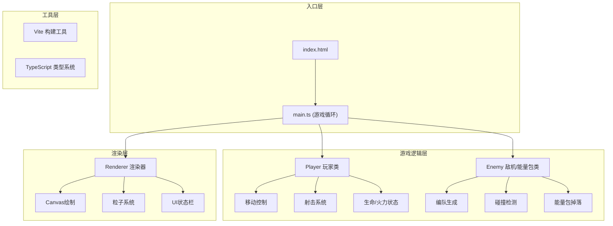

## 1. 架构设计



## 2. 技术栈描述

- **前端核心**：HTML5 Canvas 2D + TypeScript
- **构建工具**：Vite 5.x
- **编程语言**：TypeScript 5.x (严格模式, ESNext目标)
- **包管理**：npm
- **无后端**：纯前端单机游戏，无需服务端支持

## 3. 文件结构

| 文件路径 | 职责描述 |
|---------|---------|
| `package.json` | 项目依赖配置，typescript + vite，启动脚本 `npm run dev` |
| `index.html` | 入口页面，全屏Canvas容器 |
| `tsconfig.json` | TypeScript配置，严格模式，ESNext目标 |
| `vite.config.js` | Vite构建配置 |
| `src/main.ts` | 游戏循环入口，初始化游戏对象，驱动帧更新 |
| `src/player.ts` | 玩家战机类，移动、射击、生命与火力状态管理 |
| `src/enemy.ts` | 敌机与能量包类，编队生成、移动、碰撞检测 |
| `src/renderer.ts` | 渲染层，Canvas绘制、粒子系统、UI状态栏 |

## 4. 核心数据结构定义

### 4.1 玩家状态
```typescript
interface PlayerState {
  x: number;
  y: number;
  width: number;
  height: number;
  speed: number;
  lives: number;       // 3条生命
  fireLevel: number;   // 1=单发, 2=双发
  powerUpTimer: number; // 火力升级剩余时间
  isPowerUp: boolean;  // 是否处于火力增强状态
}
```

### 4.2 子弹
```typescript
interface Bullet {
  x: number;
  y: number;
  width: number;
  height: number;
  speed: number;
  active: boolean;
}
```

### 4.3 敌机
```typescript
interface Enemy {
  x: number;
  y: number;
  width: number;
  height: number;
  speed: number;
  active: boolean;
  formation: 'v' | 'line'; // 编队类型
}
```

### 4.4 能量包
```typescript
interface PowerUp {
  x: number;
  y: number;
  width: number;
  height: number;
  speed: number;
  active: boolean;
  rotation: number; // 旋转角度
}
```

### 4.5 粒子
```typescript
interface Particle {
  x: number;
  y: number;
  vx: number;
  vy: number;
  life: number;
  maxLife: number;
  color: string;
  size: number;
}
```

### 4.6 星星背景
```typescript
interface Star {
  x: number;
  y: number;
  size: number;
  speed: number;
  twinkle: number; // 闪烁相位
}
```

### 4.7 游戏状态
```typescript
interface GameState {
  score: number;
  isGameOver: boolean;
  isPaused: boolean;
  canvasWidth: number;
  canvasHeight: number;
  isMobile: boolean;
}
```

## 5. 核心算法

### 5.1 游戏主循环
```typescript
// 使用 requestAnimationFrame
function gameLoop(timestamp: number) {
  const deltaTime = timestamp - lastTime;
  lastTime = timestamp;
  
  if (!gameState.isGameOver) {
    update(deltaTime); // 更新所有游戏对象
  }
  render(); // 渲染帧
  requestAnimationFrame(gameLoop);
}
```

### 5.2 碰撞检测 (AABB)
```typescript
function checkCollision(a: Rect, b: Rect): boolean {
  return a.x < b.x + b.width &&
         a.x + a.width > b.x &&
         a.y < b.y + b.height &&
         a.y + a.height > b.y;
}
```

### 5.3 敌机编队生成
- V字形：以中心点为基准，左右对称排列
- 一字形：水平等间距排列
- 每波3-5架，随机选择编队类型

### 5.4 内存管理
- 每帧检查所有活动对象的位置
- 超出屏幕边界（上下左右各50px缓冲区）的对象标记为非活动
- 使用数组filter清理非活动对象

## 6. 输入处理

### 6.1 键盘事件
- `keydown`：记录按键状态
- `keyup`：清除按键状态
- WASD：移动方向
- 空格：射击

### 6.2 鼠标事件
- `mousedown`：射击
- `mousemove`：可选的鼠标跟随移动（预留扩展）

### 6.3 触控事件
- 虚拟摇杆：`touchstart`/`touchmove`/`touchend` 计算方向
- 射击按钮：`touchstart` 触发射击

## 7. 性能优化策略

1. **对象池模式**：子弹和粒子对象复用，减少GC
2. **分层渲染**：背景层、游戏层、UI层分离
3. **离屏渲染**：静态元素（如战机形状）预渲染到离屏Canvas
4. **帧率控制**：使用deltaTime确保移动速度与帧率无关
5. **及时清理**：每帧清理超出边界的对象，释放内存
