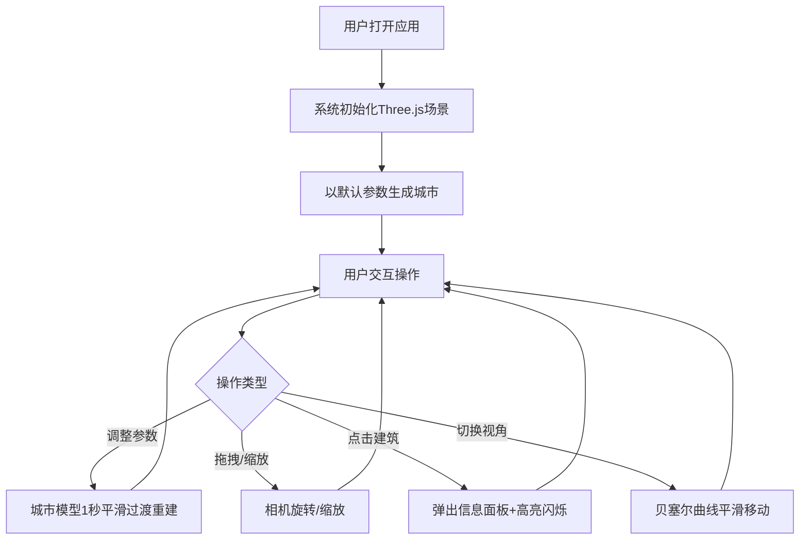

## 1. 产品概述
基于Web的3D城市天际线生成与交互可视化应用，用户通过参数面板实时调整建筑密度、高度变化范围和光照角度，系统动态生成三维城市模型并支持拖拽旋转和缩放查看。面向设计师、城市规划爱好者及3D可视化开发者。

## 2. 核心功能

### 2.1 功能模块
1. **3D城市生成区**：全屏Three.js渲染区域，展示参数驱动的城市天际线模型
2. **控制面板**：右侧半透明毛玻璃风格参数面板，包含城市生成、光照和视角控制

### 2.2 页面详情
| 页面名称 | 模块名称 | 功能描述 |
|----------|----------|----------|
| 主页面 | 3D城市渲染区 | 全屏Three.js画布，渲染城市建筑群、地面网格、雾效、光照和阴影 |
| 主页面 | 控制面板-城市参数 | 建筑密度滑块（10-50）、高度范围滑块（10-80）、随机种子滑块 |
| 主页面 | 控制面板-光照控制 | 方向光水平角度（0-360°）、仰角（0-90°）、环境光强度（0.2-1.0） |
| 主页面 | 控制面板-视角预设 | 俯视/平视/自由视角三种预设按钮 |
| 主页面 | 建筑信息面板 | 点击建筑弹出信息卡片，显示编号、高度、楼层数 |
| 主页面 | 建筑交互反馈 | 悬停光晕、点击高亮闪烁（黄色轮廓线）、脉冲波纹扩散 |

## 3. 核心流程

用户打开应用 → 系统以默认参数生成初始城市 → 用户通过控制面板调整参数 → 城市模型1秒内平滑过渡重建 → 用户拖拽旋转/滚轮缩放查看 → 点击建筑查看信息 → 切换视角预设 → 相机沿贝塞尔曲线平滑移动

## 4. 用户界面设计

### 4.1 设计风格
- **主色调**：深蓝到银灰的城市夜景感，建筑高度渐变（浅绿→银灰）
- **控制面板**：半透明毛玻璃风格，背景rgba(255,255,255,0.15)，模糊10px
- **滑块样式**：渐变色轨道（深蓝→紫罗兰）
- **字体**：显示字体Rajdhani（科技感），UI字体Source Sans 3
- **布局**：全屏3D渲染区+右侧300px浮动控制面板
- **光照色调**：暖色#ffd700到冷色#87ceeb渐变

### 4.2 页面设计概览
| 页面名称 | 模块名称 | UI元素 |
|----------|----------|--------|
| 主页面 | 3D渲染区 | 全屏Canvas，浅灰网格地面，雾效#b0c4de（近50远200），建筑高度渐变色 |
| 主页面 | 控制面板 | 右侧300px浮动，毛玻璃背景，渐变轨道滑块，数值0.3s滚动动画 |
| 主页面 | 信息面板 | 点击建筑弹出卡片，显示编号/高度/楼层 |
| 主页面 | 交互反馈 | 悬停径向渐变光晕（5px），点击黄色轮廓线闪烁（0.5s）+脉冲波纹 |

### 4.3 响应式适配
- 桌面端：控制面板固定右侧300px宽
- 移动端：控制面板折叠为底部可展开抽屉

### 4.4 3D场景指引
- **环境**：浅灰色网格地面，#b0c4de雾效营造远景朦胧感
- **光照**：环境光+方向光（可调角度），方向光开启阴影映射，色调随角度从暖#ffd700到冷#87ceeb渐变
- **相机**：透视相机，默认45°俯角，支持三种预设（俯视、平视、自由视角）
- **建筑**：BoxGeometry几何体，颜色基于高度从浅绿到银灰渐变，参数变化时1秒平滑过渡
- **交互**：OrbitControls式拖拽旋转+滚轮缩放，Raycaster点击检测，悬停光晕，点击高亮闪烁+波纹
- **后处理**：建筑外框高亮闪烁用EdgesGeometry实现
- **性能**：参数拖动时≥30FPS，静态观察时≥55FPS

## 5. 性能要求
- 参数连续拖动调整时，城市重建动画帧率不低于30FPS
- 场景静态观察时帧率稳定在55FPS以上
- 城市重建过渡时间1秒（淡出淡入）
- 视角切换过渡时间1.5秒（贝塞尔曲线）
