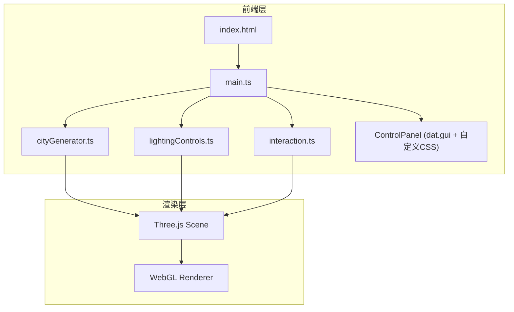

## 1. 架构设计



## 2. 技术说明
- **前端框架**：纯TypeScript + Three.js（无React/Vue，用户明确指定）
- **构建工具**：Vite
- **3D引擎**：Three.js
- **控制面板**：dat.gui + 自定义CSS覆盖实现毛玻璃风格
- **语言**：TypeScript（严格模式）
- **运行方式**：npm install && npm run dev

## 3. 文件结构与模块职责

| 文件 | 职责 |
|------|------|
| package.json | 依赖管理：three, @types/three, vite, typescript, dat.gui, @types/dat.gui |
| tsconfig.json | TypeScript严格模式，ESNext模块，ES2020目标 |
| vite.config.js | 基础Vite构建配置 |
| index.html | 入口HTML，全屏渲染容器div#app |
| src/main.ts | 应用入口：初始化场景/相机/渲染器，集成各模块，启动动画循环 |
| src/cityGenerator.ts | 城市生成：根据参数生成建筑网格和地面，输出场景对象组 |
| src/lightingControls.ts | 光照管理：环境光+方向光，暴露调整接口，色调渐变逻辑 |
| src/interaction.ts | 交互控制：鼠标拖拽旋转、滚轮缩放、Raycaster点击检测 |

## 4. 模块接口定义

### 4.1 cityGenerator.ts
```typescript
interface CityParams {
  density: number;       // 10-50
  heightMin: number;     // 最小高度
  heightMax: number;     // 最大高度（10-80）
  seed: number;          // 随机种子
}

interface CityGenerator {
  generate(params: CityParams): THREE.Group;
  update(params: CityParams, transitionDuration?: number): void;
  getBuildingById(id: number): BuildingData | null;
}

interface BuildingData {
  id: number;
  height: number;
  floors: number;
  mesh: THREE.Mesh;
}
```

### 4.2 lightingControls.ts
```typescript
interface LightingParams {
  azimuth: number;       // 水平角度 0-360
  elevation: number;     // 仰角 0-90
  ambientIntensity: number; // 0.2-1.0
}

interface LightingControls {
  update(params: LightingParams): void;
  getLights(): { ambient: THREE.AmbientLight; directional: THREE.DirectionalLight };
}
```

### 4.3 interaction.ts
```typescript
interface CameraPreset {
  name: string;
  position: THREE.Vector3;
  target: THREE.Vector3;
}

interface InteractionControls {
  enable(): void;
  disable(): void;
  setPreset(preset: CameraPreset, duration?: number): void;
  onBuildingClick(callback: (building: BuildingData) => void): void;
  onBuildingHover(callback: (building: BuildingData | null) => void): void;
}
```

## 5. 核心算法

### 5.1 伪随机数生成器（ seeded random ）
使用线性同余法根据种子生成可重复的随机序列，确保相同种子产生相同城市布局。

### 5.2 建筑颜色渐变
高度0-20单位：浅绿色 #90ee90 → 高度80单位：银灰色 #c0c0c0
使用THREE.Color.lerpColors进行线性插值。

### 5.3 光照色调渐变
水平角度0-180°：暖色 #ffd700 → 冷色 #87ceeb → 180-360°：冷色 → 暖色
使用正弦函数实现周期性渐变。

### 5.4 相机贝塞尔曲线移动
三次贝塞尔曲线：P0(当前位置) → P1(控制点1) → P2(控制点2) → P3(目标位置)
使用t参数0→1的缓动函数实现1.5秒平滑移动。

### 5.5 城市重建过渡
旧建筑组opacity从1→0（0.5秒），新建筑组opacity从0→1（0.5秒）
使用THREE.MeshStandardMaterial的transparent属性和opacity动画。

## 6. 性能优化策略
- 建筑使用InstancedMesh或合并几何体减少draw call
- 阴影贴图分辨率控制在1024x1024
- 参数变化时使用requestAnimationFrame驱动的过渡动画
- 移动端降低建筑数量和阴影质量
- 使用Three.js的fog实现远景裁剪
