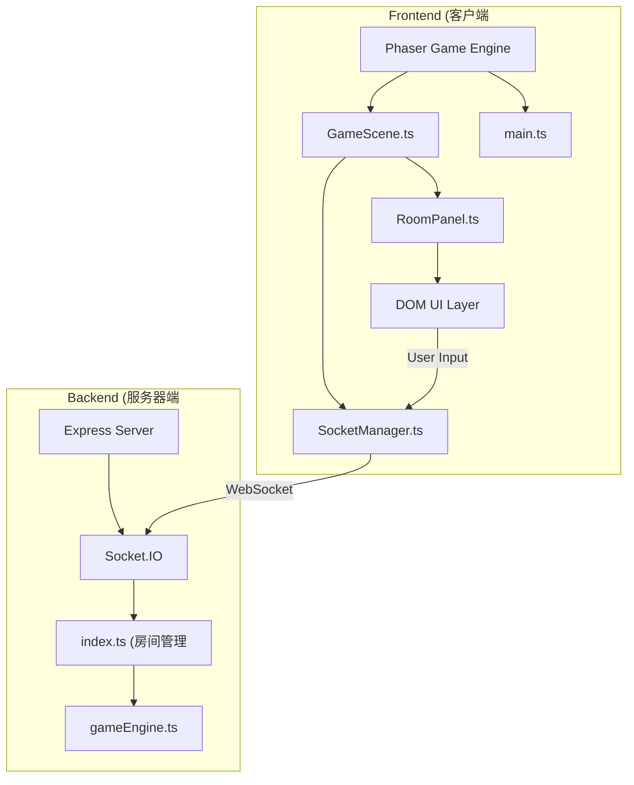
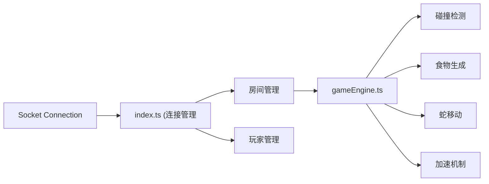

## 1. 架构设计



## 2. 技术描述

- 前端：TypeScript + Vite + Phaser@3 + socket.io-client
- 后端：Node.js + Express@4 + Socket.IO@4 + uuid
- 构建工具：Vite@5
- 代码规范：TypeScript 严格模式，ESNext目标
- 启动方式：concurrently 同时启动前端(3000端口)和后端(3001端口)

## 3. 目录结构

```
project/
├── package.json
├── index.html
├── tsconfig.json
├── vite.config.js
├── server/
│   ├── index.ts
│   └── gameEngine.ts
└── src/
    ├── main.ts
    ├── scene/
    │   └── GameScene.ts
    ├── network/
    │   └── socketManager.ts
    └── ui/
        └── roomPanel.ts
```

## 4. 核心类型定义

```typescript
interface Position {
  x: number;
  y: number;
}

interface Snake {
  id: string;
  nickname: string;
  body: Position[];
  direction: Direction;
  color: string;
  score: number;
  speed: number;
  isBoosted: boolean;
  foodEaten: number;
  isAlive: boolean;
  killCount: number;
  spawnTime: number;
}

interface Food {
  id: string;
  position: Position;
  type: 'normal' | 'speed';
}

interface Room {
  id: string;
  name: string;
  maxPlayers: number;
  players: PlayerInfo[];
  status: 'waiting' | 'playing' | 'ended';
  gameState?: GameState;
}

interface PlayerInfo {
  id: string;
  nickname: string;
  roomId: string;
  isReady: boolean;
}

interface GameState {
  snakes: Snake[];
  foods: Food[];
  gridSize: { width: number; height: number };
  startTime: number;
}

interface ChatMessage {
  id: string;
  playerId: string;
  nickname: string;
  content: string;
  timestamp: number;
}

interface GameStats {
  playerId: string;
  nickname: string;
  score: number;
  survivalTime: number;
  killCount: number;
  rank: number;
}
```

## 5. Socket.IO 事件定义

### 客户端发送事件
| 事件名 | 参数 | 说明 |
|--------|------|------|
| `set_nickname` | { nickname: string } | 设置玩家昵称 |
| `create_room` | { name: string, maxPlayers: number } | 创建房间 |
| `join_room` | { roomId: string } | 加入房间 |
| `leave_room` | {} | 离开房间 |
| `get_rooms` | {} | 获取房间列表 |
| `start_game` | {} | 开始游戏 |
| `change_direction` | { direction: Direction } | 改变蛇的方向 |
| `send_chat` | { content: string } | 发送聊天消息 |

### 服务器发送事件
| 事件名 | 参数 | 说明 |
|--------|------|------|
| `room_list` | { rooms: Room[] } | 房间列表更新 |
| `player_joined` | { player: PlayerInfo } | 玩家加入房间 |
| `player_left` | { playerId: string } | 玩家离开房间 |
| `chat_message` | { message: ChatMessage } | 收到聊天消息 |
| `game_start` | { gameState: GameState } | 游戏开始 |
| `game_update` | { gameState: GameState } | 游戏状态更新 (60ms间隔) |
| `player_dead` | { snakeId: string, killerId?: string } | 玩家死亡 |
| `game_over` | { stats: GameStats[] } | 游戏结束，返回统计数据 |
| `speed_boost` | { snakeId: string } | 玩家进入加速状态 |

## 6. 服务器架构



## 7. 游戏引擎核心逻辑

### 7.1 碰撞检测
- 蛇头与墙壁碰撞 → 死亡
- 蛇头与其他蛇身体碰撞 → 死亡，击杀者得分+1
- 蛇头与自身身体碰撞 → 死亡
- 蛇头与食物碰撞 → 得分，蛇身增长

### 7.2 加速机制
- 每吃5个食物 → 速度提升50%，持续10秒
- 加速状态显示特效

### 7.3 游戏循环
- 服务器以固定tick rate (15-20 ticks/秒) 更新游戏状态
- 广播状态到所有客户端
- 客户端使用插值优化渲染

## 8. 前端性能优化

- Phaser自动批处理渲染
- 对象池复用粒子效果
- 游戏状态插值平滑
- 请求AnimationFrame驱动渲染
- Canvas硬件加速
