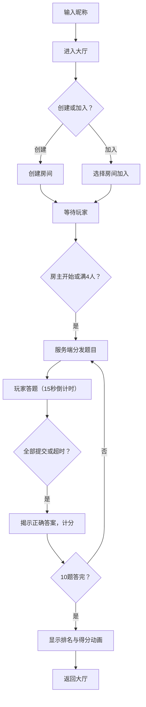

## 1. 产品概述

QuizArena 是一个实时多人知识问答对战应用，面向在线学习平台学员，通过限时答题比拼提升学习参与感和知识掌握度。玩家可以创建或加入房间，与随机匹配的对手进行限时答题对战，系统根据正确率和用时综合计算得分并排定名次。

- 目标用户：在线学习平台学员
- 核心价值：将枯燥的知识复习转化为竞技游戏，通过实时对抗激发学习动力

## 2. 核心功能

### 2.1 用户角色

| 角色 | 进入方式 | 核心权限 |
|------|----------|----------|
| 玩家 | 输入昵称进入 | 创建/加入房间、答题对战、聊天 |

### 2.2 功能模块

1. **大厅页面（Lobby）**：昵称输入、创建房间、房间列表、在线人数显示、加入房间
2. **游戏页面（GameBoard）**：题目展示、选项作答、倒计时、对手状态、答案反馈、计分排名

### 2.3 页面详情

| 页面名称 | 模块名称 | 功能描述 |
|----------|----------|----------|
| 大厅页面 | 昵称输入 | 玩家输入昵称后进入大厅，昵称作为房间内显示名 |
| 大厅页面 | 创建房间 | 点击创建房间按钮，自动生成房间ID，创建者自动加入 |
| 大厅页面 | 房间列表 | 实时展示所有等待中的房间、在线人数、房间状态 |
| 大厅页面 | 加入房间 | 点击已有房间即可加入，每房间最多4人 |
| 大厅页面 | 聊天区域 | 大厅内玩家可发送文字消息 |
| 游戏页面 | 题目区 | 中央白色圆角卡片显示题干和4个选项按钮 |
| 游戏页面 | 倒计时 | 顶部显示15秒倒计时进度条和数字，最后3秒脉冲动画 |
| 游戏页面 | 答案反馈 | 提交答案后绿色/红色闪烁反馈，全部提交后揭示正确答案 |
| 游戏页面 | 对手状态面板 | 两侧显示各玩家头像、昵称、当前得分、答题状态 |
| 游戏页面 | 题目进度 | 顶部显示当前题号（如5/10） |
| 游戏页面 | 聊天区域 | 房间内玩家可发送文字消息，支持表情符号识别 |
| 游戏页面 | 结算排名 | 一轮结束后显示本局排名，得分数字滚动动画 |

## 3. 核心流程

### 3.1 玩家进入与匹配流程

1. 玩家输入昵称进入大厅
2. 大厅展示所有等待中的房间及在线人数
3. 玩家选择创建新房间或加入已有房间
4. 房间内等待其他玩家加入，房主可开始游戏
5. 达到人数上限（4人）或房主点击开始后进入游戏

### 3.2 答题对战流程

1. 服务端从题库中选取题目，根据玩家历史正确率自适应调整难度
2. 每道题15秒倒计时，题目通过Socket.IO推送至所有玩家
3. 玩家点击选项提交答案，客户端立即显示正确/错误反馈
4. 所有玩家提交或倒计时归零后，揭示正确答案并进入下一题
5. 一轮共10题，结束后显示排名和详细得分

### 3.3 计分规则

- 答对：基础分100分 + 剩余秒数 × 5分
- 答错/超时：0分（不扣分）
- 排名按总得分降序排列

### 3.4 流程图

## 4. 用户界面设计

### 4.1 设计风格

- 主色调：蓝紫渐变（#667eea 到 #764ba2）
- 辅助色：白色卡片背景、深色文字
- 按钮样式：圆角按钮，hover放大1.05倍+箱阴影过渡，选中蓝色边框呼吸动画
- 字体：Sans-serif，题干加粗显示
- 布局：中央题目区 + 两侧玩家信息栏，移动端折叠到底部
- 图标：使用lucide-react图标库

### 4.2 页面设计概述

| 页面名称 | 模块名称 | UI元素 |
|----------|----------|--------|
| 大厅页面 | 整体布局 | 蓝紫渐变背景，中央白色卡片容器，标题使用渐变文字 |
| 大厅页面 | 昵称输入 | 圆角输入框，渐变边框聚焦效果 |
| 大厅页面 | 创建房间按钮 | 渐变背景按钮，hover放大1.05倍+阴影 |
| 大厅页面 | 房间列表 | 白色圆角卡片列表，每项显示房间名、人数、状态标签 |
| 游戏页面 | 中央题目区 | 白色圆角卡片，题干粗体，4个选项按钮网格排列 |
| 游戏页面 | 倒计时进度条 | 线性渐变绿→红，最后3秒脉冲放大动画 |
| 游戏页面 | 选项按钮 | 圆角按钮，hover放大1.05倍+箱阴影，选中蓝色边框呼吸动画 |
| 游戏页面 | 玩家信息栏 | 两侧垂直排列，显示头像、昵称、得分、答题状态图标 |
| 游戏页面 | 答案反馈 | 正确绿色闪烁、错误红色闪烁，300ms ease-out过渡 |
| 游戏页面 | 排名结算 | 卡片式排名列表，得分数字滚动动画 |
| 游戏页面 | 聊天区域 | 底部半透明输入框，消息气泡显示昵称+时间戳+内容 |

### 4.3 响应式适配

- 桌面端（≥768px）：中央题目区 + 两侧玩家信息栏经典三栏布局
- 移动端（<768px）：两侧信息栏折叠到底部，题目区占满主体宽度，聊天区域折叠为可展开面板
- 所有过渡动画时长统一为300ms ease-out

### 4.4 动画规范

- 选项hover：transform scale(1.05) + box-shadow，300ms ease-out
- 选中选项：蓝色边框呼吸动画（opacity脉冲），300ms ease-out
- 倒计时进度条：宽度线性缩减，颜色从绿色(#4ade80)过渡到红色(#ef4444)
- 最后3秒脉冲：进度条transform scale脉冲放大动画
- 答案反馈：背景色闪烁（绿/红），300ms ease-out
- 得分滚动：数字从0滚动到最终值，300ms ease-out
