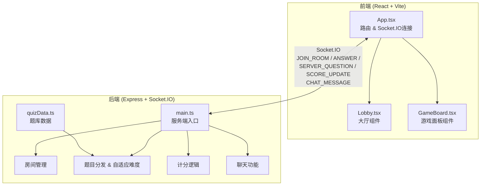
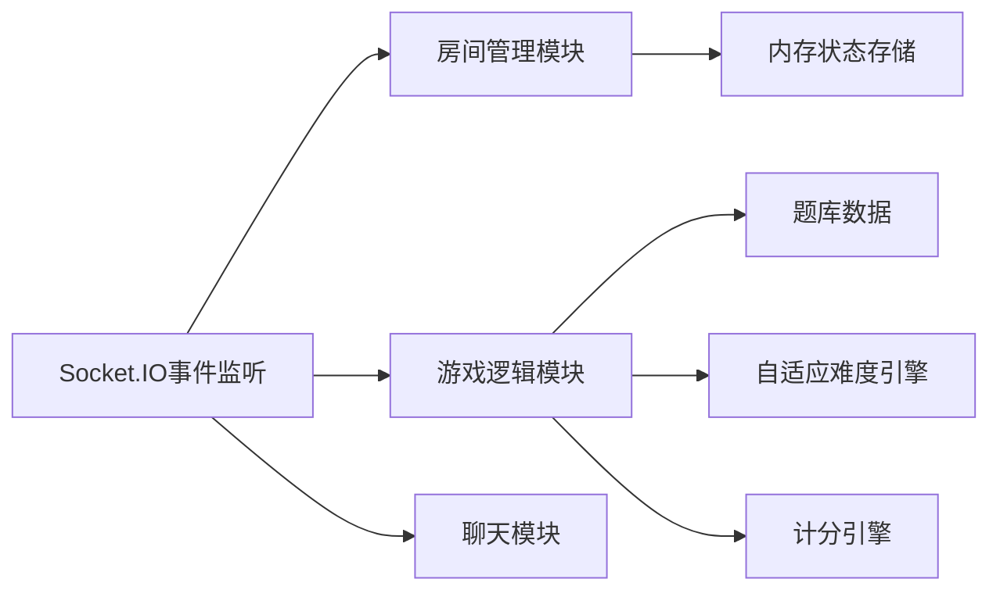

## 1. 架构设计



### 数据流向

1. **客户端 → 服务端**：`JOIN_ROOM`（加入房间）、`ANSWER`（提交答案）、`CHAT_MESSAGE`（聊天消息）、`CREATE_ROOM`（创建房间）、`START_GAME`（开始游戏）
2. **服务端 → 客户端**：`SERVER_QUESTION`（推送题目）、`SCORE_UPDATE`（得分更新）、`ROOM_LIST`（房间列表）、`ROOM_STATE`（房间状态）、`ANSWER_RESULT`（答案结果）、`GAME_OVER`（游戏结束排名）、`CHAT_MESSAGE`（聊天消息广播）

## 2. 技术说明

- **前端**：React@18 + TypeScript + Vite + Tailwind CSS
- **初始化工具**：vite-init（react-express-ts模板）
- **后端**：Express@4 + Socket.IO
- **实时通信**：Socket.IO（双向事件驱动）
- **状态管理**：Zustand
- **数据库**：无持久化数据库，所有状态在服务端内存中维护（会话级别）

## 3. 路由定义

| 路由 | 用途 |
|------|------|
| `/` | 大厅页面，输入昵称、创建/加入房间 |
| `/game/:roomId` | 游戏页面，答题对战界面 |

## 4. Socket.IO 事件定义

### 4.1 客户端发送事件

```typescript
interface ClientEvents {
  JOIN_ROOM: { roomId: string; nickname: string };
  CREATE_ROOM: { nickname: string };
  START_GAME: { roomId: string };
  ANSWER: { roomId: string; questionIndex: number; answerIndex: number; timeRemaining: number };
  CHAT_MESSAGE: { roomId: string; message: string };
  LEAVE_ROOM: { roomId: string };
}
```

### 4.2 服务端发送事件

```typescript
interface ServerEvents {
  ROOM_LIST: Room[];
  ROOM_STATE: RoomState;
  SERVER_QUESTION: { questionIndex: number; question: Question; timeLimit: number };
  ANSWER_RESULT: { correct: boolean; correctIndex: number; scores: PlayerScore[] };
  SCORE_UPDATE: PlayerScore[];
  GAME_OVER: { rankings: PlayerRanking[] };
  CHAT_MESSAGE: { nickname: string; message: string; timestamp: number };
  ERROR: { message: string };
}
```

### 4.3 数据类型

```typescript
interface Question {
  id: string;
  text: string;
  options: string[];
  correctIndex: number;
  difficulty: "easy" | "medium" | "hard";
}

interface Room {
  id: string;
  name: string;
  players: Player[];
  status: "waiting" | "playing";
  maxPlayers: number;
  currentQuestion: number;
  totalQuestions: number;
}

interface Player {
  id: string;
  nickname: string;
  score: number;
  correctCount: number;
  totalAnswered: number;
  hasAnswered: boolean;
}

interface PlayerScore {
  playerId: string;
  nickname: string;
  score: number;
  questionScore: number;
}

interface PlayerRanking {
  playerId: string;
  nickname: string;
  totalScore: number;
  correctCount: number;
  avgTime: number;
}

interface RoomState {
  room: Room;
  players: Player[];
  currentQuestionIndex: number;
  timeRemaining: number;
  chatMessages: ChatMessage[];
}

interface ChatMessage {
  nickname: string;
  message: string;
  timestamp: number;
}
```

## 5. 服务端架构



### 5.1 自适应难度引擎

- 服务端在会话内统计每个玩家的历史正确率
- 正确率 > 70%：下一题增加hard难度比例
- 正确率 40%-70%：保持medium难度为主
- 正确率 < 40%：增加easy难度比例
- 房间内取所有玩家正确率的平均值作为难度调整依据

### 5.2 计分引擎

- 答对得分 = 100 + timeRemaining × 5
- 答错/超时 = 0分
- 每题结束后推送SCORE_UPDATE事件
- 10题结束后推送GAME_OVER事件含完整排名

## 6. 文件结构与调用关系

```
├── package.json              # 依赖和启动脚本
├── index.html                # 入口HTML
├── tsconfig.json             # TypeScript配置
├── vite.config.ts            # Vite配置（代理/api和/socket.io到3001）
├── src/
│   ├── client/
│   │   ├── App.tsx           # 主组件：路由、Socket.IO连接、事件收发
│   │   ├── components/
│   │   │   ├── GameBoard.tsx # 游戏面板：题目、选项、倒计时、对手状态
│   │   │   └── Lobby.tsx     # 大厅：创建/加入房间、房间列表、聊天
│   │   ├── stores/
│   │   │   └── gameStore.ts  # Zustand状态管理
│   │   └── styles/
│   │       └── global.css    # 全局样式和动画
│   └── server/
│       ├── main.ts           # Express+Socket.IO服务端入口
│       └── quizData.ts       # 题库数据（200+题）
└── shared/
    └── types.ts              # 前后端共享类型定义
```

### 调用关系

- `App.tsx` → `Lobby.tsx`：传递Socket实例和房间列表数据作为props
- `App.tsx` → `GameBoard.tsx`：传递当前题目、得分、玩家列表、倒计时等数据作为props
- `App.tsx` ↔ `server/main.ts`：通过Socket.IO双向通信
- `server/main.ts` → `quizData.ts`：读取题库数据
- `server/main.ts` → `shared/types.ts`：使用共享类型定义
- `App.tsx` → `shared/types.ts`：使用共享类型定义
