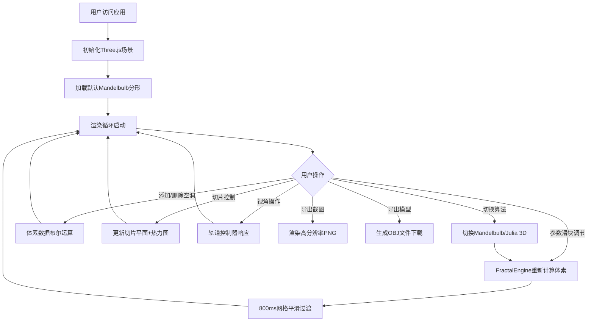

## 1. 产品概述

三维分形交互式探索器是一款基于WebGL的专业分形可视化与编辑工具，解决传统分形生成器仅输出静态图像、无法进行三维空间交互操控的痛点。面向数字艺术家、数学研究者和3D建模爱好者，提供实时参数调节、深度编辑、多维度切片等创新功能。

产品核心价值在于将复杂的数学分形算法通过直观的三维交互呈现，让用户在浏览器中即可探索无限复杂的分形世界，同时支持模型导出用于创作和研究。

---

## 2. 核心功能

### 2.1 用户角色

| 角色 | 注册方式 | 核心权限 |
|------|---------|---------|
| 普通用户 | 直接访问 | 分形生成、参数调节、三维交互、导出功能 |

### 2.2 功能模块

1. **主视口页面**：三维分形渲染视口、控制面板、视角设置栏
2. **分形计算引擎**：Mandelbulb算法、Julia 3D算法、体素数据管理
3. **深度编辑系统**：球体空洞增删、三轴平面切片、密度热力图
4. **导出模块**：高分辨率PNG截图、OBJ三维模型导出

### 2.3 页面详情

| 页面名称 | 模块名称 | 功能描述 |
|-----------|---------|---------|
| 主视口页面 | 三维渲染视口 | 全屏WebGL渲染分形模型，支持鼠标拖拽旋转、滚轮缩放、右键平移，最小尺寸800x600 |
| 主视口页面 | 分形算法选择器 | Mandelbulb/Julia 3D切换，800ms平滑过渡动画 |
| 主视口页面 | 参数调节面板 | 迭代次数(5-30)、幂次(2-8)、逃逸半径(1-4)滑块，200ms内实时响应 |
| 主视口页面 | 空洞编辑工具 | 点击视口添加球体空洞，半径可调，体素置空 |
| 主视口页面 | 切片控制面板 | X/Y/Z轴切片开关，位置滑块控制，蓝红渐变热力图显示密度分布 |
| 主视口页面 | 视角设置栏 | 自动旋转开关(0-5度/秒)、旋转速度调节 |
| 主视口页面 | 导出功能区 | 1920x1080 PNG截图导出、OBJ模型文件导出 |

---

## 3. 核心流程

### 3.1 主用户流程

用户打开应用 → 初始化默认Mandelbulb分形 → 用户通过滑块调节参数实时预览 → 切换Julia 3D算法观察过渡动画 → 添加球体空洞进行深度编辑 → 开启切片功能观察内部结构 → 调节视角并导出截图或模型

### 3.2 流程图

---

## 4. 用户界面设计

### 4.1 设计风格

- **主色调**：深靛蓝 `#1a1a2e`（背景色）、玫瑰红 `#e94560`（强调色）、深海蓝 `#0f3460`（次要色）
- **控件风格**：玻璃拟态（Glassmorphism），半透明磨砂玻璃背景 `rgba(255,255,255,0.08)`、边框高光 `rgba(255,255,255,0.15)`、`backdrop-filter: blur(20px)` 毛玻璃模糊
- **交互反馈**：滑块和按钮悬浮时 `transform: scale(1.05)` 平滑放大动画，过渡时长200ms
- **视觉规范**：所有元素圆角8px，柔和投影 `box-shadow: 0 8px 32px rgba(0,0,0,0.3)`
- **字体**：JetBrains Mono（等宽技术感）+ Noto Sans SC（中文）

### 4.2 页面设计概览

| 页面名称 | 模块名称 | UI元素 |
|-----------|---------|--------|
| 主视口页面 | 三维渲染视口 | 全屏Canvas，居中，黑色晕影背景，分形模型居中展示 |
| 主视口页面 | 左侧控制面板 | 固定左侧悬浮面板，玻璃拟态卡片，分组折叠式布局 |
| 主视口页面 | 顶部视角设置栏 | 顶部横向玻璃条，居中对齐 |
| 主视口页面 | 底部状态栏 | 底部细条显示FPS、体素数量、当前算法 |
| 主视口页面 | 算法选择器 | 胶囊式Tab切换，选中态强调色发光 |
| 主视口页面 | 参数滑块 | 自定义滑块轨道深色，滑块填充强调色渐变 |
| 主视口页面 | 操作按钮 | 玻璃按钮，悬浮放大，图标+文字 |
| 主视口页面 | 切片热力图 | 半透明彩色平面，蓝→红渐变颜色映射 |

### 4.3 响应式设计

- 采用桌面优先设计，视口最小尺寸800x600
- 控制面板在窗口宽度<1200px时自动折叠为抽屉式
- 触摸设备支持双指缩放、单指旋转、双指平移

### 4.4 3D场景指引

- **环境氛围**：深色宇宙空间感，径向渐变背景从 `#0a0a1a` 到 `#1a1a2e`
- **光照配置**：三光源布置——主光(暖白`#ffffff` 强度1.2、补光(蓝紫`#6366f1` 强度0.6位于左上方、轮廓光(玫瑰红`#e94560` 强度0.4位于右后方，营造分形表面高光层次
- **相机设置**：PerspectiveCamera，FOV 60°，初始距离4.5，看向原点，OrbitControls启用阻尼
- **构图**：分形模型始终居中，视觉权重占画面中心60%区域
- **交互动画**：算法切换时顶点位置morph过渡800ms，缓动函数easeInOutCubic
- **后期处理**：Bloom泛光效果(阈值0.8，强度0.4)，FXAA抗锯齿，轻微色差(0.3px)提升科技感
- **性能预算**：80万体素时稳定35FPS+，体素使用InstancedMesh渲染，几何复用

