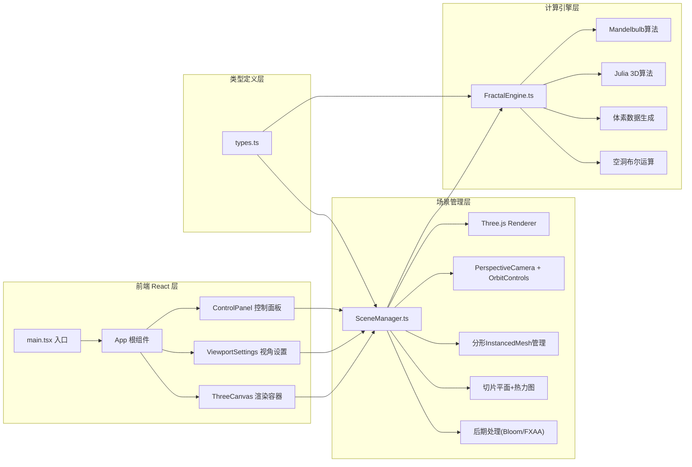

## 1. 架构设计



---

## 2. 技术栈说明

- **前端框架**：React 18 + TypeScript 5 + Vite 5
- **3D渲染**：Three.js r160 + @types/three
- **构建工具**：Vite 5 + @vitejs/plugin-react 4
- **工具库**：uuid（唯一标识管理）
- **无后端服务**：计算任务通过Web Worker异步执行（轻量级计算模块内嵌），无服务器依赖
- **CSS方案**：内联样式 + CSS变量（主题色管理）

---

## 3. 路由定义

| 路由 | 用途 |
|-----|------|
| / | 主视口页面，包含全部功能模块 |

---

## 4. 类型定义

### 4.1 FractalParams 分形参数

```typescript
interface FractalParams {
  algorithm: 'mandelbulb' | 'julia3d';
  iterations: number;      // 5-30
  power: number;             // 2-8
  escapeRadius: number;     // 1-4
  resolution: number;      // 体素网格分辨率
}
```

### 4.2 VoxelData 体素数据

```typescript
interface VoxelData {
  positions: Float32Array;  // x,y,z 坐标数组
  colors: Float32Array;      // r,g,b 颜色数组
  densities: Float32Array;       // 密度值（用于热力图）
  count: number;              // 体素总数
}
```

### 4.3 SliceConfig 切片配置

```typescript
interface SliceConfig {
  axis: 'x' | 'y' | 'z';
  position: number;       // -1.0 ~ 1.0
  enabled: boolean;
}
```

### 4.4 SphereHole 球体空洞

```typescript
interface SphereHole {
  id: string;
  center: { x: number; y: number; z: number };
  radius: number;
}
```

### 4.5 CameraSettings 相机设置

```typescript
interface CameraSettings {
  autoRotate: boolean;
  autoRotateSpeed: number;  // 0-5 度/秒
}
```

---

## 5. 核心模块接口

### 5.1 FractalEngine 接口

```typescript
class FractalEngine {
  generateVoxels(params: FractalParams): Promise<VoxelData>;
  applySphereHoles(data: VoxelData, holes: SphereHole[]): VoxelData;
  computeSliceDensity(data: VoxelData, config: SliceConfig): { positions: Float32Array; colors: Float32Array };
}
```

### 5.2 SceneManager 接口

```typescript
class SceneManager {
  init(container: HTMLElement): void;
  updateFractal(data: VoxelData, animate?: boolean): void;
  setSlice(config: SliceConfig | null): void;
  setCameraSettings(settings: Partial<CameraSettings>): void;
  exportScreenshot(width: number, height: number): Promise<Blob>;
  exportOBJ(): string;
  pickVoxel(screenX: number, screenY: number): { x: number; y: number; z: number } | null;
  dispose(): void;
}
```

---

## 6. 文件结构

```
项目根目录
├── package.json
├── index.html
├── tsconfig.json
├── vite.config.js
└── src/
    ├── main.tsx              # React入口
    ├── types.ts             # 类型定义
    ├── FractalEngine.ts      # 分形计算引擎
    ├── SceneManager.ts     # Three.js场景管理
    └── components/
        ├── ControlPanel.tsx       # 控制面板组件
        └── ViewportSettings.tsx  # 视角设置组件
```

---

## 7. 性能优化策略

7.1 渲染优化

- 使用 **InstancedMesh** 批量渲染体素，80万体素单次Draw Call
- 体素几何复用 **BoxGeometry(0.02, 0.02, 0.02)**
- 材质使用 **MeshStandardMaterial**，关闭阴影投射以节省性能
- 算法切换时使用 **vertex morphing** 而非重建Mesh，减少GC压力
- 后期处理按需启用，低性能设备自动降级

7.2 计算优化

- 分形计算通过 **异步分块计算**，每帧计算1/8体素块避免阻塞
- 使用 **Float32Array** TypedArray减少内存占用
- 参数变化时 **防抖200ms** 后触发重计算
- 逃逸半径提前终止迭代
- 空洞布尔运算使用空间哈希快速查询

