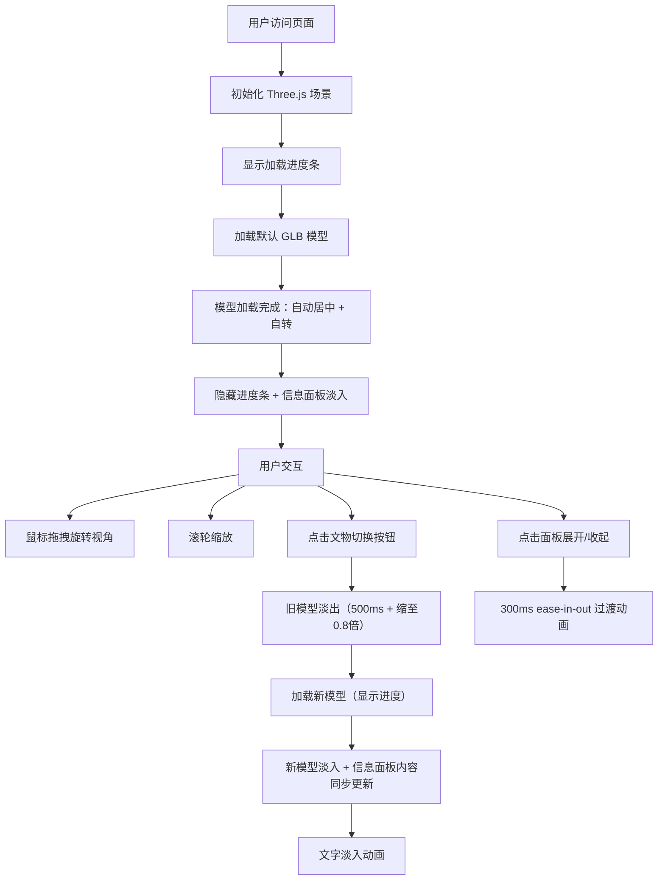

## 1. 产品概述
数字文物博物馆是一个基于 WebGL/Three.js 的在线交互式文物浏览平台，通过高精度 3D 模型与沉浸式界面设计，让用户足不出户即可欣赏和研究珍贵的历史文物。

- 核心目标：利用 3D 可视化技术打造沉浸式数字博物馆体验，打破物理时空限制，为文化爱好者、教育工作者和研究人员提供可交互的文物数字化体验。
- 目标用户：历史文化爱好者、博物馆访客、教育工作者、学生群体、考古研究人员。
- 产品价值：文物数字化保护与传播，降低文化遗产欣赏门槛，提升公众对历史文物的认知和兴趣。

---

## 2. 核心功能

### 2.1 功能模块
1. **3D 模型展示区**：高精度 GLB 文物模型渲染、自动居中、缓慢自转、用户交互控制（拖拽旋转、滚轮缩放）。
2. **模型加载系统**：GLB 模型异步加载、进度条显示、模型缓存管理、切换动画（淡出/淡入+缩放过渡）。
3. **信息面板模块**：文物详情展示（名称、年代、出土地点、背景描述）、毛玻璃风格设计、平滑展开/收起动画、文字淡入效果。
4. **文物选择列表**：至少 4 件文物切换选项、按钮金色主题、悬停发光脉冲动画。
5. **导航栏模块**：博物馆名称、导航链接、半透明毛玻璃风格。
6. **场景光照系统**：暖色调博物馆射灯效果（聚光灯+柔和环境光）、阴影与材质质感、环境贴图反射。

### 2.2 页面详情
| 页面名称 | 模块名称 | 功能描述 |
|---------|---------|---------|
| 主页 | 顶部导航栏 | 半透明毛玻璃效果，展示博物馆名称和导航链接 |
| 主页 | 3D 展示区 | 占屏幕 75% 高度，Three.js 渲染场景，支持鼠标拖拽旋转、滚轮缩放，模型自动居中缓慢自转（每秒 5 度） |
| 主页 | 加载进度条 | GLB 模型加载过程中显示百分比进度，加载完成后自动隐藏 |
| 主页 | 信息面板 | 右下角浮动面板，半透明毛玻璃+金色边框发光，支持展开/收起，展示文物名称、年代、出土地点、历史背景（≥200字） |
| 主页 | 文物切换列表 | 至少 4 个文物选项按钮，金色主题，悬停发光脉冲，切换时旧模型淡出（500ms）新模型淡入 |
| 主页 | 光照与材质 | 暖色调聚光灯+柔和环境光，金属/釉面材质质感，环境贴图反射 |

---

## 3. 核心流程

用户访问页面 → 初始化 Three.js 场景（相机、渲染器、光照）→ 显示加载进度条 → 加载默认文物 GLB 模型 → 加载完成后模型自动居中并缓慢自转 → 显示信息面板并淡入文字内容 → 用户可：
- 鼠标拖拽：任意旋转视角
- 滚轮滑动：平滑缩放
- 点击文物切换按钮：旧模型淡出缩小（0.8倍），新模型淡入，信息面板同步更新
- 点击信息面板展开/收起：平滑过渡动画
- 信息面板内容与选中文物实时同步

---

## 4. 用户界面设计

### 4.1 设计风格
- **设计基调**：博物馆级别的典雅奢华感，深色神秘背景烘托文物高贵气质，金色点缀体现历史厚重感。
- **主色调**：深色背景 `#1a1a2e`（深空蓝紫调），金色主色 `#c9a74b`（古典黄铜金），辅助色：暖光米白 `#f5e6c8`，次要文字色 `#a0a0b8`。
- **毛玻璃效果**：半透明白色 `rgba(255,255,255,0.15)` + `backdrop-filter: blur(10px)` + 微弱金色边框 `rgba(201,167,75,0.3)` + 金色发光外阴影。
- **按钮风格**：金色 `#c9a74b` 边框和文字，悬停时发光脉冲动画（`box-shadow` 金色光晕叠加 + `scale(1.05)` 轻微放大），圆角 6px。
- **字体方案**：标题使用 'Cinzel' 或 'Noto Serif SC' 衬线字体（典雅），正文使用 'Noto Sans SC' 无衬线（易读）。
- **布局风格**：顶部固定导航栏，中央 3D 展示区（75vh），右下角浮动信息面板，左下角文物切换列表，大量留白营造呼吸感。

### 4.2 页面设计概览
| 页面名称 | 模块名称 | UI 元素描述 |
|---------|---------|-----------|
| 主页 | 顶部导航栏 | 固定顶部，毛玻璃效果，高度 60px，左侧博物馆Logo名称（Cinzel 金色大字体），右侧导航链接（藏品、展览、关于） |
| 主页 | 3D 展示区 | 背景 `#1a1a2e`，暖色调聚光灯投射于模型，柔和环境光，地面微弱阴影，占 75vh 高度 |
| 主页 | 加载进度条 | 屏幕中央，金色细条进度，上方白色百分比文字，下方模型名称 |
| 主页 | 信息面板 | 右下角，毛玻璃+金色发光边框，标题区（文物名称+年代+展开/收起图标），内容区（出土地点+背景描述） |
| 主页 | 文物切换列表 | 左下角，竖向/横向按钮列表，金色边框+文字，悬停发光脉冲，当前选中项高亮 |
| 主页 | 操作提示 | 左下角淡灰色文字提示"拖拽旋转 · 滚轮缩放" |

### 4.3 响应式设计
- **设计策略**：Desktop-first，移动端自适应。
- **大屏（≥1200px）**：信息面板右下角浮动，300px 宽度，文物切换列表左下角竖向排列。
- **中屏（768px-1199px）**：信息面板宽度 260px，文物切换列表横向排列于底部。
- **小屏（<768px）**：信息面板变为底部横条（全宽、高度自适应），文物切换列表横向滚动，触控优化（touch-action）。
- **触控优化**：移动端支持单指拖拽旋转、双指捏合缩放。

### 4.4 3D 场景指南
- **环境/HDRI 氛围**：暖色调博物馆室内环境，使用 PMREMGenerator 生成环境贴图，模拟暖色墙面反射。
- **光照设置**：
  - 主光源：`SpotLight` 聚光灯（暖色 `#fff2d4`，强度 2.0，距离 20，角度 45°，衰减 1.2，投射阴影），位于模型前上方 45°。
  - 辅光源：`AmbientLight` 环境光（暖灰 `#c9b896`，强度 0.4），`DirectionalLight` 补光（暖色 `#f5e6c8`，强度 0.6，模型侧方）。
  - 阴影：`renderer.shadowMap.enabled = true`，软阴影类型 PCFSoftShadowMap。
- **相机设置**：`PerspectiveCamera`，视场角 45°，初始距离模型 5-8 单位，目标指向场景中心（0,0,0）。
- **材质质感**：
  - 青铜鼎：`MeshStandardMaterial`，metalness 0.85，roughness 0.25，envMapIntensity 1.0，模拟青铜器金属氧化质感。
  - 陶瓷瓶：`MeshStandardMaterial`，metalness 0.1，roughness 0.15，envMapIntensity 1.5，模拟釉面高反光质感。
- **交互动画**：模型每秒 5° 自动绕 Y 轴自转，鼠标拖拽禁用自转，松开后 2 秒恢复自转；缩放范围 0.5x - 3x。
- **后处理**：`ACESFilmicToneMapping` 色调映射，曝光度 1.0，输出编码 sRGBEncoding。
- **性能预算**：单模型 ≤ 7MB，总模型 ≤ 15MB，稳定帧率 ≥ 50FPS，目标设备：中端独立显卡以上。
