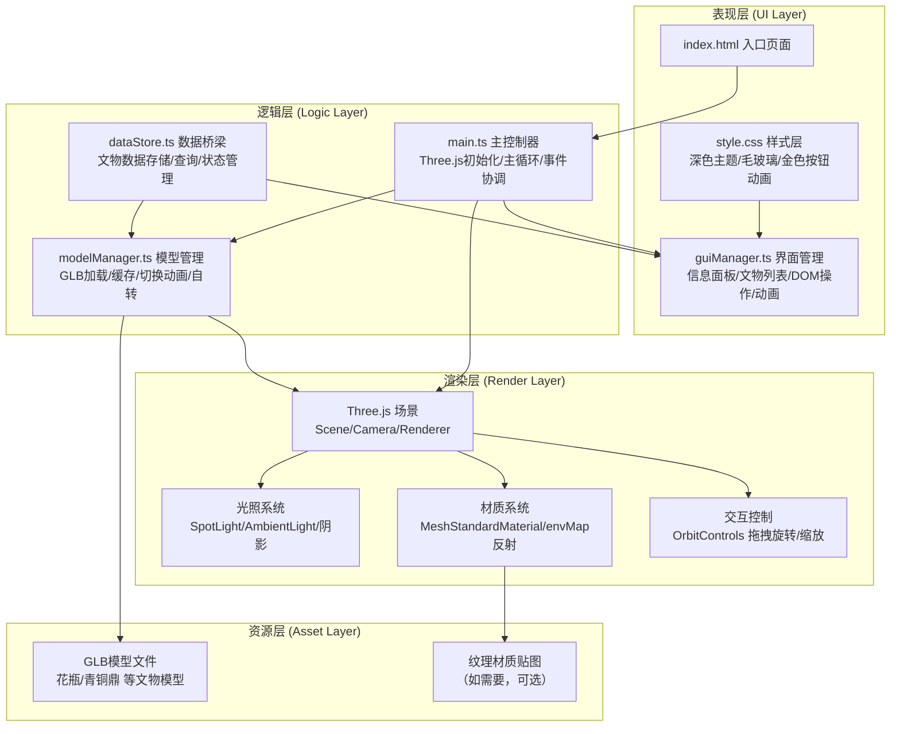

## 1. 架构设计



---

## 2. 技术描述

- **前端框架**：原生 TypeScript（不使用 React/Vue，遵循用户要求的文件结构），通过模块拆分实现解耦。
- **3D 渲染引擎**：Three.js `^0.160.0`，原生 GLTFLoader 加载 GLB，OrbitControls 控制视角。
- **构建工具**：Vite `^5.0.0`，极速冷启动 + HMR，资源打包优化。
- **语言规范**：TypeScript `^5.3.0`，strict 模式，ESNext 模块，保证类型安全。
- **样式方案**：原生 CSS3，CSS 变量管理主题色，CSS Keyframes 动画，backdrop-filter 毛玻璃。
- **后端**：无后端，纯前端静态资源项目，文物数据硬编码在 dataStore.ts 中（Mock 数据）。
- **数据库**：不使用数据库。

---

## 3. 项目文件结构

```
auto31/
├── .trae/
│   └── documents/
│       ├── 数字文物博物馆-PRD.md
│       └── 数字文物博物馆-技术架构.md
├── public/
│   └── models/
│       ├── vase.glb              （花瓶模型，需用户自备）
│       ├── ding.glb              （青铜鼎模型，需用户自备）
│       ├── jade.glb              （玉器模型，需用户自备）
│       └── sword.glb             （古剑模型，需用户自备）
├── src/
│   ├── main.ts                   主入口：Three.js 初始化/主循环
│   ├── modelManager.ts           模型管理：GLB加载/缓存/切换动画/自转
│   ├── guiManager.ts             界面管理：信息面板/文物列表/DOM交互
│   ├── dataStore.ts              数据层：文物列表/状态管理
│   └── style.css                 样式层：主题/毛玻璃/动画
├── index.html                    入口 HTML
├── package.json                  项目依赖/脚本
├── tsconfig.json                 TypeScript 配置
└── vite.config.js                Vite 构建配置
```

---

## 4. 模块职责与接口定义

### 4.1 dataStore.ts - 数据存储模块

```typescript
// 文物数据接口
export interface Artifact {
    id: string;
    name: string;
    dynasty: string;
    location: string;
    description: string;       // 200字以上
    modelPath: string;         // GLB模型路径
    scale: number;             // 模型缩放系数
    materialPreset: 'bronze' | 'porcelain' | 'jade' | 'iron';
}

// 数据存储类
export class DataStore {
    private artifacts: Artifact[];      // 文物列表
    private currentIndex: number;       // 当前选中索引
    private listeners: (() => void)[];  // 变更监听器

    constructor();
    getAllArtifacts(): Artifact[];
    getCurrentArtifact(): Artifact;
    getArtifactById(id: string): Artifact | undefined;
    switchTo(index: number): void;      // 切换文物 + 触发监听器
    switchNext(): void;
    switchPrev(): void;
    onChange(callback: () => void): () => void;  // 订阅变更，返回取消函数
}
```

### 4.2 modelManager.ts - 模型管理模块

```typescript
export type LoadProgressCallback = (percent: number, artifactName: string) => void;
export type LoadCompleteCallback = () => void;

export class ModelManager {
    private scene: THREE.Scene;
    private loader: GLTFLoader;
    private cache: Map<string, THREE.Group>;   // 模型缓存
    private currentModel: THREE.Group | null;
    private isAutoRotating: boolean;
    private autoRotateSpeed: number;           // 5度/秒 → 弧度转换

    constructor(scene: THREE.Scene);
    loadModel(
        artifact: Artifact,
        onProgress?: LoadProgressCallback,
        onComplete?: LoadCompleteCallback
    ): Promise<THREE.Group>;
    switchModel(artifact: Artifact, onProgress?: LoadProgressCallback): Promise<void>;
    centerModel(model: THREE.Group, artifact: Artifact): void;  // 自动居中+缩放
    applyMaterialPreset(model: THREE.Group, preset: string): void;
    update(delta: number): void;              // 每帧：自转逻辑
    pauseAutoRotate(durationMs?: number): void;  // 用户交互时暂停自转
    dispose(): void;
}
```

### 4.3 guiManager.ts - 界面管理模块

```typescript
export interface GUIManagerOptions {
    dataStore: DataStore;
    onSelectArtifact: (index: number) => void;
}

export class GUIManager {
    private dataStore: DataStore;
    private panelEl: HTMLElement;
    private panelContentEl: HTMLElement;
    private listEl: HTMLElement;
    private progressEl: HTMLElement;
    private isPanelExpanded: boolean;

    constructor(options: GUIManagerOptions);
    buildPanel(): void;                       // 创建信息面板DOM
    buildList(): void;                        // 创建文物切换列表
    updateContent(): void;                    // 同步当前文物内容 + 文字淡入
    updateProgress(percent: number, name: string): void;  // 更新加载进度条
    hideProgress(): void;
    togglePanel(force?: boolean): void;       // 展开/收起面板，300ms过渡
    highlightListItem(index: number): void;
    bindEvents(): void;
}
```

### 4.4 main.ts - 主控制器

```typescript
// 主流程
1. 创建 Scene / PerspectiveCamera / WebGLRenderer(antialias+shadow)
2. 设置光照：SpotLight 聚光灯 + AmbientLight + DirectionalLight 补光
3. PMREMGenerator 生成环境贴图 → 场景环境反射
4. 创建 OrbitControls（enableDamping平滑）
5. 实例化 DataStore / ModelManager / GUIManager
6. 订阅 DataStore 变更 → 触发 ModelManager.switchModel + GUIManager.updateContent
7. 加载默认文物（index=0）
8. 启动 requestAnimationFrame 主循环 → ModelManager.update / controls.update / renderer.render
9. 监听窗口 resize → 更新相机矩阵 + 渲染器尺寸
```

---

## 5. 关键技术实现点

### 5.1 模型切换动画
- 旧模型淡出：TWEEN/手动插值 500ms，`model.scale.lerp(0.8)` + `material.opacity → 0`
- 新模型淡入：加载完成后初始 `opacity=0, scale=0.8`，500ms 插值到 `opacity=1, scale=1`
- 利用 `traverse()` 遍历模型所有 mesh，设置 `material.transparent = true` 支持透明度动画

### 5.2 加载进度条
- `GLTFLoader.load(url, onLoad, onProgress, onError)`
- `onProgress(event)` 中 `percent = event.loaded / event.total * 100`
- 若 GLB 未返回 total（服务器未设置 Content-Length），降级为伪进度 + 加载完成后强制 100%

### 5.3 毛玻璃面板
- CSS: `background: rgba(255,255,255,0.15)`
- CSS: `backdrop-filter: blur(10px); -webkit-backdrop-filter: blur(10px);`
- 金色发光边框：`border: 1px solid rgba(201,167,75,0.3)` + `box-shadow: 0 0 20px rgba(201,167,75,0.25), inset 0 0 10px rgba(201,167,75,0.1)`

### 5.4 金色按钮发光脉冲
- CSS Keyframes: `@keyframes goldPulse { 0%,100% { box-shadow: 0 0 5px #c9a74b; } 50% { box-shadow: 0 0 20px #c9a74b, 0 0 30px rgba(201,167,75,0.5); } }`
- `:hover` 触发 `animation: goldPulse 1.5s ease-in-out infinite` + `transform: scale(1.05)`

### 5.5 模型自动居中
- `new THREE.Box3().setFromObject(model).getCenter(center)`
- `model.position.sub(center)` → 平移到原点
- `box3.getSize(size)` → 按 `targetSize / max(size.x,size.y,size.z)` 计算缩放系数

### 5.6 性能优化
- 模型缓存：`Map<string, THREE.Group>`，已加载模型直接克隆复用
- 材质共享：相同 preset 的 mesh 共享 Material 实例
- `renderer.setPixelRatio(Math.min(window.devicePixelRatio, 2))` 限制像素比
- OrbitControls `enableDamping = true, dampingFactor = 0.08` 平滑阻尼

---

## 6. 数据模型（内置 Mock 数据）

### 6.1 文物数据定义

| ID | 名称 | 年代 | 出土地点 | 材质预设 | 模型路径 |
|----|------|------|----------|---------|---------|
| vase-01 | 青花缠枝莲纹梅瓶 | 明代·永乐年间（1403-1424） | 江西景德镇御窑遗址 | porcelain | /models/vase.glb |
| ding-01 | 司母戊青铜方鼎 | 商代晚期（约公元前1300年） | 河南安阳武官村 | bronze | /models/ding.glb |
| jade-01 | 玉镂雕螭龙纹璧 | 西汉（公元前202年-公元8年） | 河北满城中山靖王墓 | jade | /models/jade.glb |
| sword-01 | 越王勾践青铜剑 | 春秋晚期（约公元前500年） | 湖北江陵望山楚墓 | bronze | /models/sword.glb |

每件文物 description 字段包含 200 字以上的详细历史背景描述，涵盖文物形制、工艺特点、历史价值、文化意义。
