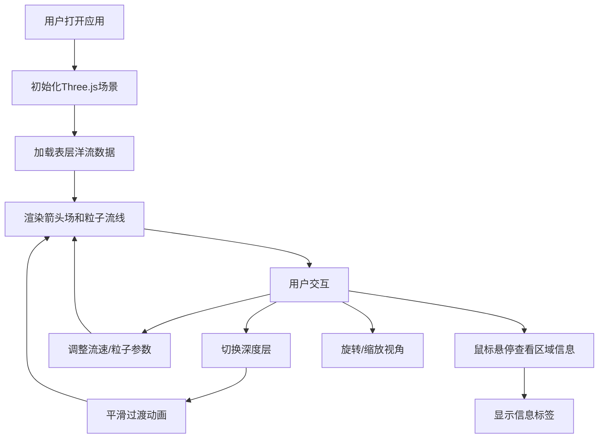

## 1. 产品概述
本项目是一个基于 Three.js 的海洋洋流三维动态可视化应用，旨在帮助海洋科学研究与教育领域的用户直观理解海流的三维分布、流速及方向变化。通过交互式三维可视化方式，用户可以探索全球主要洋流的立体结构和动态演化过程。

- **目标用户**：海洋科学研究者、教育工作者、学生
- **核心价值**：将抽象的三维洋流数据转化为直观、可交互的可视化体验，解决传统二维图表难以展示深层洋流立体结构的问题

## 2. 核心功能

### 2.1 功能模块

1. **三维洋流箭头场**：以箭头形式展示洋流方向和相对流速，箭头随流速线性变化，颜色按深度渐变，箭头微微上下浮动模拟海流波动
2. **动态粒子流线**：沿主要洋流路径生成粒子群，粒子沿流线运动并留下渐隐尾迹
3. **多深度层切换**：支持表层（0m）、中层（500m）、深层（1500m）洋流展示切换，平滑过渡动画
4. **区域高亮与信息标签**：鼠标悬停时区域箭头高亮，显示区域名称、平均流速和当前深度信息

### 2.2 页面详情

| 页面名称 | 模块名称 | 功能描述 |
|-----------|-------------|---------------------|
| 主可视化页面 | 三维场景渲染 | Three.js 全景渲染，展示洋流箭头场和粒子流线 |
| 主可视化页面 | UI控制面板 | 深度层选择、流速缩放、粒子速度控制、视角重置 |
| 主可视化页面 | 信息标签 | 鼠标悬停时显示区域信息浮动标签 |

## 3. 核心流程

用户打开应用后，默认展示表层洋流的三维视图。用户可以：
- 通过鼠标拖拽旋转视角、滚轮缩放来探索洋流分布
- 使用右上角控制面板切换不同深度层的洋流
- 调整流速缩放和粒子速度参数
- 鼠标悬停在洋流密集区域查看详细信息
- 点击重置视角按钮恢复初始视角

## 4. 用户界面设计

### 4.1 设计风格

- **主色调**：深蓝色渐变背景（#0a0a2e → #1a1a4e），模拟深海环境
- **配色方案**：
  - 表层洋流：暖色调（红→橙）
  - 中层洋流：绿色调
  - 深层洋流：冷色调（蓝→紫）
  - 高亮色：亮黄色
- **UI风格**：深色半透明面板（rgba(0,0,0,0.7)）配白色文字，微光效果
- **字体**：现代无衬线字体，清晰易读

### 4.2 页面设计概述

| 页面名称 | 模块名称 | UI元素 |
|-----------|-------------|-------------|
| 主可视化页面 | 三维场景 | 全屏渲染容器、深蓝色渐变背景、箭头几何体、粒子流线 |
| 主可视化页面 | 控制面板 | 右上角半透明面板、下拉选择框、滑块控件、按钮 |
| 主可视化页面 | 信息标签 | 跟随鼠标浮动标签、半透明背景、白色文字 |

### 4.3 3D场景指南

- **环境**：深蓝色渐变背景，营造深海氛围，表层偏亮蓝、深层偏暗紫
- **光照**：环境光 + 方向光，确保箭头和粒子清晰可见
- **相机**：透视相机，初始俯视45度，距离原点80单位
- **交互动画**：
  - 箭头微微上下浮动
  - 粒子沿流线连续运动
  - 深度切换时1.5秒平滑过渡
  - 区域悬停高亮效果
- **性能预算**：200个箭头 + 2000个粒子，保持50FPS以上

### 4.4 响应性

桌面端全屏应用，自适应窗口大小变化
