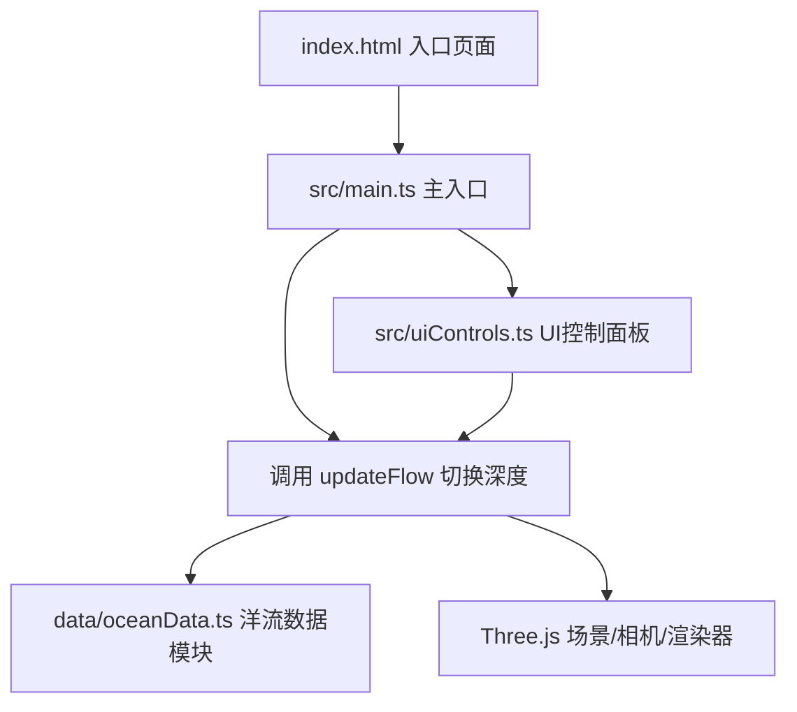

## 1. 架构设计

本项目采用模块化架构，分为渲染层、数据层和UI层，各模块职责清晰、低耦合。



### 模块调用关系与数据流向

1. **main.ts** → 初始化Three.js环境 → 调用 oceanRenderer.init() → 启动渲染循环
2. **uiControls.ts** → 监听用户交互 → 调用 oceanRenderer.updateFlow() / 更新渲染参数
3. **oceanRenderer.ts** → 从 oceanData.ts 获取洋流数据 → 创建箭头和粒子 → 每帧更新动画
4. **oceanData.ts** → 模拟生成三大洋区域洋流数据 → 输出统一格式的数据结构

## 2. 技术描述

- **前端框架**：原生 TypeScript + Three.js（不使用React/Vue，专注3D渲染性能）
- **构建工具**：Vite
- **UI控件**：dat.GUI
- **数据**：前端模拟数据，无后端依赖
- **类型系统**：TypeScript 严格模式

### 依赖包

| 包名 | 版本 | 用途 |
|------|------|------|
| three | latest | 3D渲染引擎 |
| @types/three | latest | Three.js TypeScript 类型定义 |
| vite | latest | 构建工具和开发服务器 |
| typescript | latest | TypeScript 编译器 |
| dat.gui | latest | UI控制面板库 |
| @types/dat.gui | latest | dat.GUI TypeScript 类型定义 |

## 3. 文件结构

```
project/
├── package.json           # 项目依赖和脚本
├── index.html             # 入口HTML页面
├── tsconfig.json          # TypeScript配置
├── vite.config.js         # Vite构建配置
├── src/
│   ├── main.ts            # 主入口：初始化Three.js场景、相机、渲染器
│   ├── oceanRenderer.ts   # 洋流渲染核心：箭头几何体、粒子流线、动画更新
│   └── uiControls.ts      # UI控制：dat.GUI控制面板、交互回调
└── data/
    └── oceanData.ts       # 洋流数据：模拟生成三大洋区域洋流数据
```

## 4. 数据模型

### 4.1 洋流数据结构

```typescript
interface OceanCurrentData {
  region: string;      // 区域名称（北大西洋、南太平洋、印度洋）
  depth: number;       // 深度层（0, 500, 1500 米）
  position: Vector3[]; // 箭头位置数组（XZ平面，±50单位范围）
  direction: Vector3[];// 洋流方向向量数组
  speed: number[];     // 流速数组（0.5-5.0 单位/秒）
}
```

### 4.2 深度层定义

| 深度层 | 深度值(m) | 颜色渐变 |
|--------|-----------|----------|
| 表层 | 0 | 红 → 橙（暖色调） |
| 中层 | 500 | 绿（绿色调） |
| 深层 | 1500 | 蓝 → 紫（冷色调） |

### 4.3 三大洋区域

1. **北大西洋洋流**：位于场景左上区域
2. **南太平洋洋流**：位于场景右下区域
3. **印度洋洋流**：位于场景中部偏右区域

## 5. 核心技术实现

### 5.1 箭头场渲染

- 使用 Three.js ArrowHelper 或自定义锥体+柱体几何体
- 箭头长度和直径随流速线性缩放（流速0.5→5.0，长度因子0.5→3.0）
- 颜色按深度层渐变
- 每帧更新Y轴微浮动（sin函数）

### 5.2 粒子流线系统

- 2000个粒子，沿流线方向运动
- 使用 BufferGeometry 提升性能
- 粒子尾迹效果（渐隐带状轨迹，持续2秒）
- 粒子颜色与深度层匹配

### 5.3 深度层平滑过渡

- 1.5秒过渡动画
- 旧数据透明度从1→0
- 新数据透明度从0→1
- 过渡期间禁用用户交互

### 5.4 区域高亮与信息标签

- 射线检测（Raycaster）识别鼠标悬停区域
- 区域箭头颜色变为亮黄色，透明度提高到0.9
- 屏幕空间浮动标签跟随鼠标（偏移+20px）
- 显示区域名称、平均流速、当前深度

### 5.5 性能优化

- 使用 BufferGeometry 而非 Geometry
- 粒子系统使用 Points + ShaderMaterial
- 合理的帧间更新策略
- 目标帧率：50FPS以上
