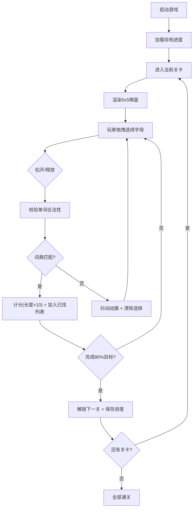

## 1. 产品概述

PuzzlePhrase 是一款基于 Boggle 变体的英语拼词游戏。玩家在 5x5 棋盘上通过连接相邻字母方块拼出单词，结合主题关卡与进度存档功能，提供沉浸式词汇挑战体验。

- **核心目标**：通过主题化关卡设计与流畅的交互体验，让玩家在游戏中提升英语词汇量
- **目标用户**：英语学习者、休闲游戏玩家、词汇爱好者
- **产品价值**：寓教于乐的拼词游戏，20 个主题关卡带来丰富内容，深色星空主题营造专注氛围

## 2. 核心功能

### 2.1 功能模块

1. **游戏主界面**：5x5 棋盘、分数显示、倒计时、进度条、已找到单词列表、暂停按钮
2. **拼词交互系统**：拖拽选择相邻字母、高亮显示、弹跳动画、单词校验、错误抖动
3. **关卡系统**：20 个主题关卡、目标单词、解锁机制、星标显示、进度存档
4. **单词校验系统**：内置 5000 常用词词典、实时校验、得分计算

### 2.2 页面详情

| 页面名称 | 模块名称 | 功能描述 |
|-----------|-------------|---------------------|
| 游戏主界面 | 棋盘区域 | 5x5 字母网格、拖拽交互、选中高亮与弹跳动画 |
| 游戏主界面 | 左侧信息栏 | 当前分数、等级进度条、120秒倒计时 |
| 游戏主界面 | 右侧单词列表 | 已找到单词滚动显示 |
| 游戏主界面 | 顶部导航 | 暂停按钮、主题标识 |
| 关卡选择（可选） | 关卡网格 | 20 关星标显示、解锁状态、点击进入 |

## 3. 核心流程

玩家启动游戏后进入当前解锁关卡，通过鼠标/手指拖拽连接相邻字母组成单词，松开后系统校验单词：合法则计分并加入已找列表，非法则抖动清除。完成当前关卡 80% 目标单词后解锁下一关，已通关关卡显示金色星标。

## 4. 用户界面设计

### 4.1 设计风格

- **主色调**：深蓝色渐变背景（#0a0e27 → #1a1f4a），营造星空氛围
- **强调色**：金色星标（#ffd700）、选中高亮（#4fc3f7）、错误抖动（#ef5350）
- **字母格子**：半透明深蓝 + 微弱光晕效果，悬停/选中时发光增强
- **字体**：Google Fonts - Orbitron（标题/数字）+ Nunito（正文/单词）
- **按钮风格**：圆角胶囊按钮，带渐变边框与微发光效果
- **动效**：选中字母 200ms 放大弹跳，错误时水平抖动 300ms，星标金光闪烁

### 4.2 页面设计概览

| 页面名称 | 模块名称 | UI 元素 |
|-----------|-------------|-------------|
| 游戏主界面 | 棋盘 | 5x5 网格、字母大写显示、选中路径连线、光晕效果 |
| 游戏主界面 | 信息栏 | 分数大字显示、进度条带百分比、倒计时圆环 |
| 游戏主界面 | 单词列表 | 滚动容器、已找到单词标签、目标单词提示 |
| 游戏主界面 | 顶栏 | 暂停图标按钮、主题名称居中 |

### 4.3 响应式设计

- **桌面端**：左右布局，左侧信息栏 + 中间棋盘 + 右侧单词列表
- **移动端**：上下布局，顶栏 → 信息栏 → 棋盘 → 单词列表，按钮尺寸增大至 48px+ 便于触控
- **Canvas 自适应**：根据容器尺寸等比缩放，保持正方形比例
