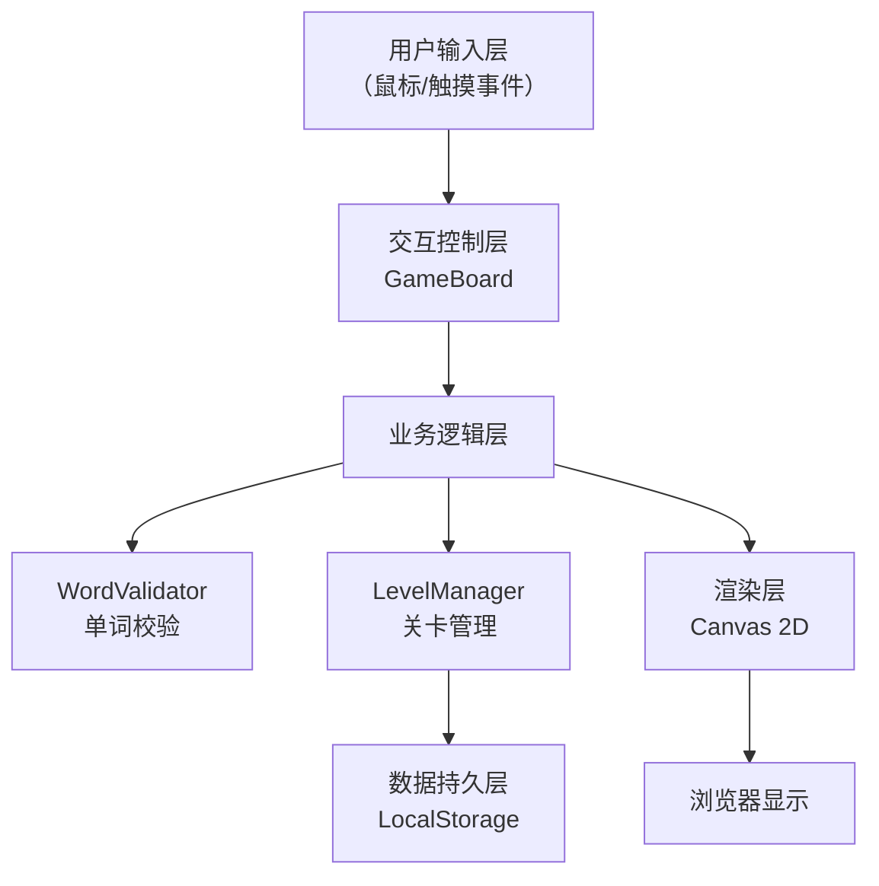

## 1. 架构设计



## 2. 技术栈说明

- **前端语言**：TypeScript（严格模式，ESNext 模块）
- **构建工具**：Vite 5.x
- **渲染引擎**：Canvas 2D API（纯绘制，无第三方游戏引擎）
- **数据存储**：浏览器 LocalStorage（存档进度）
- **字体资源**：Google Fonts（Orbitron + Nunito）
- **外部依赖**：无（词典数据内置为 TS 常量）

## 3. 文件结构

```
auto39/
├── package.json
├── index.html
├── tsconfig.json
├── vite.config.js
└── src/
    ├── main.ts              # 游戏入口、Canvas 创建、主循环
    ├── gameBoard.ts         # 棋盘渲染、拖拽交互、动画
    ├── wordValidator.ts     # 内置词典、单词校验、计分
    └── levelManager.ts      # 关卡数据、解锁逻辑、存档
```

## 4. 模块职责定义

### 4.1 main.ts
- 创建全屏 Canvas 容器，设置 DPR 适配
- 实例化 GameBoard、WordValidator、LevelManager
- 启动 requestAnimationFrame 主循环（目标 60FPS）
- 响应窗口 resize，自适应布局（桌面左右 / 移动上下）
- 处理暂停/继续全局状态

### 4.2 gameBoard.ts
- 维护 5x5 字母网格状态与选中路径
- 渲染：背景星空渐变、格子光晕、字母文字、选中路径连线
- 动画：选中格子 200ms 放大弹跳（easeOutBack）、错误抖动 300ms
- 交互：mousedown/touchstart 开始选择、mousemove/touchmove 扩展路径（8 方向相邻判定）、mouseup/touchend 触发校验回调
- 暴露 API：`render(ctx, deltaTime)`、`reset(letters)`、`onWordSubmit(callback)`

### 4.3 wordValidator.ts
- 内置约 5000 个常用英语单词（Set 数据结构，O(1) 查找）
- 提供 `validate(word: string): boolean`，响应时间 < 50ms
- 提供 `calculateScore(word: string): number`（长度 × 10）

### 4.4 levelManager.ts
- 内置 20 个主题关卡数据（主题名、字母分布、≥15 个目标单词）
- 进度存档读写（LocalStorage key: `puzzlephrase_progress`）
- 解锁逻辑：当前关完成 80% 目标单词 → 解锁下一关
- 暴露 API：`getCurrentLevel()`、`completeWord(levelId, word)`、`isUnlocked(levelId)`、`getProgress()`

## 5. 性能指标

| 指标 | 目标值 | 实现方案 |
|------|--------|----------|
| 渲染帧率 | ≥ 55 FPS | requestAnimationFrame + 增量渲染，仅动画格子重绘 |
| 单词校验响应 | ≤ 50ms | Set 哈希查找 O(1)，词典预加载 |
| 内存占用 | ≤ 100MB | Canvas 单层绘制，避免离屏缓存滥用 |
| 首次加载 | ≤ 2s | 无图片资源，仅字体 + JS |

## 6. 数据模型

```typescript
interface Level {
  id: number;
  theme: string;
  letters: string[][];       // 5x5 字母矩阵
  targetWords: string[];     // ≥15 个目标单词
}

interface GameProgress {
  unlockedLevel: number;     // 当前解锁到的关卡 ID
  completedLevels: number[]; // 已通关关卡（金色星标）
  levelWords: Record<number, string[]>; // 每关已找到单词
  totalScore: number;
}

interface CellState {
  letter: string;
  selected: boolean;
  selectOrder: number;       // 选中顺序，用于路径绘制
  bounceProgress: number;    // 0~1，弹跳动画进度
  shakeProgress: number;     // 0~1，抖动动画进度
}
```
