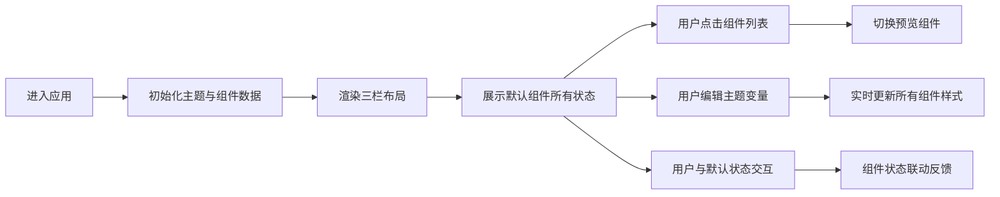

## 1. 产品概述

StateShowcase 是一款面向前端设计师与开发者的交互式组件状态预览工具，用于浏览和调试常见 UI 组件在不同状态下的渲染效果，并支持实时主题定制。
- 解决组件状态调试效率低、主题一致性难以把控的痛点，目标用户为前端开发者、UI 设计师和产品经理。
- 提供可视化的组件状态矩阵，配合实时主题编辑，加速设计评审与开发联调流程。

## 2. 核心功能

### 2.1 用户角色
| 角色 | 使用方式 | 核心需求 |
|------|----------|----------|
| 前端开发者 | 浏览器访问 | 快速预览组件状态、调试主题变量 |
| UI 设计师 | 浏览器访问 | 直观查看设计稿落地效果、调整主题 |

### 2.2 功能模块
1. **组件导航面板**：左侧展示所有可用组件列表，点击切换预览对象
2. **组件预览面板**：中央区域展示选中组件的所有状态实例，支持交互
3. **主题编辑器面板**：右侧提供颜色、圆角、阴影、字体等主题变量编辑控件
4. **响应式布局系统**：三栏布局自适应，移动端抽屉与标签页适配

### 2.3 页面详情
| 页面名称 | 模块名称 | 功能描述 |
|---------|---------|----------|
| 主页 | 组件导航 | 展示组件列表，高亮选中项，支持点击切换 |
| 主页 | 组件预览 | 多状态矩阵展示，状态标签，交互反馈，状态切换动画 |
| 主页 | 主题编辑器 | 颜色拾色器、圆角滑块、阴影滑块、字体选择器、实时预览色块 |
| 主页 | 响应式适配 | 900px 断点：右侧面板折叠为底部抽屉；700px 断点：左侧导航变为顶部标签 |

## 3. 核心流程

用户进入应用 → 默认展示第一个组件的所有状态 → 可点击左侧组件列表切换 → 可与默认状态组件交互 → 通过右侧编辑器调整主题变量 → 所有组件预览实时更新

## 4. 用户界面设计

### 4.1 设计风格
- **主色**：可定制（默认 #4F46E5），通过 CSS 变量驱动全局主题
- **中性色**：浅灰背景 #F7F8FA，文字主色 #333，辅助文字 #999，分隔线 #E0E3E7
- **圆角**：默认 8px，可通过滑块在 4px-20px 范围内调节
- **阴影**：浅阴影 #E0E3E7，内阴影营造凹陷感，强度可通过滑块调节（0-8）
- **字体**：默认系统无衬线字体，支持切换衬线体和等宽体
- **组件风格**：现代极简，卡片式布局，状态标签 12px 字号 3px 圆角灰色背景
- **动效**：悬停 200ms ease-in-out 过渡，状态切换 300ms 淡入淡出

### 4.2 页面设计概述
| 页面名称 | 模块名称 | UI 元素 |
|---------|---------|---------|
| 主页 | 组件导航 | 白色卡片背景、浅阴影、240px 固定宽度、组件名列表、选中高亮、悬停动效 |
| 主页 | 组件预览 | 白色背景、内阴影凹陷感、状态矩阵排列、状态标签、分隔线、交互状态实例、过渡动画 |
| 主页 | 主题编辑器 | 颜色选择器带预览色块、滑块带高亮指示器、字体选择器、分组标题、实时更新 |
| 主页 | 底部抽屉 | 900px 以下出现、展开/收起按钮、抽屉滑入动画 |
| 主页 | 顶部标签 | 700px 以下出现、下划线动画、可横向滚动 |

### 4.3 响应式
- **桌面端（>900px）**：三栏布局，左 240px + 中自适应 + 右 320px
- **平板端（700px-900px）**：左 200px + 中自适应 + 右侧折叠为底部抽屉
- **移动端（<700px）**：顶部标签页导航 + 内容区 + 底部抽屉
- 触控目标最小尺寸 44x44px，间距按比例缩小

### 4.4 动效与微交互
- 按钮悬停：透明度 0.9 + 轻微上移
- 输入框聚焦：边框色过渡 + 外发光
- 状态切换：淡入淡出 300ms
- 滑块拖拽：高亮指示器跟随
- 抽屉展开/收起：Y 轴位移动画 300ms ease-out
- 标签页切换：下划线位移动画 200ms
