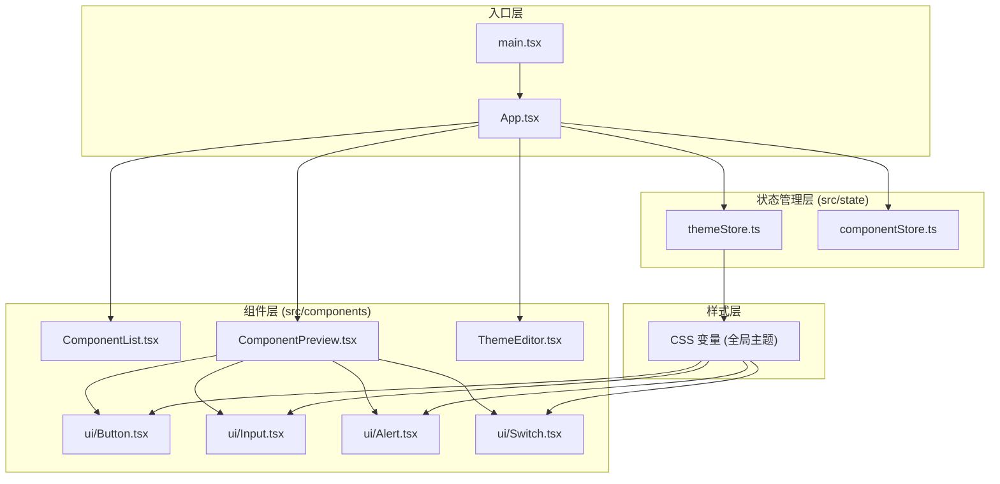

## 1. 架构设计



## 2. 技术说明

- **前端框架**：React@18 + TypeScript@5
- **构建工具**：Vite@5 + @vitejs/plugin-react@4
- **状态管理**：React Context + useReducer（轻量级，避免引入额外依赖）
- **样式方案**：原生 CSS + CSS 变量（CSS Custom Properties）实现主题切换
- **图标**：lucide-react
- **性能优化**：React.memo、useMemo、useCallback 避免不必要重渲染

## 3. 文件结构

```
src/
├── main.tsx                  # React 入口，渲染 App
├── App.tsx                   # 根组件，整合三栏布局
├── state/
│   ├── themeStore.ts         # 主题状态管理（Context + Provider）
│   ├── componentStore.ts     # 组件数据管理（Context + Provider）
│   └── index.ts              # 统一导出
├── components/
│   ├── ComponentList.tsx     # 左侧组件导航列表
│   ├── ComponentPreview.tsx  # 中央组件预览面板
│   ├── ThemeEditor.tsx       # 右侧主题编辑器
│   └── ui/
│       ├── Button.tsx        # 按钮组件（含三种变体）
│       ├── Input.tsx         # 输入框组件（含三种类型）
│       ├── Alert.tsx         # 提示条组件（含四种类型）
│       └── Switch.tsx        # 开关组件
├── styles/
│   ├── globals.css           # 全局样式与 CSS 变量
│   └── variables.css         # 主题变量定义
└── types/
    ├── theme.ts              # 主题类型定义
    └── component.ts          # 组件类型定义
```

### 文件间调用关系与数据流向

1. **main.tsx → App.tsx**：应用入口，挂载根组件
2. **App.tsx**：
   - 引入 `ThemeProvider` 和 `ComponentProvider` 包裹整个应用
   - 组合 `ComponentList`、`ComponentPreview`、`ThemeEditor` 三栏布局
   - 数据流向：Provider 向下注入状态，各组件通过 hook 消费

3. **state/themeStore.ts**：
   - 定义 `ThemeContext` 和 `ThemeProvider`
   - 提供 `useTheme` hook 供消费
   - 数据流向：`ThemeEditor` 调用 `setTheme` → 更新 Context → 所有消费组件重渲染

4. **state/componentStore.ts**：
   - 定义 `ComponentContext` 和 `ComponentProvider`
   - 内置四个组件的所有状态定义数据
   - 提供 `useComponent` hook 供消费
   - 数据流向：`ComponentList` 调用 `selectComponent` → 更新当前选中 → `ComponentPreview` 接收新数据

5. **components/ComponentPreview.tsx**：
   - 消费 `useTheme` 和 `useComponent`
   - 渲染当前选中组件的所有状态实例
   - 数据流向：读取主题变量和组件状态 → 映射渲染多个 `ui/*` 组件

6. **components/ThemeEditor.tsx**：
   - 消费 `useTheme`
   - 提供颜色、圆角、阴影、字体编辑控件
   - 数据流向：用户交互 → 调用 `updateTheme` → 主题更新

7. **components/ComponentList.tsx**：
   - 消费 `useComponent`
   - 渲染组件导航列表
   - 数据流向：用户点击 → 调用 `selectComponent` → 切换预览组件

## 4. 数据模型

### 4.1 主题数据模型

```typescript
interface Theme {
  primaryColor: string;      // 主色
  borderRadius: number;      // 圆角大小 (px)
  boxShadow: number;         // 阴影强度 (0-8)
  fontFamily: string;        // 字体族
}
```

### 4.2 组件数据模型

```typescript
type ComponentType = 'button' | 'input' | 'alert' | 'switch';
type ComponentState = 'default' | 'hover' | 'focus' | 'loading' | 'disabled' | 'success' | 'error';
type ButtonVariant = 'primary' | 'secondary' | 'text';
type InputType = 'text' | 'password' | 'search';
type AlertType = 'info' | 'warning' | 'error' | 'success';

interface ComponentItem {
  id: ComponentType;
  name: string;
  defaultProps: Record<string, unknown>;
  states: ComponentState[];
  variants?: string[];
}
```

## 5. 性能优化策略

1. **React.memo**：`ComponentPreview`、`ThemeEditor`、`ComponentList` 及所有 UI 组件均使用 memo 包裹
2. **useMemo**：组件状态矩阵计算、样式对象计算使用 useMemo 缓存
3. **useCallback**：事件处理函数使用 useCallback 缓存
4. **CSS 变量**：主题变更通过 CSS 变量实现，避免 React 树的全量重渲染
5. **状态隔离**：主题状态与组件状态分离，避免互相触发无关重渲染

## 6. 响应式断点

| 断点 | 布局变化 |
|------|---------|
| > 900px | 三栏完整布局 |
| ≤ 900px | 右侧主题编辑器折叠为底部抽屉 |
| ≤ 700px | 左侧组件导航变为顶部标签页 |
