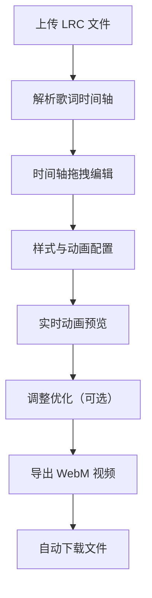

## 1. 产品概述
在线歌词排版与分享应用，让用户上传 LRC 格式歌词，通过可视化编辑器调整时间轴、样式和动画效果，最终导出可播放的歌词动画视频。

- 主要用途：为音乐创作者、视频制作者提供便捷的歌词动画制作工具
- 解决问题：传统歌词视频制作需要专业视频编辑软件，门槛高、耗时久
- 目标用户：音乐爱好者、UP主、短视频创作者、教育工作者
- 市场价值：零门槛、浏览器端运行、无需安装软件，降低歌词视频制作成本

## 2. 核心功能

### 2.1 用户角色
| 角色 | 注册方式 | 核心权限 |
|------|----------|----------|
| 访客用户 | 无需注册 | 上传歌词、编辑样式、导出视频、下载文件 |

### 2.2 功能模块
1. **歌词上传模块**：拖拽/点击上传 LRC 文件，实时解析进度显示
2. **时间轴编辑器**：歌词列表展示、拖拽排序、边缘拖拽调整时间、精确时间戳显示
3. **样式编辑面板**：字体、字号、颜色、入场/出场动画效果配置
4. **动画预览区**：16:9 比例预览窗口、播放控制、进度条拖拽、实时动画渲染
5. **视频导出模块**：浏览器端 FFmpeg 合成 WebM 视频、进度显示、自动下载

### 2.3 页面详情
| 页面名称 | 模块名称 | 功能描述 |
|-----------|-------------|---------------------|
| 主页面 | 上传区域 | 点击或拖拽上传 LRC 文件，高亮动画反馈，进度条显示 |
| 主页面 | 时间轴编辑器 | 歌词条目列表，支持拖拽排序，左右边缘拖拽调整起止时间（最小步长 0.1 秒） |
| 主页面 | 样式编辑面板 | 下拉选择字体（宋体、黑体、楷体、Arial、Georgia），字号滑块（12-72px），颜色选择器（十六进制/HSL），动画效果选择 |
| 主页面 | 动画预览区 | 16:9 播放窗口，播放/暂停按钮，可拖拽进度条，当前时间显示（精确到 0.1 秒），实时歌词动画渲染 |
| 主页面 | 导出工具栏 | 导出 WebM 按钮，进度百分比显示，模拟进度条动画 |

## 3. 核心流程
用户上传 LRC 歌词文件 → 系统自动解析时间轴和文本 → 用户拖拽调整歌词顺序和时间 → 用户配置每句歌词的字体、颜色和动画 → 用户点击预览查看动画效果 → 用户点击导出生成 WebM 视频 → 自动下载视频文件

## 4. 用户界面设计

### 4.1 设计风格
- 主色调：深色背景 #1a1a2e，卡片底色 #16213e，强调色 #e94560
- 渐变背景：顶部工具栏 #0f3460 到 #1a1a2e 渐变
- 按钮样式：圆角设计，悬停时背景色亮度提升 + translateY(-2px) 动画
- 布局风格：左右分栏（桌面端），上下堆叠（移动端）
- 阴影效果：卡片柔和阴影，拖拽元素阴影放大 + 缩放动画
- 边框效果：预览区四周 #e94560 发光边框

### 4.2 页面设计概述
| 页面名称 | 模块名称 | UI 元素 |
|-----------|-------------|-------------|
| 主页面 | 上传区域 | 渐变背景，虚线边框，拖拽高亮动画（transform 0.2s ease），上传进度条 |
| 主页面 | 时间轴编辑器 | 白色卡片（圆角 12px，柔和阴影），占 40% 宽度，可拖拽条目（拖拽时缩放 1.05 + 阴影加深） |
| 主页面 | 样式编辑面板 | 深色背景，表单控件，下拉选择器，颜色选择器，滑块控件 |
| 主页面 | 动画预览区 | 深色背景，占 60% 宽度，16:9 比例，四周 #e94560 发光边框，播放控制栏 |
| 主页面 | 导出工具栏 | 强调色按钮，导出进度条，百分比数字 |

### 4.3 响应式设计
- **桌面端（≥768px）**：左右分栏布局，左侧时间轴 40%，右侧预览 60%
- **移动端（<768px）**：上下堆叠布局，时间轴在上，预览区在下，全宽显示
- **缩放适配**：字体大小、按钮尺寸、间距按比例缩小
- **触控优化**：拖拽区域扩大，最小触控目标 44px

### 4.4 动画规范
- 拖拽动画：transform 0.2s ease，缩放 1.05，阴影加深
- 按钮悬停：background-color 亮度 +15%，translateY(-2px)，0.2s 过渡
- 歌词动画：淡入、左侧滑入、底部升起、缩放出现；淡出、右侧滑出、缩小消失
- 进度条动画：平滑过渡，60FPS 渲染
- 高亮效果：拖拽上传区域边框闪烁动画

## 5. 性能指标
- LRC 解析：≤500 行歌词解析时间 ≤200ms
- 拖拽响应：时间轴拖拽时预览刷新延迟 ≤100ms
- 动画帧率：稳定 ≥30FPS
- 视频导出：4 分钟视频合成耗时 ≤3 分钟
