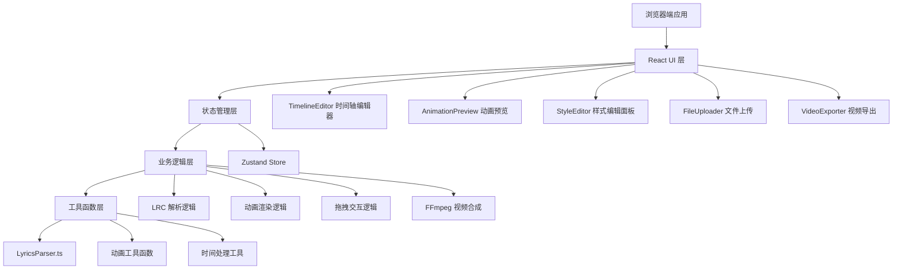

## 1. 架构设计


## 2. 技术描述
- **前端框架**：React 18 + TypeScript 5 + Vite 5
- **构建工具**：Vite 5，使用 @vitejs/plugin-react
- **拖拽库**：react-dnd + react-dnd-html5-backend
- **视频处理**：@ffmpeg/ffmpeg（浏览器端 WebAssembly）
- **状态管理**：Zustand（轻量级状态管理）
- **样式方案**：原生 CSS + CSS 变量 + 响应式媒体查询
- **初始化工具**：vite-init react-ts 模板

## 3. 项目文件结构
```
auto41/
├── package.json
├── index.html
├── tsconfig.json
├── vite.config.js
├── src/
│   ├── main.tsx                 # React 应用入口
│   ├── App.tsx                  # 主应用组件
│   ├── LyricsParser.ts          # LRC 歌词解析器
│   ├── TimelineEditor.tsx       # 时间轴编辑器
│   ├── AnimationPreview.tsx     # 动画预览面板
│   ├── StyleEditor.tsx          # 样式编辑面板
│   ├── VideoExporter.tsx        # 视频导出组件
│   ├── FileUploader.tsx         # 文件上传组件
│   ├── store/
│   │   └── useLyricsStore.ts    # Zustand 状态管理
│   ├── types/
│   │   └── index.ts             # TypeScript 类型定义
│   ├── utils/
│   │   ├── animation.ts         # 动画工具函数
│   │   └── time.ts              # 时间处理工具
│   └── styles/
│       └── global.css           # 全局样式
```

## 4. 核心类型定义
```typescript
// src/types/index.ts

export interface LyricLine {
  id: string;
  startTime: number;      // 秒
  endTime: number;        // 秒
  text: string;
  style: LyricStyle;
}

export interface LyricStyle {
  fontFamily: '宋体' | '黑体' | '楷体' | 'Arial' | 'Georgia';
  fontSize: number;       // 12-72px
  color: string;          // 十六进制颜色
  enterAnimation: 'fadeIn' | 'slideLeft' | 'riseUp' | 'zoomIn';
  exitAnimation: 'fadeOut' | 'slideRight' | 'zoomOut';
  animationDuration: number;  // 秒
}

export interface LyricsMetadata {
  title?: string;
  artist?: string;
  album?: string;
}

export interface LyricsData {
  metadata: LyricsMetadata;
  lines: LyricLine[];
  totalDuration: number;
}

export interface PlayerState {
  isPlaying: boolean;
  currentTime: number;
  duration: number;
}

export type ExportProgress = {
  status: 'idle' | 'processing' | 'completed' | 'error';
  progress: number;  // 0-100
  message?: string;
};
```

## 5. 状态管理设计
```typescript
// src/store/useLyricsStore.ts
import { create } from 'zustand';
import { LyricsData, LyricLine, PlayerState, ExportProgress } from '../types';

interface LyricsStore {
  lyricsData: LyricsData | null;
  selectedLineId: string | null;
  playerState: PlayerState;
  exportProgress: ExportProgress;
  
  // Actions
  setLyricsData: (data: LyricsData) => void;
  updateLyricLine: (id: string, updates: Partial<LyricLine>) => void;
  reorderLyricLines: (fromIndex: number, toIndex: number) => void;
  selectLine: (id: string | null) => void;
  setPlayerState: (state: Partial<PlayerState>) => void;
  setExportProgress: (progress: Partial<ExportProgress>) => void;
  clearAll: () => void;
}
```

## 6. 核心模块设计

### 6.1 LyricsParser 模块
- **输入**：LRC 格式文本字符串
- **输出**：LyricsData 结构化数据
- **核心功能**：
  - 解析 LRC 时间标签 [mm:ss.xx]
  - 解析元数据标签 [ti:], [ar:], [al:]
  - 自动计算每句歌词的结束时间（下一句开始时间）
  - 性能优化：≤500 行歌词解析 ≤200ms

### 6.2 TimelineEditor 模块
- **技术实现**：react-dnd 拖拽交互
- **核心功能**：
  - 歌词条目拖拽排序（调整顺序）
  - 左右边缘拖拽调整起止时间（最小步长 0.1 秒）
  - 鼠标悬停显示精确时间戳
  - 选中状态高亮
  - 实时联动预览面板

### 6.3 AnimationPreview 模块
- **渲染技术**：requestAnimationFrame + CSS 动画
- **核心功能**：
  - 16:9 比例自适应容器
  - requestAnimationFrame 驱动的动画循环（≥30FPS）
  - 根据当前时间计算歌词显示状态
  - 应用入场/出场 CSS 动画
  - 播放控制（播放/暂停/进度跳转）

### 6.4 VideoExporter 模块
- **技术实现**：@ffmpeg/ffmpeg WebAssembly
- **核心功能**：
  - 逐帧渲染动画到 Canvas
  - 使用 FFmpeg 编码为 WebM 格式
  - 实时导出进度反馈（0-100%）
  - 导出完成自动触发下载
  - 文件名包含歌曲名和时间戳

## 7. 动画实现方案
### 7.1 CSS 动画关键帧
```css
@keyframes fadeIn { from { opacity: 0; } to { opacity: 1; } }
@keyframes fadeOut { from { opacity: 1; } to { opacity: 0; } }
@keyframes slideLeft { from { transform: translateX(-100px); opacity: 0; } }
@keyframes slideRight { to { transform: translateX(100px); opacity: 0; } }
@keyframes riseUp { from { transform: translateY(50px); opacity: 0; } }
@keyframes zoomIn { from { transform: scale(0.5); opacity: 0; } }
@keyframes zoomOut { to { transform: scale(0.5); opacity: 0; } }
```

### 7.2 动画状态机
```
INACTIVE → ENTERING（入场动画）→ ACTIVE（显示）→ EXITING（出场动画）→ INACTIVE
```

## 8. 性能优化策略
1. **LRC 解析优化**：正则表达式预编译，一次性扫描解析
2. **拖拽防抖**：使用 requestAnimationFrame 节流拖拽事件
3. **React 优化**：memo 包裹重渲染组件，useCallback 缓存回调
4. **动画优化**：transform + opacity 动画，触发 GPU 加速
5. **导出优化**：Canvas 离屏渲染，帧缓存复用

## 9. 构建配置
### vite.config.js
- 使用 @vitejs/plugin-react
- 配置 @ffmpeg/ffmpeg 的 WebAssembly 加载路径
- 生产构建优化配置

### tsconfig.json
- 严格模式 strict: true
- JSX 编译模式：react-jsx
- 模块解析：bundler
