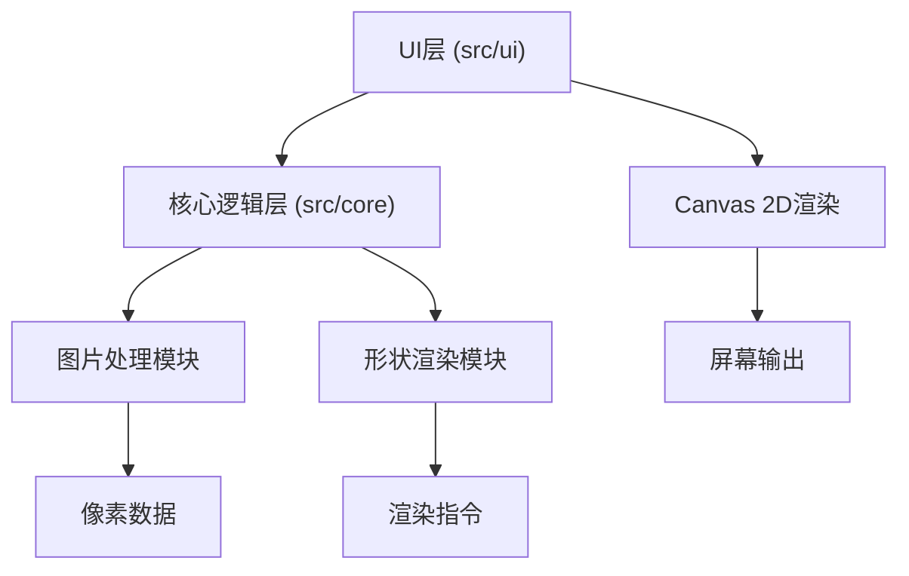

## 1. 架构设计



## 2. 技术说明

- **前端框架**：React 18 + TypeScript
- **构建工具**：Vite
- **渲染引擎**：Canvas 2D API
- **状态管理**：React useState/useReducer（组件内状态）
- **图标库**：lucide-react

## 3. 模块结构

```
src/
├── core/
│   ├── imageProcessor.ts    # 图片加载、缩略生成、像素颜色提取
│   └── shapeRenderer.ts     # 几何形状SVG路径、混合模式、发光效果
└── ui/
    ├── App.tsx              # 主应用组件，全局状态管理
    ├── Canvas.tsx           # 画布渲染，缩放平移，粒子动画
    ├── Toolbar.tsx          # 左侧工具栏，图片上传拖拽
    └── EditorPanel.tsx      # 右侧编辑面板，参数调整
```

## 4. 数据模型

### 4.1 类型定义

```typescript
// 上传图片数据
interface UploadedImage {
  id: string;
  file: File;
  thumbnailUrl: string;
  originalUrl: string;
  width: number;
  height: number;
  pixelData: ImageData;
}

// 画布上的图片实例
interface CanvasImage {
  id: string;
  imageId: string;
  x: number;
  y: number;
  width: number;
  height: number;
  opacity: number;           // 0-100
  blendMode: 'normal' | 'multiply' | 'screen' | 'overlay';
  fadeInProgress: number;    // 0-1 动画进度
}

// 几何形状
interface Shape {
  id: string;
  canvasImageId: string;
  type: 'circle' | 'triangle' | 'hexagon';
  x: number;
  y: number;
  size: number;              // 10-200 px
  rotation: number;          // 0-360 degrees
  strokeWidth: number;       // 0.5-2 px
  glowColor: string;
  fillPixels: { r: number; g: number; b: number }[];
}

// 粒子光效
interface Particle {
  id: string;
  shapeId: string;
  x: number;
  y: number;
  vx: number;
  vy: number;
  size: number;
  color: { r: number; g: number; b: number };
  alpha: number;
  life: number;
}

// 画布视图状态
interface CanvasView {
  scale: number;             // 0.5-3
  offsetX: number;
  offsetY: number;
}

// 全局状态
interface AppState {
  uploadedImages: UploadedImage[];
  canvasImages: CanvasImage[];
  shapes: Shape[];
  particles: Particle[];
  lightEffectsEnabled: boolean;
  selectedImageId: string | null;
  canvasView: CanvasView;
}
```

## 5. 核心函数接口

### 5.1 src/core/imageProcessor.ts
```typescript
// 上传并处理图片，生成缩略图和像素数据
export async function uploadImage(
  file: File,
  canvasSize: { width: number; height: number }
): Promise<{
  thumbnailUrl: string;
  originalUrl: string;
  pixelData: ImageData;
  width: number;
  height: number;
}>;

// 从指定位置提取像素颜色
export function extractColor(
  pixelData: ImageData,
  x: number,
  y: number,
  width: number
): { r: number; g: number; b: number };
```

### 5.2 src/core/shapeRenderer.ts
```typescript
// 生成几何形状的SVG路径数据
export function createShape(
  type: 'circle' | 'triangle' | 'hexagon',
  size: number,
  rotation: number,
  centerX: number,
  centerY: number
): string;

// 计算形状与图片交集区域的像素
export function getShapePixelRegion(
  type: 'circle' | 'triangle' | 'hexagon',
  size: number,
  rotation: number,
  centerX: number,
  centerY: number,
  imagePixelData: ImageData,
  imageX: number,
  imageY: number,
  imageWidth: number
): { r: number; g: number; b: number }[];

// 应用混合模式计算最终颜色
export function applyBlendMode(
  baseColor: { r: number; g: number; b: number },
  blendColor: { r: number; g: number; b: number },
  mode: 'normal' | 'multiply' | 'screen' | 'overlay',
  opacity: number
): { r: number; g: number; b: number };
```
