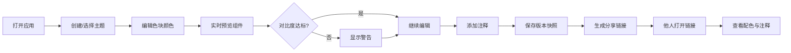

## 1. 产品概述

多主题配色方案协作编辑与预览网页应用，解决设计团队协作时颜色风格不统一、预览效率低的痛点。面向设计师与前端开发者，支持在线创建多主题、实时预览组件效果、共享协作链接、版本回溯与无障碍检查。

## 2. 核心功能

### 2.1 用户角色
| 角色 | 登录方式 | 核心权限 |
|------|---------|---------|
| 访客用户 | 无需登录，直接使用 | 编辑主题、预览、生成分享链接、查看注释与历史版本 |

### 2.2 功能模块
1. **编辑面板（左侧）**：主题列表管理、5色色块拾色器、注释输入、历史版本列表
2. **预览区域（右侧）**：6种UI组件实时渲染、对比度警告提示
3. **共享系统**：URL哈希编码主题数据、生成唯一链接、注释绑定

### 2.3 页面详情
| 页面名称 | 模块名称 | 功能描述 |
|---------|---------|---------|
| 主页面 | 主题管理 | 创建/重命名/删除主题、切换当前编辑主题 |
| 主页面 | 色块编辑 | 5色（主色/辅色/背景/文字/强调）拾色器、HEX输入、对比度警告 |
| 主页面 | 版本管理 | 手动保存快照、最多10条版本、点击还原 |
| 主页面 | 注释系统 | 文本输入、保存绑定、分享后可见 |
| 主页面 | 共享链接 | 生成带主题编码的URL、一键复制 |
| 主页面 | 实时预览 | 按钮/卡片/导航栏/输入框/侧边栏/进度条6组件渲染 |
| 主页面 | 无障碍检查 | 主色-背景、文字-背景对比度WCAG AA校验 |

## 3. 核心流程

用户打开应用 → 创建或选择主题 → 调整5个色块（实时预览）→ 查看对比度警告 → 添加注释 → 保存版本快照 → 生成分享链接 → 他人打开链接查看相同配色与注释

## 4. 用户界面设计

### 4.1 设计风格
- **色彩体系**：深色模式，背景 #1a1a2e，文字 #e0e0e0
- **圆角**：统一 12px
- **毛玻璃**：左侧面板 backdrop-filter: blur(8px)
- **交互反馈**：
  - 按钮悬停：scale(1.05) + 阴影加深
  - 点击按下：transform: translateY(1px)
  - 颜色切换：0.3s 渐入动画
  - 警告提示：0.5s 淡入淡出
- **尺寸**：左侧面板固定 320px

### 4.2 页面设计概览
| 页面名称 | 模块名称 | UI元素 |
|---------|---------|-------|
| 主页面 | 编辑面板 | 主题列表（添加/重命名/删除按钮）、5个色块+拾色器+对比度警告图标、注释文本框、保存按钮、版本列表、分享链接按钮 |
| 主页面 | 预览区域 | 网格布局：按钮、卡片、导航栏、输入框、侧边栏、进度条6组件，各组件下方显示对比度警告 |

### 4.3 响应式
- **1024px 以上**：左右两栏布局，左320px右弹性
- **768px ~ 1024px**：左侧折叠为图标按钮，点击展开覆盖式抽屉面板
- **768px 以下**：同抽屉模式，面板宽度自适应

### 4.4 性能优化
- 色块变化时使用 CSS 变量 + React memo 避免全量重绘
- 颜色更新防抖处理，预览延迟控制在 50ms 以内
