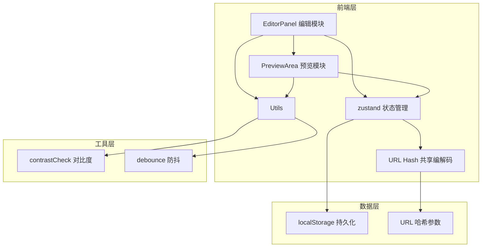

## 1. 架构设计



## 2. 技术说明

- **前端框架**：React@18 + TypeScript + Vite@5
- **样式方案**：原生 CSS（CSS Modules），不使用 Tailwind，按需使用 CSS 变量
- **状态管理**：zustand（轻量、简洁、支持 selector 优化渲染）
- **拾色器**：react-colorful（轻量、支持 HEX、无额外依赖）
- **数据持久化**：localStorage（主题、注释、历史版本）
- **共享机制**：URL Hash 编码（Base64 + JSON.stringify，无需后端）
- **构建工具**：Vite@5 + @vitejs/plugin-react

## 3. 路由定义

| 路由 | 用途 |
|-----|------|
| / | 主编辑页面（无参数时加载默认主题） |
| /#theme=xxx | 加载共享主题（Base64 编码的主题 JSON） |

## 4. 类型定义

```typescript
interface ThemeColors {
  primary: string;   // 主色
  secondary: string; // 辅色
  background: string;// 背景色
  text: string;      // 文字色
  accent: string;    // 强调色
}

interface Theme {
  id: string;
  name: string;
  colors: ThemeColors;
  comments: string;
  createdAt: number;
  updatedAt: number;
}

interface HistorySnapshot {
  id: string;
  themeId: string;
  colors: ThemeColors;
  timestamp: number;
  label?: string;
}

interface AppState {
  themes: Theme[];
  activeThemeId: string | null;
  history: HistorySnapshot[];
  // actions
  createTheme: () => void;
  renameTheme: (id: string, name: string) => void;
  deleteTheme: (id: string) => void;
  setActiveTheme: (id: string) => void;
  updateColor: (key: keyof ThemeColors, value: string) => void;
  updateComments: (text: string) => void;
  saveSnapshot: () => void;
  restoreSnapshot: (snapshotId: string) => void;
  generateShareLink: () => string;
  loadFromHash: () => void;
}
```

## 5. 目录结构

```
src/
├── editor/
│   ├── EditorPanel.tsx      # 左侧编辑主面板
│   ├── ColorPickerCell.tsx  # 单个色块+拾色器子组件
│   └── HistoryPanel.tsx     # 历史版本列表子组件
├── preview/
│   ├── PreviewArea.tsx      # 右侧预览主区域
│   └── components/
│       ├── ButtonDemo.tsx
│       ├── CardDemo.tsx
│       ├── NavBarDemo.tsx
│       ├── InputDemo.tsx
│       ├── SidebarDemo.tsx
│       └── ProgressDemo.tsx
├── utils/
│   ├── contrastCheck.ts     # WCAG 对比度计算
│   └── debounce.ts          # 防抖工具
├── store/
│   └── useThemeStore.ts     # zustand 状态管理
├── styles/
│   └── global.css           # 全局样式与 CSS 变量
├── App.tsx
└── main.tsx
```

## 6. 数据模型

### 6.1 数据存储策略
- **localStorage 键**：
  - `colorlab.themes`：所有主题数组
  - `colorlab.activeThemeId`：当前激活主题 ID
  - `colorlab.history.{themeId}`：每个主题的历史版本数组（最多10条）
- **URL Hash 格式**：`#t=<base64url(JSON.stringify(Theme))>`
