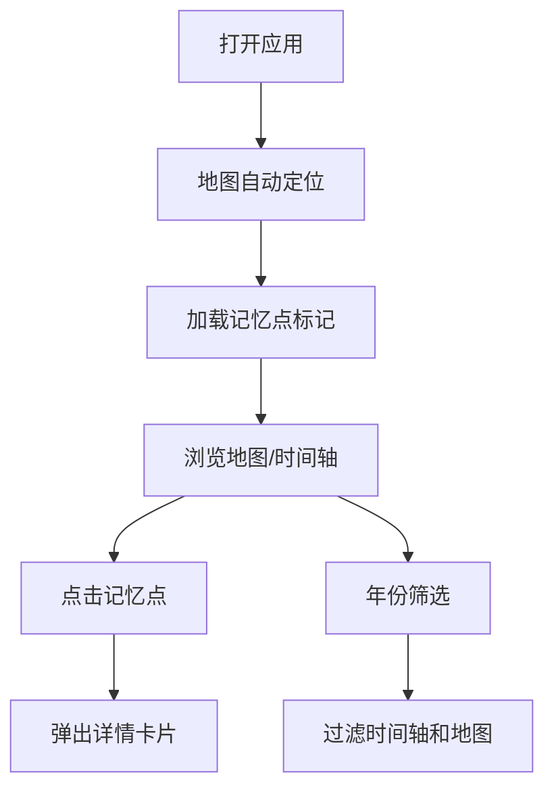

## 1. 产品概述
MemoirMap 是一款基于地图的记忆记录与浏览应用，让用户在交互式地图上记录不同时刻的回忆片段，通过时间线与地图联动的方式重温美好时光。
- 核心价值：将空间位置与时间记忆结合，创造沉浸式的回忆浏览体验
- 目标用户：喜欢记录生活、旅行、重要时刻的用户群体

## 2. 核心功能

### 2.1 用户角色
| 角色 | 注册方式 | 核心权限 |
|------|----------|----------|
| 普通用户 | 无需注册，本地使用 | 浏览记忆、添加记忆、筛选记忆 |

### 2.2 功能模块
1. **地图交互模块**：全屏交互式地图，自动定位，记忆点标记，弹出卡片展示
2. **时间轴模块**：垂直时间轴展示记忆列表，年份筛选，与地图联动
3. **记忆卡片模块**：展示记忆详情，包含标题、描述、图片、心情标签
4. **数据管理模块**：后端API服务，SQLite数据存储，增删改查操作

### 2.3 页面详情
| 页面名称 | 模块名称 | 功能描述 |
|----------|----------|----------|
| 主页面 | 地图视图 | 全屏Leaflet地图，自动定位到用户位置，彩色图钉标记记忆点，点击弹出详情卡片 |
| 主页面 | 时间轴 | 左侧垂直时间轴，按日期倒序排列，支持年份筛选，点击联动地图 |
| 主页面 | 记忆卡片 | 模糊背景圆角卡片，展示标题、描述、缩略图、心情emoji，淡入淡出动画 |

## 3. 核心流程
用户打开应用 → 地图自动定位并加载记忆点 → 用户浏览地图或滚动时间轴 → 点击记忆点或时间轴条目 → 查看记忆详情 → 通过年份筛选快速定位特定时期的回忆

## 4. 用户界面设计

### 4.1 设计风格
- 主色调：#F5E6CA（暖米色）
- 辅助色：#8B4513（深棕色）、#A0522D（赭石色）
- 按钮风格：圆角按钮，细微阴影，悬停上浮效果（translateY -2px）
- 字体：标题使用"Noto Serif SC"，正文使用"Noto Sans SC"
- 布局：地图全屏，时间轴左侧悬浮，毛玻璃半透明背景
- 心情emoji：开心😊、忧伤😢、惊喜😮、平静😌、怀念🥹

### 4.2 页面设计概述
| 页面名称 | 模块名称 | UI元素 |
|----------|----------|--------|
| 主页面 | 地图视图 | 全屏Leaflet地图、彩色图钉标记、地图控制按钮（右下角）、淡入卡片动画 |
| 主页面 | 时间轴 | 垂直时间线、日期标签、标题、心情颜色圆点、年份下拉筛选框、毛玻璃背景 |
| 主页面 | 记忆卡片 | 模糊背景、圆角边框、阴影、缩略图、标题、描述、emoji、淡入滑入动画 |

### 4.3 响应式设计
- 桌面端（≥768px）：左侧垂直时间轴（宽度280px），地图自适应剩余空间
- 移动端（<768px）：时间轴收窄为底部横条，点击后展开为全屏时间轴
- 地图高度始终自适应视口高度
- 触摸交互优化，增大点击区域

## 5. 性能要求
- 地图加载和标记渲染：≤2秒
- 时间轴筛选响应：≤200ms
- 卡片动画流畅度：60fps
- 飞行动画时间：500ms
