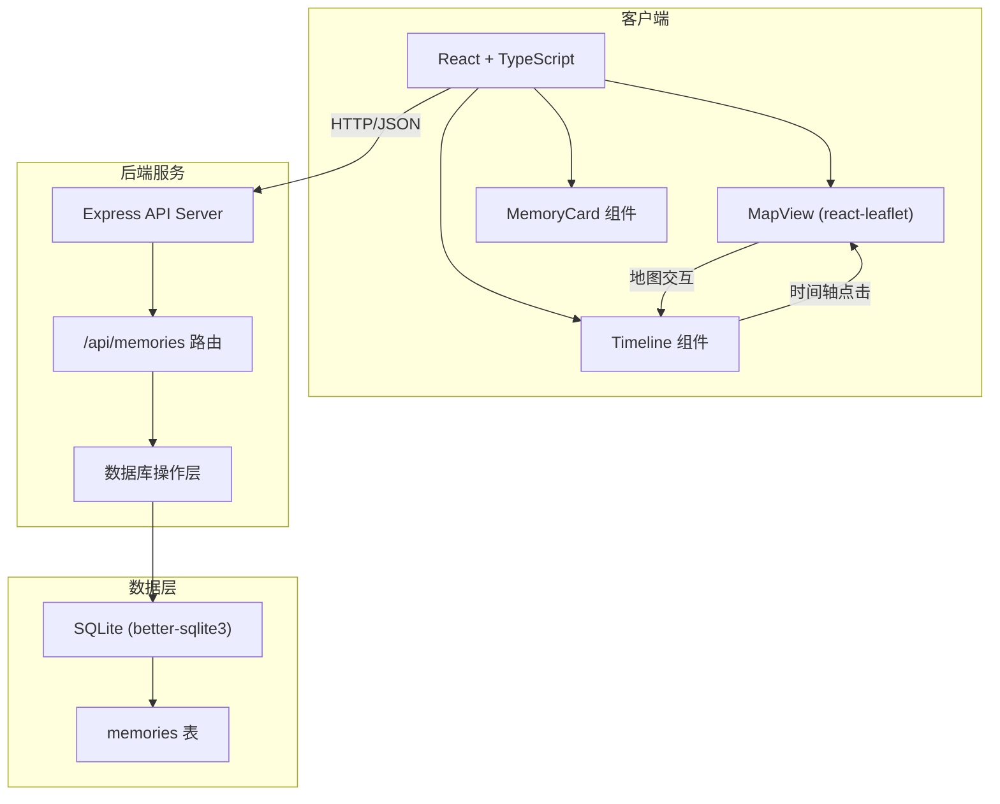
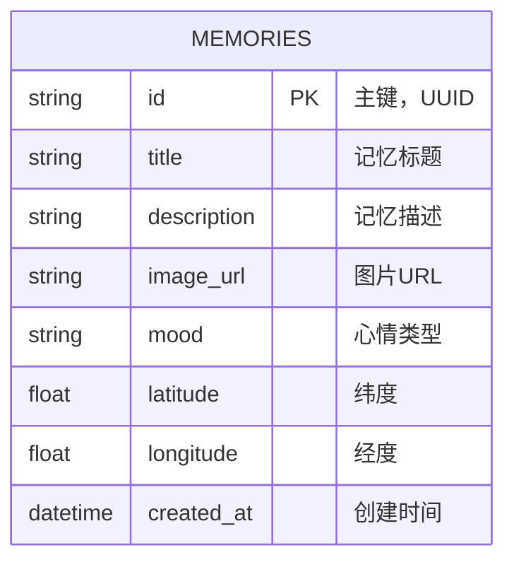

## 1. 架构设计



## 2. 技术描述
- **前端框架**：React 18 + TypeScript
- **构建工具**：Vite
- **地图库**：Leaflet + react-leaflet
- **状态管理**：React useState/useEffect (简单场景)
- **HTTP客户端**：Axios
- **后端**：Express 4 + TypeScript
- **数据库**：SQLite (better-sqlite3)
- **唯一ID**：uuid
- **跨域处理**：cors
- **图标**：lucide-react

## 3. 路由定义
| 路由 | 用途 |
|------|------|
| / | 主页面，包含地图和时间轴 |
| GET /api/memories | 获取所有记忆列表 |
| GET /api/memories?year=2024 | 按年份筛选记忆 |
| POST /api/memories | 新增记忆 |

## 4. API 定义

### 4.1 类型定义
```typescript
enum Mood {
  HAPPY = 'happy',
  SAD = 'sad',
  SURPRISED = 'surprised',
  CALM = 'calm',
  NOSTALGIC = 'nostalgic'
}

interface Memory {
  id: string;
  title: string;
  description: string;
  image_url: string;
  mood: Mood;
  latitude: number;
  longitude: number;
  created_at: string;
}
```

### 4.2 接口规范

**GET /api/memories**
- 请求参数：year (可选，number)
- 响应：`{ success: boolean; data: Memory[] }`
- 状态码：200

**POST /api/memories**
- 请求体：`Omit<Memory, 'id' | 'created_at'>`
- 响应：`{ success: boolean; data: Memory }`
- 状态码：201

## 5. 服务器架构图


## 6. 数据模型

### 6.1 数据模型定义



### 6.2 数据定义语言

```sql
CREATE TABLE IF NOT EXISTS memories (
  id TEXT PRIMARY KEY,
  title TEXT NOT NULL,
  description TEXT NOT NULL,
  image_url TEXT NOT NULL,
  mood TEXT NOT NULL CHECK (mood IN ('happy', 'sad', 'surprised', 'calm', 'nostalgic')),
  latitude REAL NOT NULL,
  longitude REAL NOT NULL,
  created_at DATETIME DEFAULT CURRENT_TIMESTAMP
);

CREATE INDEX IF NOT EXISTS idx_memories_created_at ON memories(created_at);
CREATE INDEX IF NOT EXISTS idx_memories_mood ON memories(mood);

-- 示例数据
INSERT INTO memories (id, title, description, image_url, mood, latitude, longitude, created_at) VALUES
('1', '巴黎铁塔的日落', '那天在巴黎埃菲尔铁塔下看到了最美的日落，整个天空都被染成了金色。', 'https://images.unsplash.com/photo-1502602898657-3e91760cbb34?w=400', 'happy', 48.8584, 2.2945, '2024-06-15T18:30:00Z'),
('2', '东京的初雪', '2023年冬天在东京看到的第一场雪，浅草寺在雪中显得格外宁静。', 'https://images.unsplash.com/photo-1545569341-9eb8b30979d9?w=400', 'calm', 35.7148, 139.7967, '2023-12-20T09:15:00Z'),
('3', '丽江古城的邂逅', '在丽江古城的小桥流水旁，遇到了多年未见的老朋友。', 'https://images.unsplash.com/photo-1528127269322-539801943592?w=400', 'surprised', 26.8721, 100.2313, '2024-03-08T14:20:00Z'),
('4', '故乡的老槐树', '回到故乡，看到村口那棵老槐树，想起了童年的夏天。', 'https://images.unsplash.com/photo-1441974231531-c6227db76b6e?w=400', 'nostalgic', 34.0522, 118.2437, '2024-01-12T11:00:00Z'),
('5', '雨天的咖啡馆', '一个人在咖啡馆看书，窗外下着雨，心情有些低落。', 'https://images.unsplash.com/photo-1495474472287-4d71bcdd2085?w=400', 'sad', 31.2304, 121.4737, '2024-04-22T16:45:00Z'),
('6', '马尔代夫的婚礼', '最好的朋友在马尔代夫举办了婚礼，那是我见过最美的海边仪式。', 'https://images.unsplash.com/photo-1519741497674-611481863552?w=400', 'happy', 3.2028, 73.2207, '2024-05-20T10:30:00Z');
```

## 7. 项目文件结构

```
auto52/
├── package.json
├── index.html
├── tsconfig.json
├── vite.config.js
├── server/
│   ├── database.ts
│   └── api.ts
├── src/
│   ├── main.tsx
│   ├── types.ts
│   └── components/
│       ├── MapView.tsx
│       └── Timeline.tsx
└── .trae/
    └── documents/
        ├── prd.md
        └── technical-architecture.md
```
