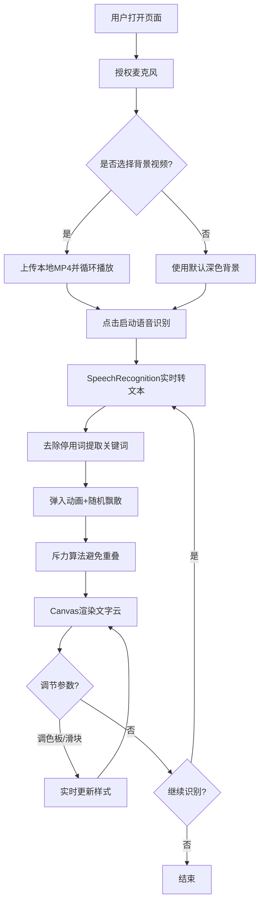

## 1. 产品概述

实时语音文字云可视化应用，将用户语音输入实时转化为动态文字云并叠加到背景视频上，解决直播/会议场景中纯语音或文字列表缺乏视觉吸引力的问题。

- 核心价值：语音→文字→动态视觉的全链路实时呈现，增强信息传达的视觉冲击力和沉浸感
- 目标用户：主播、会议演讲者、教育工作者、内容创作者

## 2. 核心特性

### 2.1 用户角色

| 角色 | 注册方式 | 核心权限 |
|------|----------|----------|
| 普通用户 | 无需注册，直接使用 | 语音识别、视频上传、参数调节、文字云展示 |

### 2.2 功能模块

1. **主界面**：视频背景区、文字云画布、顶部语音滚动条、右侧控制面板
2. **语音识别模块**：麦克风输入、SpeechRecognition实时转译、关键词提取（去停用词）
3. **文字云渲染模块**：Canvas粒子动画、弹入动画、斥力算法避免重叠、圆形/椭圆分布
4. **背景视频模块**：本地MP4上传、循环播放、全屏铺满
5. **控制面板模块**：6种调色板切换、速度滑块（1-10级）、字号滑块（20-60px）、面板折叠

### 2.3 页面详情

| 页面名称 | 模块名称 | 功能描述 |
|----------|----------|----------|
| 主页面 | 视频背景区 | 本地MP4选择、循环播放、全屏铺满、响应式适配 |
| 主页面 | 文字云画布 | Canvas实时渲染、弹入动画（0.8→1.0，200ms）、随机飘散、斥力算法（≤50粒子，帧耗时≤3ms，≥40FPS） |
| 主页面 | 顶部语音滚动条 | 最近5秒文本滚动展示，半透明毛玻璃风格 |
| 主页面 | 右侧控制面板 | 调色板（6色系，0.5s渐变）、速度滑块、字号滑块、折叠展开、圆角卡片样式 |
| 主页面 | 底部工具栏 | 语音启停按钮、视频选择按钮 |

## 3. 核心流程

用户打开页面 → 授权麦克风权限 → 选择本地视频文件（可选） → 启动语音识别 → 语音实时转文本→关键词提取 → 关键词以弹入动画出现→随机飘散形成文字云 → 通过调色板/滑块实时调节效果 → 结束识别

## 4. 用户界面设计

### 4.1 设计风格

- **主色调**：深色毛玻璃风格，背景模糊 blur(10px)，半透明白色边框
- **文字颜色**：默认白色带半透明阴影，支持6种预设色系切换
  - 纯白系、金色系、青蓝系、粉红系、翠绿系、橙黄色系
- **按钮/控件样式**：圆角卡片（border-radius 12-16px），渐变轨道滑块，圆形把柄带脉冲光效
- **字体**：展示字体使用 Noto Sans SC / ZCOOL KuaiLe，正文字体使用系统无衬线
- **布局风格**：左侧视频画布（全屏）+ 右侧控制面板（280px，可折叠），顶部语音滚动条
- **动效**：弹入缩放动画（0.8→1.0，200ms）、颜色渐变过渡（0.5s）、脉冲光效、随机飘散

### 4.2 页面设计概览

| 页面名称 | 模块名称 | UI元素 |
|----------|----------|--------|
| 主页面 | 视频背景区 | 全屏video标签，object-fit: cover，循环播放，z-index: 0 |
| 主页面 | 文字云画布 | position:absolute，全屏Canvas，z-index: 1，透明背景 |
| 主页面 | 顶部滚动条 | 固定顶部，毛玻璃效果，高度50px，白色文字，滚动动画，z-index: 2 |
| 主页面 | 右侧控制面板 | 固定右侧，280px宽，毛玻璃卡片，padding 20px，z-index: 3，支持折叠 |
| 主页面 | 底部工具栏 | 固定底部，毛玻璃栏，居中按钮组，z-index: 2 |

### 4.3 响应式设计

- **桌面端（1024px以上）**：左侧全屏视频区域 + 右侧280px控制面板
- **平板端（1024px及以下）**：视频区域高度为屏幕60%，控制面板变为底部半透明抽屉式
- 触控设备：增大滑块热区，按钮尺寸不小于44px

### 4.4 性能指标

| 指标 | 目标值 |
|------|--------|
| 语音识别启动延迟 | ≤100ms |
| 文字云帧率 | ≥40FPS |
| 最大粒子数 | ≤50个 |
| 单粒子帧耗时 | ≤3ms |
