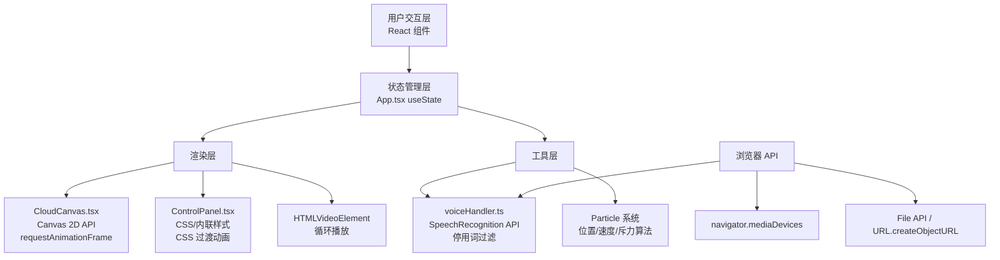

## 1. 架构设计



## 2. 技术栈说明

- **前端框架**：React@18 + TypeScript@5
- **构建工具**：Vite@5 + @vitejs/plugin-react@4
- **渲染方式**：
  - UI 层：React JSX + 原生 CSS（styled via inline/className）
  - 文字云：HTML5 Canvas 2D API + requestAnimationFrame 循环
  - 视频：HTML5 `<video>` + object-fit: cover
- **语音识别**：Web Speech API (SpeechRecognition / webkitSpeechRecognition)
- **无需后端**：全部处理在浏览器端完成，数据零上送

## 3. 项目文件结构

```
auto54/
├── package.json
├── tsconfig.json                  (strict: true)
├── vite.config.js
├── index.html                     (含字体 CDN 链接)
└── src/
    ├── main.tsx                   (React入口，挂载App)
    ├── App.tsx                    (主组件，全局状态+布局组合)
    ├── components/
    │   ├── CloudCanvas.tsx        (Canvas文字云渲染：粒子+斥力+动画)
    │   └── ControlPanel.tsx       (右侧控制面板：调色板+滑块+折叠)
    └── utils/
        └── voiceHandler.ts        (SpeechRecognition封装+去停用词)
```

## 4. 路由定义

| 路由 | 用途 |
|------|------|
| / | 单页应用，主界面（无路由，单组件结构） |

## 5. 核心模块接口定义

### 5.1 状态数据结构

```typescript
// App.tsx 全局状态
interface AppState {
  videoSource: string | null;           // 视频 URL or null
  colorTheme: ColorTheme;               // 当前颜色主题
  speedLevel: 1 | 2 | 3 | 4 | 5 | 6 | 7 | 8 | 9 | 10;  // 文字消失速度
  maxFontSize: number;                  // 最大字号 20-60
  isListening: boolean;                 // 语音识别状态
  recentText: string;                   // 最近5秒文本（顶部滚动）
  keywords: Keyword[];                  // 活跃关键词粒子数组
  panelCollapsed: boolean;              // 控制面板折叠状态
}

// 颜色主题预设
type ColorThemeName = 'white' | 'gold' | 'cyan' | 'pink' | 'green' | 'orange';

interface ColorTheme {
  name: ColorThemeName;
  primary: string;       // 主色
  shadow: string;        // 阴影色(半透明)
  accent: string;        // 强调色
  gradient: [string, string];  // 渐变起止色
}

// 关键词粒子
interface Keyword {
  id: number;
  text: string;
  x: number;             // 画布坐标
  y: number;
  vx: number;            // 速度
  vy: number;
  size: number;          // 当前字号
  targetSize: number;    // 目标字号
  opacity: number;       // 当前透明度
  birthTime: number;     // 出生时间戳 ms
  lifetime: number;      // 生命周期 ms
  scale: number;         // 弹入动画缩放 0.8 -> 1.0
  rotation: number;      // 旋转角度
}
```

### 5.2 voiceHandler 接口

```typescript
interface VoiceHandler {
  start(lang?: string): Promise<void>;
  stop(): void;
  onKeyword(callback: (keyword: string) => void): void;
  onFullText(callback: (text: string) => void): void;
  onError(callback: (error: SpeechRecognitionErrorEvent) => void): void;
  isActive(): boolean;
  destroy(): void;
}

// 停用词集合（中英文）
declare const STOP_WORDS: Set<string>;
```

### 5.3 CloudCanvas Props

```typescript
interface CloudCanvasProps {
  keywords: Keyword[];                 // 由父组件维护
  colorTheme: ColorTheme;
  maxFontSize: number;
  speedLevel: number;                  // 影响寿命/速度
  width: number;                       // 画布宽
  height: number;                      // 画布高
  onParticleUpdate?: (particles: Keyword[]) => void;
}
```

### 5.4 ControlPanel Props

```typescript
interface ControlPanelProps {
  colorTheme: ColorTheme;
  speedLevel: number;
  maxFontSize: number;
  collapsed: boolean;
  isListening: boolean;
  onColorChange: (theme: ColorTheme) => void;
  onSpeedChange: (level: number) => void;
  onFontSizeChange: (size: number) => void;
  onToggleCollapse: () => void;
  onToggleListening: () => void;
  onVideoSelect: (file: File) => void;
}
```

## 6. 核心算法说明

### 6.1 斥力算法（O(N²)，N≤50，总运算≤2500次/帧）

```
每个粒子 P_i 对其他粒子 P_j (j≠i) 施加力：
  dx = P_j.x - P_i.x
  dy = P_j.y - P_i.y
  dist² = dx² + dy² + ε²  (ε 防止除零)
  距离阈值 D = (P_i.size/2 + P_j.size/2) * 1.2
  若 dist² < D² :
    force = k * (1 - sqrt(dist²)/D) / max(sqrt(dist²), 0.1)
    P_i.vx -= force * dx
    P_i.vy -= force * dy
```

### 6.2 椭圆形分布约束

```
画布中心 (cx, cy), 椭圆半轴 a = width*0.4, b = height*0.4
粒子距中心 dx, dy 归一化: dx²/a² + dy²/b² = r²
若 r² > 1.15，则施加指向中心的弹性恢复力
```

### 6.3 速度/寿命映射

```
speedLevel: 1 → 10
lifetime (ms) = clip(12000 - (speedLevel-1)*1000, 2000, 12000)
速度系数   = 0.3 + (speedLevel-1)*0.1
```

## 7. 性能优化策略

| 场景 | 手段 |
|------|------|
| Canvas 渲染 | 离屏测量文字宽度；每帧仅 clear + 重绘，无额外状态切换 |
| 粒子上限 | 数量达 50 时，移除 lifetime 剩余最少的粒子 |
| 帧率控制 | requestAnimationFrame，帧间 deltaTime 补偿物理步进 |
| 语音识别 | continuous + interimResults，仅提取 final 或稳定 interim |
| 重绘优化 | 关键词列表与粒子数据分离，Canvas 内部维护粒子池引用 |

## 8. 预置颜色主题定义

```typescript
const COLOR_THEMES: ColorTheme[] = [
  { name: 'white',  primary: '#ffffff', shadow: 'rgba(0,0,0,0.65)', accent: '#f0f0f0', gradient: ['#ffffff','#d9e8ff'] },
  { name: 'gold',   primary: '#ffd76a', shadow: 'rgba(120,70,0,0.55)', accent: '#fff3b0', gradient: ['#ffd76a','#ff9e45'] },
  { name: 'cyan',   primary: '#6ee7ff', shadow: 'rgba(0,60,120,0.55)', accent: '#bff5ff', gradient: ['#6ee7ff','#3a8bff'] },
  { name: 'pink',   primary: '#ff9ac1', shadow: 'rgba(120,20,60,0.55)', accent: '#ffd1e2', gradient: ['#ff9ac1','#ff5d8f'] },
  { name: 'green',  primary: '#8ef0a7', shadow: 'rgba(0,90,40,0.55)', accent: '#cff9d9', gradient: ['#8ef0a7','#35c97a'] },
  { name: 'orange', primary: '#ffb36b', shadow: 'rgba(140,50,0,0.55)', accent: '#ffd9a8', gradient: ['#ffb36b','#ff7730'] },
];
```
