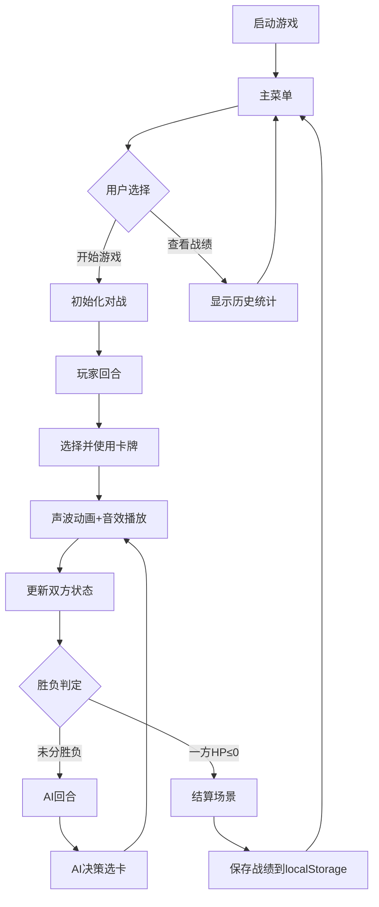

## 1. 产品概述

EchoCaster是一款基于声波卡牌的回合制对战游戏，玩家通过组合不同属性的声波卡牌进行攻击、防御和干扰，体验独特的声波视觉与听觉交互。

- 产品定位：融合音频合成技术与策略卡牌玩法的网页游戏
- 目标用户：喜欢策略卡牌游戏、对音频可视化感兴趣的玩家
- 核心价值：将抽象的声波属性转化为可感知的视觉与听觉体验，创造独特的游戏反馈

## 2. 核心功能

### 2.1 功能模块

1. **主菜单场景**：游戏标题、开始游戏按钮、战绩查看按钮、历史统计显示
2. **对战场景**：玩家与AI回合制卡牌对战、声波动画特效、实时UI更新
3. **结算场景**：胜负结果展示、回合数统计、最高连击数、战绩持久化

### 2.2 页面详情

| 页面名称 | 模块名称 | 功能描述 |
|---------|---------|---------|
| 主菜单 | 标题区 | 发光EchoCaster标题动画 |
| 主菜单 | 按钮区 | 开始游戏、战绩查看按钮，带悬停动效 |
| 主菜单 | 统计区 | 历史战绩（总胜场、总回合数）展示 |
| 对战场景 | 对手信息栏 | 头像、名字、生命值条、能量槽 |
| 对战场景 | 玩家信息栏 | 生命值条、能量槽、回合指示器 |
| 对战场景 | 手牌区 | 五张卡牌弧形排列，可点击使用 |
| 对战场景 | 战斗动画区 | 声波波形扩散、粒子特效、护盾波纹 |
| 结算场景 | 结果展示 | 胜利/失败文字动画 |
| 结算场景 | 统计数据 | 回合数、最高连击数 |
| 结算场景 | 操作按钮 | 返回主菜单 |

## 3. 核心流程

## 4. 用户界面设计

### 4.1 设计风格

- **主色调**：深空蓝紫渐变（#0B0B2A → #1A1A4E）背景
- **卡牌配色**：正弦波-蓝色系、方波-红色系、锯齿波-绿色系
- **AI卡牌配色**：暗紫色系
- **生命值低警告**：红色闪烁动画
- **字体**：现代科幻风格，标题使用大尺寸发光字体
- **按钮风格**：圆角矩形，悬停时亮度提升+轻微放大
- **粒子效果**：
  - 低频：蓝色粒子缓慢扩散
  - 中频：绿色粒子旋转
  - 高频：红色粒子快速闪烁

### 4.2 页面设计概览

| 页面名称 | 模块名称 | UI元素 |
|---------|---------|--------|
| 主菜单 | 背景 | 深空蓝紫渐变+暗色星云粒子缓慢旋转漂浮 |
| 主菜单 | 标题 | 中央发光"EchoCaster"，带脉冲光晕 |
| 主菜单 | 按钮 | 圆角矩形，悬停亮度+50%，缩放1.05倍 |
| 对战场景 | 顶部 | AI头像、名称、HP条（渐变）、能量槽（5格） |
| 对战场景 | 中部 | 声波扩散动画区，粒子特效 |
| 对战场景 | 底部 | 5张卡牌弧形排列，显示能量消耗和名称 |
| 卡牌 | 样式 | 圆角矩形，左上角能量数字，中央名称，波形颜色区分 |
| 结算场景 | 背景 | 圆形遮罩展开动画（500ms） |

### 4.3 响应式设计

桌面端优先，适配主流分辨率（1280×720以上），全屏渲染Phaser游戏画布。
