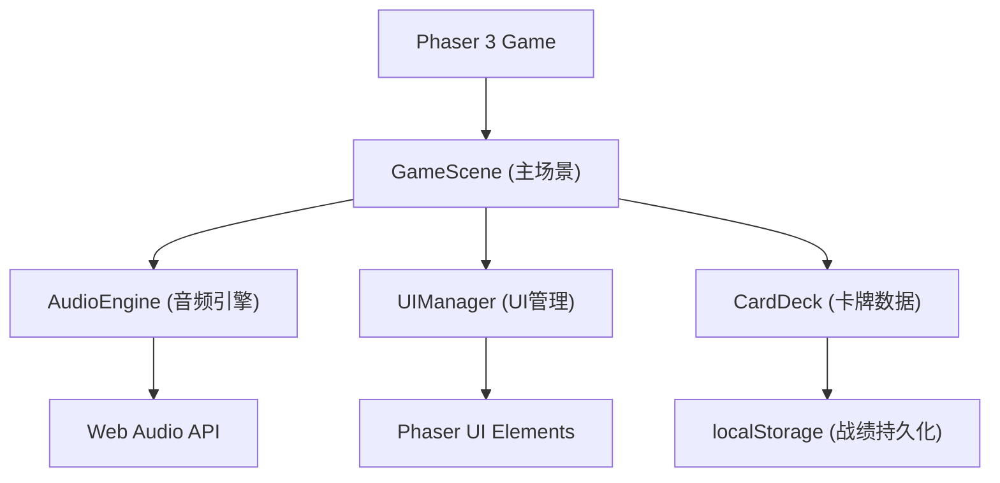

## 1. 架构设计



## 2. 技术说明

- **前端框架**：Phaser 3.80+
- **语言**：TypeScript 5+（严格模式）
- **构建工具**：Vite 5+
- **音频**：Web Audio API（原生，无额外依赖）
- **数据持久化**：localStorage

## 3. 文件结构

```
auto58/
├── package.json
├── index.html
├── tsconfig.json
├── vite.config.js
└── src/
    ├── game/
    │   └── GameScene.ts       # 游戏主场景：对战循环、输入处理、声波动画
    ├── audio/
    │   └── AudioEngine.ts     # 音频引擎：声波合成、频谱分析、波形生成
    ├── ui/
    │   └── UIManager.ts       # UI管理：手牌区、生命值条、能量槽、回合指示器
    └── data/
        └── CardDeck.ts        # 卡牌数据：卡牌定义、牌库、手牌逻辑
```

## 4. 核心数据模型

### 4.1 卡牌定义

```typescript
enum WaveformType {
  SINE = 'sine',      // 正弦波
  SQUARE = 'square',  // 方波
  SAWTOOTH = 'sawtooth' // 锯齿波
}

enum CardType {
  ATTACK = 'attack',    // 攻击
  DEFENSE = 'defense',  // 防御
  DISRUPT = 'disrupt'   // 干扰
}

interface SoundCard {
  id: string;
  name: string;
  type: CardType;
  waveform: WaveformType;
  frequency: number;     // 200-2000 Hz
  duration: number;      // 0.5-2 秒
  energyCost: number;    // 1-5
  value: number;         // 伤害/护盾/干扰数值
  color: number;         // Phaser颜色值
}
```

### 4.2 玩家状态

```typescript
interface PlayerState {
  hp: number;            // 生命值 30
  maxHp: number;
  energy: number;        // 能量 5
  maxEnergy: number;
  shield: number;        // 护盾值
  hand: SoundCard[];     // 手牌
  deck: SoundCard[];     // 牌库
}
```

### 4.3 战绩数据

```typescript
interface GameStats {
  totalWins: number;
  totalRounds: number;
  currentStreak: number;
  maxCombo: number;
}
```

## 5. 模块职责

### 5.1 AudioEngine
- 使用 `OscillatorNode` + `GainNode` 合成声波
- 支持正弦/方波/锯齿三种波形
- 根据卡牌参数动态生成频率和时长
- 暴露 `playCardSound(card: SoundCard)` 方法
- 暴露 `getWaveformData()` 供渲染使用

### 5.2 CardDeck
- 预设8种声波卡牌定义
- 管理牌库洗牌、抽牌逻辑
- 初始手牌4张，每回合抽1张（上限5张）
- 提供 `drawCard()`, `shuffleDeck()` 方法

### 5.3 UIManager
- 创建和管理所有UI元素
- 手牌区：五张卡牌弧形排列、可点击选中
- 生命值条：渐变色，低血量红色闪烁
- 能量槽：五格图标显示
- 回合指示器：当前回合提示
- 提供 `updateHP()`, `updateEnergy()`, `renderHand()` 等方法

### 5.4 GameScene
- 游戏主循环：玩家回合 → AI回合 → 胜负判定
- 处理玩家点击卡牌输入
- 声波动画：从玩家位置向对手扩散的波形渲染
- 粒子特效：根据频率显示不同颜色和运动模式
- AI决策：基于血量和能量的简单策略
- 场景过渡动画：圆形遮罩展开/收起
- localStorage 战绩读写
