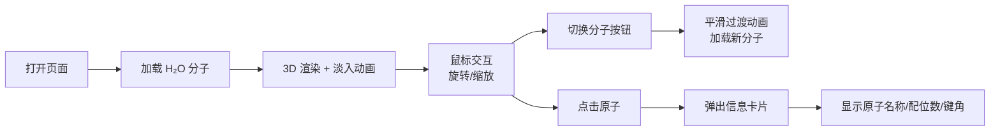

## 1. 产品概述

基于 Three.js 的交互式 3D 分子结构可视化工具，帮助化学学习者直观理解分子中原子与化学键的空间排布，提升化学学习的沉浸感和效率。

- 面向化学学习者、教师和科普爱好者，提供直观的分子三维展示
- 通过交互式操作和视觉特效，降低微观分子结构的理解门槛

## 2. 核心功能

### 2.1 用户角色
| 角色 | 注册方式 | 核心权限 |
|------|----------|----------|
| 普通用户 | 无需注册 | 浏览分子、切换分子、查看原子信息 |

### 2.2 功能模块
1. **3D 分子渲染模块**：从 JSON 数据加载分子信息，三维渲染原子球体与化学键圆柱体
2. **交互控制模块**：鼠标拖拽旋转、滚轮缩放、点击选中原子
3. **分子切换模块**：控制面板提供 H₂O、CO₂、CH₄ 三种预设分子切换
4. **原子信息展示模块**：点击原子弹出信息卡片，显示名称、配位数、键角

### 2.3 页面详情
| 页面名称 | 模块名称 | 功能描述 |
|----------|----------|----------|
| 主页面 | 3D 场景画布 | 全屏 Canvas 容器，渲染分子三维结构，支持鼠标交互 |
| 主页面 | 左侧控制面板 | 毛玻璃侧栏，分子切换按钮组，FPS 显示 |
| 主页面 | 原子信息卡片 | 点击原子后在屏幕右上角弹出，显示原子详细信息 |

## 3. 核心流程

用户打开页面 → 加载默认水分子 (H₂O) → 场景淡入显示分子 → 用户拖拽旋转/滚轮缩放查看 → 点击按钮切换其他分子（平滑过渡动画）→ 点击原子查看信息卡片 → 可继续交互或切换分子

## 4. 用户界面设计

### 4.1 设计风格
- **主色调**：深色科技风，背景采用 `#1a1a2e` 到 `#16213e` 的垂直渐变
- **强调色**：半透明发光蓝色 (`rgba(0, 200, 255, 0.7)`) 用于化学键
- **原子配色**：
  - 氢 (H)：白色 `#ffffff`，半径 0.32
  - 碳 (C)：灰色 `#909090`，半径 0.45
  - 氮 (N)：蓝色 `#3050f8`，半径 0.42
  - 氧 (O)：红色 `#ff0d0d`，半径 0.40
- **按钮样式**：毛玻璃效果，圆角 8px，悬停时轻微放大并增强发光
- **字体**：使用 Orbitron 作为科技感标题字体，JetBrains Mono 作为信息展示字体
- **布局**：左侧固定 280px 控制面板，右侧全屏 3D 画布，信息卡片悬浮于右上角

### 4.2 页面设计概述
| 页面名称 | 模块名称 | UI 元素 |
|----------|----------|----------|
| 主页面 | 3D 场景画布 | 全屏 Canvas、渐变背景、雾化效果、分子居中 |
| 主页面 | 左侧控制面板 | 毛玻璃背景 (backdrop-filter: blur(10px))、分子切换按钮组、FPS 计数器、操作提示 |
| 主页面 | 原子信息卡片 | 半透明深色背景、发光边框、原子名称大字体、配位数和键角列表 |
| 主页面 | 选中效果 | 原子周围脉冲光环动画 (scale 1.0→1.3→1.0 循环)、亮度提升 |

### 4.3 响应性
- 桌面端优先设计，全屏 Canvas 自适应窗口大小
- 控制面板固定宽度 280px，不随窗口缩放
- 支持窗口 resize 事件自动调整渲染尺寸

### 4.4 3D 场景指导
- **环境与氛围**：深色背景配合雾化效果 (`FogExp2`, 密度 0.02)，营造宇宙深空感
- **光照设置**：
  - 环境光 `AmbientLight` (强度 0.3) 提供基础照明
  - 两盏方向光 `DirectionalLight` 分别从左上和右下照射 (强度 0.8)
  - 点光源 `PointLight` 跟随相机移动，增强 Fresnel 效果
- **相机设置**：`PerspectiveCamera`，fov 60，初始位置 (0, 0, 5)，看向原点
- **材质与特效**：
  - 原子使用 `MeshPhysicalMaterial`，配合自定义 Shader 实现 Fresnel 边缘辉光
  - 化学键使用半透明 `MeshBasicMaterial`，颜色 `#00c8ff`，透明度 0.7
  - 选中光环使用 `MeshBasicMaterial`，透明度动画，双面渲染
- **后处理**：轻微 Bloom 效果增强发光感，在保证 FPS ≥ 55 的前提下启用
- **动画**：
  - 分子切换时使用 GSAP 或 TWEEN 实现 opacity 从 0→1 的 800ms 淡入
  - 选中光环使用 `requestAnimationFrame` 实现 2s 周期的脉冲缩放
  - 化学键使用 sin 函数实现轻微呼吸亮度变化
