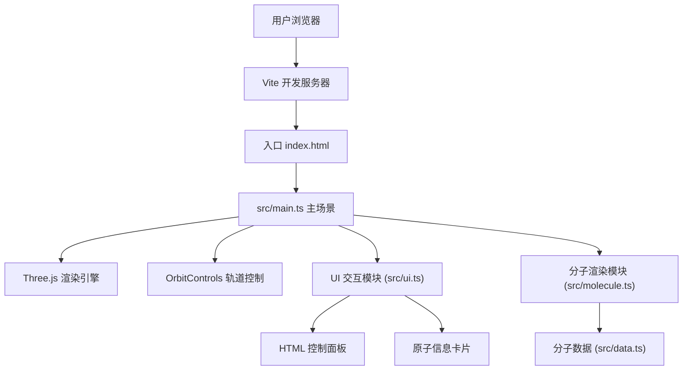

## 1. 架构设计



## 2. 技术描述

- **前端**：TypeScript 5.x + Three.js 0.160.x + Vite 5.x
- **构建工具**：Vite 5.x，使用原生 ES Modules
- **样式方案**：原生 CSS + CSS Variables，毛玻璃效果使用 `backdrop-filter`
- **3D 渲染**：Three.js + WebGLRenderer，使用 ShaderMaterial 实现 Fresnel 效果
- **交互控制**：Three.js OrbitControls 实现拖拽旋转和滚轮缩放
- **动画方案**：requestAnimationFrame 主循环 + 自定义 Tween 类实现平滑过渡
- **无后端**：所有数据静态存储在 data.ts 中，无需服务器支持

## 3. 目录结构

```
auto6/
├── package.json          # 项目依赖和脚本
├── index.html            # 入口 HTML 页面
├── tsconfig.json         # TypeScript 配置
├── vite.config.js        # Vite 配置
├── .trae/
│   └── documents/        # 项目文档
└── src/
    ├── main.ts           # 场景初始化、动画循环、主逻辑
    ├── data.ts           # 分子数据集 (H₂O, CO₂, CH₄)
    ├── molecule.ts       # 原子和化学键创建函数
    └── ui.ts             # 控制面板和信息卡片交互
```

## 4. 数据模型

### 4.1 数据结构定义

```typescript
// 原子数据
interface AtomData {
  name: string;           // 原子化学符号 (H, C, O, N 等)
  position: [number, number, number];  // 三维坐标 [x, y, z]
  radius: number;         // 原子半径
  color: string;          // 原子颜色 (十六进制)
}

// 化学键数据
interface BondData {
  from: number;           // 起始原子索引
  to: number;             // 结束原子索引
}

// 分子数据
interface MoleculeData {
  name: string;           // 分子名称 (H₂O, CO₂, CH₄)
  formula: string;        // 化学式
  atoms: AtomData[];      // 原子列表
  bonds: BondData[];      // 化学键列表
}
```

### 4.2 预设分子坐标数据

**H₂O (水分子)**：
- O 原子位于原点 (0, 0, 0)
- 两个 H 原子分别位于 (0.958, 0, 0) 和 (-0.239, 0.928, 0)
- 键角约 104.5°
- 2 个 O-H 键

**CO₂ (二氧化碳)**：
- C 原子位于原点 (0, 0, 0)
- 两个 O 原子分别位于 (1.16, 0, 0) 和 (-1.16, 0, 0)
- 线性分子，键角 180°
- 2 个 C=O 双键

**CH₄ (甲烷)**：
- C 原子位于原点 (0, 0, 0)
- 四个 H 原子形成正四面体构型
- 键角约 109.5°
- 4 个 C-H 键

## 5. 核心模块设计

### 5.1 src/data.ts - 分子数据模块

```typescript
export const molecules: Record<string, MoleculeData> = {
  h2o: { ... },
  co2: { ... },
  ch4: { ... }
};

export type { AtomData, BondData, MoleculeData };
```

### 5.2 src/molecule.ts - 分子渲染模块

核心函数：
- `createAtom(atomData: AtomData): Mesh` - 创建带 Fresnel 材质的原子球体
- `createBond(from: Vector3, to: Vector3): Mesh` - 创建两个原子之间的化学键圆柱体
- `createMoleculeGroup(data: MoleculeData): Group` - 创建完整分子 Group，包含所有原子和键
- `calculateCoordinationNumber(atoms: AtomData[], bonds: BondData[], atomIndex: number): number` - 计算指定原子的配位数
- `calculateBondAngles(atoms: AtomData[], bonds: BondData[], atomIndex: number): { connectedAtom: string, angle: number }[]` - 计算键角

### 5.3 src/ui.ts - UI 交互模块

核心函数：
- `createControlPanel(moleculeNames: string[], onSelect: (name: string) => void): HTMLElement` - 创建左侧控制面板
- `createInfoCard(): { element: HTMLElement, update: (data: AtomInfo) => void, hide: () => void }` - 创建原子信息卡片
- `setupRaycaster(canvas: HTMLCanvasElement, camera: Camera, objects: Object3D[], onClick: (hit: Intersection) => void): void` - 设置射线检测用于原子点击

### 5.4 src/main.ts - 主场景模块

核心流程：
1. 初始化 WebGLRenderer、Scene、Camera、OrbitControls
2. 设置光照系统（环境光 + 方向光 + 点光源）
3. 创建初始分子 Group 并添加到场景
4. 绑定 UI 事件（分子切换、原子点击）
5. 启动 requestAnimationFrame 动画循环
6. 处理窗口 resize 事件

## 6. 性能优化策略

- **几何体复用**：原子球体和键圆柱体使用共享的 SphereGeometry 和 CylinderGeometry 实例
- **材质复用**：相同颜色的原子共享 Material 实例
- **Fresnel 优化**：使用 ShaderMaterial 实现 Fresnel，避免多次渲染 Pass
- **FPS 监控**：实现简单的 FPS 计数器，确保稳定在 55 FPS 以上
- **后处理降级**：如果检测到 FPS 低于 55，自动禁用 Bloom 等后处理效果
- **平滑动画**：使用 deltaTime 确保动画速度与帧率无关

## 7. 关键技术实现要点

### 7.1 Fresnel 辉光 Shader

顶点着色器计算法向量和视线方向的夹角，片元着色器根据夹角计算边缘发光强度：

```glsl
// Vertex Shader
varying vec3 vNormal;
varying vec3 vViewDirection;
void main() {
  vNormal = normalize(normalMatrix * normal);
  vec4 mvPosition = modelViewMatrix * vec4(position, 1.0);
  vViewDirection = normalize(-mvPosition.xyz);
  gl_Position = projectionMatrix * mvPosition;
}

// Fragment Shader
uniform vec3 uColor;
uniform float uFresnelPower;
varying vec3 vNormal;
varying vec3 vViewDirection;
void main() {
  float fresnel = pow(1.0 - abs(dot(vNormal, vViewDirection)), uFresnelPower);
  vec3 finalColor = uColor + fresnel * vec3(0.5, 0.8, 1.0);
  gl_FragColor = vec4(finalColor, 0.85 + fresnel * 0.15);
}
```

### 7.2 化学键对齐算法

使用四元数旋转将圆柱体从 Y 轴方向旋转到两个原子连线方向：

```typescript
const direction = new Vector3().subVectors(to, from);
const length = direction.length();
const midPoint = new Vector3().addVectors(from, to).multiplyScalar(0.5);

const cylinder = new Mesh(geometry, material);
cylinder.position.copy(midPoint);
cylinder.quaternion.setFromUnitVectors(
  new Vector3(0, 1, 0),
  direction.clone().normalize()
);
cylinder.scale.y = length;
```

### 7.3 键角计算

使用向量点积公式计算三个原子形成的夹角：

```typescript
const vec1 = new Vector3().subVectors(posA, posCenter).normalize();
const vec2 = new Vector3().subVectors(posB, posCenter).normalize();
const dot = vec1.dot(vec2);
const angle = Math.acos(Math.max(-1, Math.min(1, dot))) * (180 / Math.PI);
```
