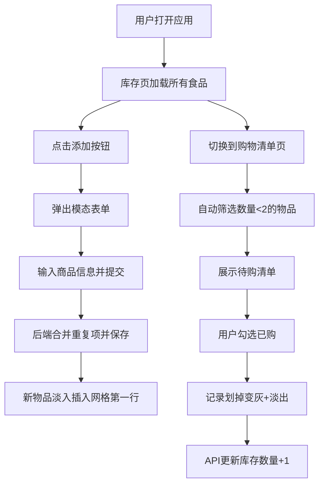

## 1. 产品概述

GroceryCollab 是一个面向家庭和小团队的共享食品库存与购物清单协作应用，旨在解决多人共用食品时的库存管理混乱、重复采购、物品过期等问题。

- 核心目标：提供直观、实时的食品库存追踪与智能购物清单生成
- 目标用户：家庭、合租室友、小型办公团队
- 核心价值：减少食品浪费、避免重复购买、提升协作效率

## 2. 核心功能

### 2.1 功能模块

1. **库存页**：食品库存网格展示、添加/删除物品、过期预警高亮
2. **购物清单页**：自动生成低库存待购清单、勾选标记已购、实时更新库存

### 2.2 页面详情

| 页面名称 | 模块名称 | 功能描述 |
|----------|----------|----------|
| 库存页 | 顶部导航 | Tab 切换库存页/购物清单页 |
| 库存页 | 添加按钮 | 弹出模态表单输入商品名、数量、单位、过期日期 |
| 库存页 | 物品网格 | 卡片展示商品名、数量、单位、过期日期、删除按钮 |
| 库存页 | 过期预警 | 过期日期 < 3 天的物品红色高亮 + 脉冲动画 |
| 购物清单页 | 自动生成 | 从库存中筛选数量 < 阈值（默认 2）的物品 |
| 购物清单页 | 勾选已购 | 复选框勾选后划掉变灰，库存数量 +1，300ms 淡出动画 |

## 3. 核心流程

### 主用户流程

用户打开应用 → 默认进入库存页查看所有食品 → 点击添加按钮录入新物品 → 物品自动合并重复项 → 切换到购物清单页 → 查看低库存待购列表 → 勾选已购物品 → 系统自动更新对应库存数量

## 4. 用户界面设计

### 4.1 设计风格

- **主题**：极简毛玻璃（Glassmorphism）
- **主背景**：蓝紫色线性渐变 `#667eea → #764ba2`
- **卡片/表单**：白色半透明背景 `rgba(255,255,255,0.15)` + `backdrop-filter: blur(12px)`
- **按钮交互**：hover 时轻微上移（-2px）+ 阴影加深
- **过渡动画**：统一 `ease-out 200ms`
- **过期警示**：红色高亮 + 缓慢脉冲动画（`@keyframes pulse`）
- **圆角**：卡片和按钮使用 16px 圆角

### 4.2 页面设计概览

| 页面名称 | 模块名称 | UI 元素 |
|----------|----------|---------|
| 库存页 | 顶部导航 | 毛玻璃 Tab，当前页下划线高亮 |
| 库存页 | 添加按钮 | 悬浮右下角，圆形 + 图标，点击弹出模态框 |
| 库存页 | 模态表单 | 圆角卡片，半透明模糊遮罩，居中弹出 |
| 库存页 | 物品卡片 | 网格布局，商品名、数量、过期日期、删除按钮 |
| 购物清单页 | 列表项 | 左侧复选框，右侧商品信息，勾选后划掉变灰 |

### 4.3 响应式设计

- **桌面端（>768px）**：多列网格布局（自适应列数）
- **移动端（≤768px）**：单列布局，所有卡片宽度 100%
- **触摸优化**：按钮最小点击区域 44×44px
