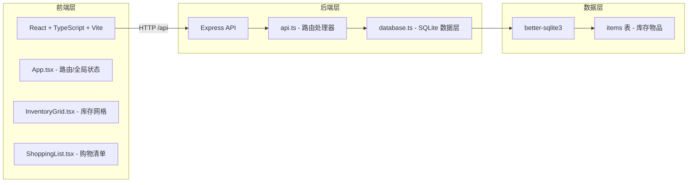
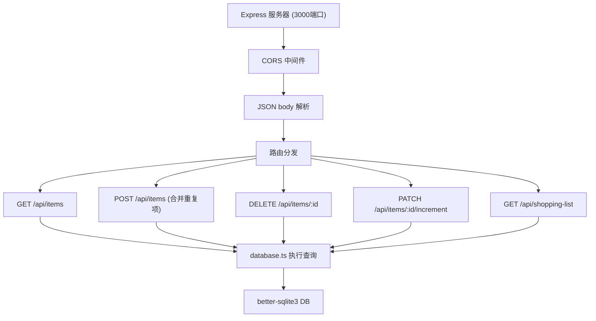
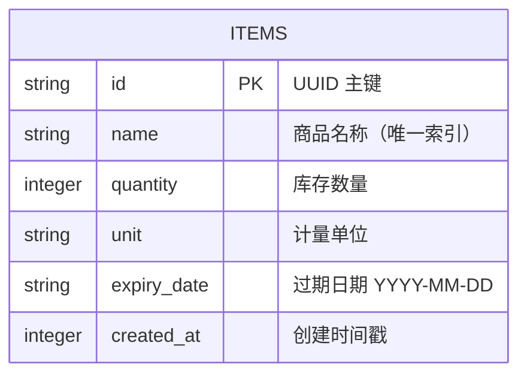

## 1. 架构设计



## 2. 技术说明

- **前端**：React 18 + TypeScript + Vite 5
  - UI 框架：原生 CSS（毛玻璃效果，无额外 UI 库）
  - 状态管理：React useState/useEffect（轻量级场景）
  - 唯一 ID：uuid
- **后端**：Express 4 + TypeScript
  - 数据库：better-sqlite3（同步 SQLite 驱动，性能优异）
  - CORS：cors 中间件
- **构建脚本**：`npm run dev` 同时启动 Vite（5173）和 Express（3000）

## 3. 路由定义

| 路由 | 页面 | 说明 |
|------|------|------|
| / (默认) | 库存页 | 展示所有库存物品网格 |
| /shopping | 购物清单页 | 展示数量低于阈值的待购物品 |

## 4. API 定义

### TypeScript 类型

```typescript
interface InventoryItem {
  id: string;
  name: string;
  quantity: number;
  unit: string;
  expiryDate: string; // ISO date string YYYY-MM-DD
  createdAt: number;
}

interface ShoppingListItem {
  id: string;
  name: string;
  quantity: number;
  unit: string;
  currentStock: number;
}
```

### REST API

| Method | Path | Request Body | Response | 说明 |
|--------|------|--------------|----------|------|
| GET | /api/items | - | `InventoryItem[]` | 获取所有库存物品 |
| POST | /api/items | `{name, quantity, unit, expiryDate}` | `InventoryItem` | 添加/合并物品（同名自动合并数量） |
| DELETE | /api/items/:id | - | `{success: true}` | 删除指定库存物品 |
| PATCH | /api/items/:id/increment | - | `InventoryItem` | 物品数量 +1（标记已购） |
| GET | /api/shopping-list | - | `ShoppingListItem[]` | 获取购物清单（数量 < 阈值） |

## 5. 服务器架构图



## 6. 数据模型

### 6.1 数据模型定义



### 6.2 数据定义语言

```sql
CREATE TABLE IF NOT EXISTS items (
  id TEXT PRIMARY KEY,
  name TEXT NOT NULL UNIQUE,
  quantity INTEGER NOT NULL DEFAULT 0,
  unit TEXT NOT NULL DEFAULT '个',
  expiry_date TEXT,
  created_at INTEGER NOT NULL
);

CREATE INDEX IF NOT EXISTS idx_items_name ON items(name);
CREATE INDEX IF NOT EXISTS idx_items_quantity ON items(quantity);
```

初始种子数据（可选）：
```sql
INSERT OR IGNORE INTO items (id, name, quantity, unit, expiry_date, created_at) VALUES
  ('seed-1', '牛奶', 3, '盒', '2026-06-15', 1718000000000),
  ('seed-2', '鸡蛋', 6, '个', '2026-06-20', 1718000000001),
  ('seed-3', '面包', 1, '袋', '2026-06-13', 1718000000002),
  ('seed-4', '苹果', 8, '个', '2026-06-18', 1718000000003);
```
