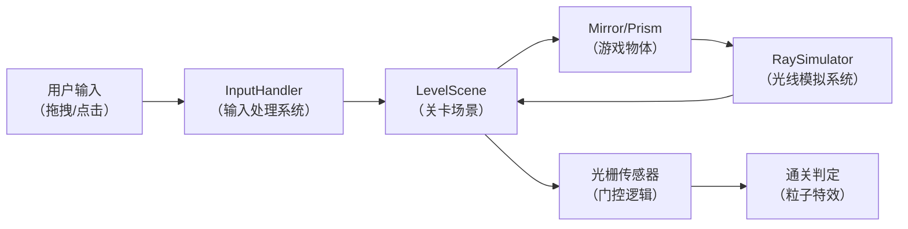

## 1. 产品概述

LightPuzzle是一款以"光与影"为主题的2D光线折射与反射解谜游戏。玩家通过拖拽镜面和棱镜来引导激光从起点到达终点，触发光栅开关解锁通道。

- 核心玩法：利用物理光学原理，通过直觉式拖拽操作引导光线
- 目标用户：休闲解谜游戏爱好者、对物理光学感兴趣的玩家
- 产品价值：提供沉浸式的光线解谜体验，结合物理真实感与创意玩法

## 2. 核心功能

### 2.1 功能模块

1. **菜单场景**：游戏标题、操作教程、开始按钮
2. **关卡场景**：核心游戏场景，包含激光发射器、镜面、棱镜、光栅传感器、终点接收器
3. **光线模拟系统**：基于向量数学的激光反射与折射计算
4. **交互系统**：鼠标/触摸拖拽、惯性滑行、吸附效果
5. **关卡系统**：5个递进难度关卡，门控机制

### 2.2 功能详情

| 页面名称 | 模块名称 | 功能描述 |
|-----------|---------|---------|
| 菜单场景 | 标题区域 | 游戏标题、副标题、动态光效背景 |
| 菜单场景 | 教程区域 | 操作演示gif序列帧动画，展示拖拽镜面引导光线操作 |
| 菜单场景 | 开始按钮 | 发光按钮，点击进入关卡场景 |
| 关卡场景 | 激光发射器 | 从左侧固定位置发射黄色激光 |
| 关卡场景 | 镜面物体 | 可拖拽旋转的反射镜，支持45度或自定义角度 |
| 关卡场景 | 棱镜物体 | 三角形玻璃块，色散为红绿蓝三色光 |
| 关卡场景 | 光栅传感器 | 圆形传感器，被正确颜色光线照射时激活并触发门控 |
| 关卡场景 | 门控障碍物 | 关联传感器激活后平滑滑出场景 |
| 关卡场景 | 终点接收器 | 激光到达后通关 |
| 关卡场景 | 关卡标识 | 左上角显示当前关卡号 |

## 3. 核心流程

### 3.1 用户流程

玩家进入游戏 → 查看操作教程 → 点击开始 → 进入第一关 → 拖拽镜面/棱镜调整位置 → 观察激光路径 → 点亮光栅传感器 → 门打开 → 激光到达终点 → 通关动画 → 进入下一关

### 3.2 数据流图

## 4. 用户界面设计

### 4.1 设计风格

- **主题**：深空幽暗风格，营造神秘科幻氛围
- **主色调**：深空蓝(#0A0E27) 到 暗紫(#1B0A3E) 径向渐变背景
- **强调色**：黄色激光(#FFD700)、彩色色散(红#FF4444、绿#44FF44、蓝#4444FF)
- **字体**：Nunito，现代无衬线字体
- **材质**：磨砂玻璃质感的镜面和棱镜，带半透明边框
- **动效**：激光光晕、光点粒子、脉冲波、惯性滑行

### 4.2 页面设计概览

| 页面名称 | 模块名称 | UI元素 |
|---------|---------|--------|
| 菜单场景 | 标题区域 | 大号游戏标题、光晕效果、渐变色 |
| 菜单场景 | 教程区域 | 序列帧gif动画、说明文字 |
| 菜单场景 | 开始按钮 | 发光圆角按钮、悬停放大效果 |
| 关卡场景 | 背景 | 径向渐变深空背景、星点粒子 |
| 关卡场景 | 激光 | 黄色光线、光晕效果、尘埃光点 |
| 关卡场景 | 镜面/棱镜 | 磨砂玻璃质感、半透明边框、拖拽时蓝色吸附环 |
| 关卡场景 | 光栅传感器 | 灰色未激活状态、同心圆环旋转、激活后彩色脉冲波 |
| 关卡场景 | 关卡号 | 左上角白色半透明文字、Nunito 24px |

### 4.3 响应式设计

- **虚拟相机全屏覆盖，自适应宽高比16:9
- 移动端触摸区域放大1.5倍
- 支持鼠标和触摸双端操作

### 4.4 视觉效果细节

- 激光宽度4px，带光晕效果
- 激光路径上每隔10帧生成2-4px白色光点，沿路径缓慢移动淡出
- 镜面拖拽时周围出现淡蓝色吸附环（半径2倍物体，闪烁周期1s）
- 光栅传感器未激活时透明灰色，内部同心圆环缓慢旋转（周期3s）
- 传感器激活后圆环变彩色、停止旋转、发出脉冲波（半径20px→50px，透明度0.8→0，时长500ms）
- 门控滑出动画400ms ease-out
- 通关粒子烟花效果持续2秒
- 物体松开后惯性滑行（阻尼系数0.9，持续150ms）

## 5. 性能约束

- 光线重新计算频率不低于45FPS
- 单关卡最多6个物体同时交互
- 光线追踪不超过15次反射/折射
- 整体内存占用低于200MB
