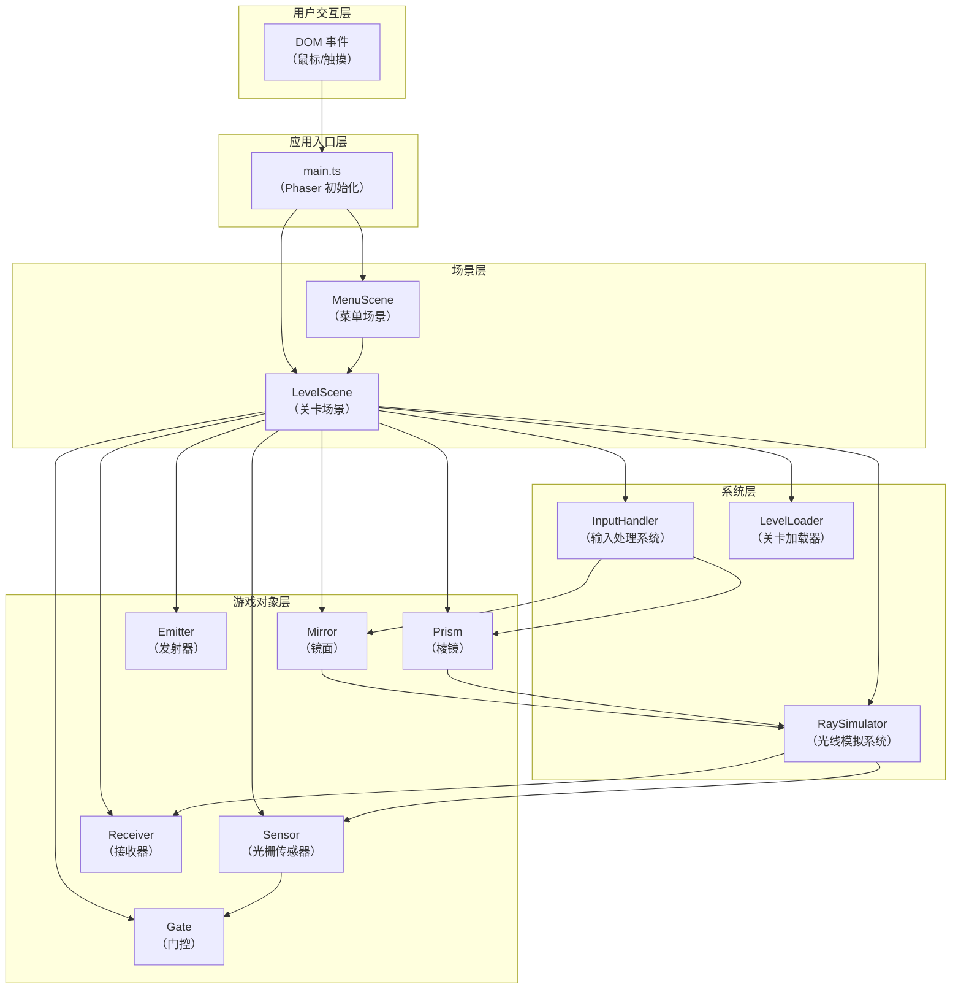

## 1. 架构设计

### 1.1 整体架构



### 1.2 数据流向

1. **输入流**：DOM事件 → InputHandler → LevelScene → 游戏对象
2. **光流线**：游戏对象位置/角度 → RaySimulator → 光线路径数组 → LevelScene渲染
3. **关卡流**：LevelScene请求 → LevelLoader → 关卡配置数据 → LevelScene初始化
4. **门控流**：光栅传感器激活 → 门控动画 → 通道开启 → 通关判定

## 2. 技术描述

- **前端框架**：Phaser 3.70.x
- **开发语言**：TypeScript 5.x（严格模式，ESNext模块）
- **构建工具**：Vite 5.x
- **类型定义**：@types/phaser
- **无后端、无数据库**：纯前端游戏，关卡数据内置

### 2.1 技术选型说明

- **Phaser 3**：成熟的2D游戏引擎，提供Canvas/WebGL渲染、输入处理、粒子系统、动画系统等完整功能
- **TypeScript**：提供类型安全，降低复杂系统的维护成本
- **Vite**：快速的开发服务器和构建工具，支持HMR

## 3. 文件结构

```
src/
├── main.ts              # 应用入口，初始化Phaser游戏
├── scenes/
│   ├── MenuScene.ts     # 菜单场景
│   └── LevelScene.ts    # 关卡场景
├── systems/
│   ├── RaySimulator.ts  # 光线模拟系统
│   ├── InputHandler.ts  # 输入处理系统
│   └── LevelLoader.ts   # 关卡加载器
├── gameobjects/
│   ├── Mirror.ts        # 镜面游戏对象
│   ├── Prism.ts         # 棱镜游戏对象
│   ├── Sensor.ts        # 光栅传感器
│   ├── Gate.ts          # 门控障碍物
│   ├── LaserEmitter.ts  # 激光发射器
│   └── LaserReceiver.ts # 终点接收器
├── types/
│   └── index.ts         # 类型定义
└── config/
    └── levels.ts        # 关卡配置数据
```

### 3.1 文件调用关系

| 文件 | 依赖 | 被依赖 | 职责 |
|------|------|--------|------|
| main.ts | MenuScene, LevelScene | - | 游戏入口，注册场景 |
| MenuScene | - | main.ts | 菜单界面，关卡选择入口 |
| LevelScene | InputHandler, RaySimulator, LevelLoader, 各类游戏对象 | main.ts | 核心游戏循环，渲染与逻辑协调 |
| RaySimulator | - | LevelScene | 光线反射折射计算 |
| InputHandler | - | LevelScene | 鼠标/触摸输入处理 |
| LevelLoader | levels配置 | LevelScene | 关卡数据加载 |
| Mirror | - | LevelScene | 镜面物体逻辑与渲染 |
| Prism | - | LevelScene | 棱镜物体逻辑与渲染 |

## 4. 核心算法

### 4.1 光线反射算法

基于向量数学的反射计算：
- 入射向量 I
- 法向量 N（单位向量）
- 反射向量 R = I - 2 * dot(I, N) * N
- 计算精度：0.1度

### 4.2 光线折射算法（棱镜色散）

- 基于斯涅尔定律（Snell's Law）
- 三色光折射率不同：红光<绿光<蓝光
- 偏转角度：红光最小，蓝光最大

### 4.3 光线追踪流程

1. 从发射器起点出发，沿初始方向发射光线
2. 检测光线与所有物体（镜面、棱镜、传感器、接收器、边界）的碰撞
3. 取最近碰撞点
4. 根据物体类型计算反射/折射
5. 递归追踪，最多15次
6. 返回光线路径节点数组

## 5. 性能优化策略

- **光线计算频率限制**：每帧重新计算，但通过空间划分减少碰撞检测量
- **对象池**：光点粒子复用，避免频繁创建销毁
- **渲染优化**：使用Phaser的Graphics对象批量绘制，减少draw call
- **内存控制**：关卡切换时释放前一关资源，保持内存低于200MB

## 6. 关卡数据结构

```typescript
interface LevelData {
  id: number;
  name: string;
  emitter: { x: number; y: number; angle: number };
  receiver: { x: number; y: number };
  mirrors: Array<{ x: number; y: number; angle: number; movable: boolean }>;
  prisms: Array<{ x: number; y: number; angle: number; movable: boolean }>;
  sensors: Array<{
    x: number; y: number; color: 'red' | 'green' | 'blue' | 'yellow';
    gateId?: string;
  }>;
  gates: Array<{
    id: string; x: number; y: number; width: number; height: number;
    direction: 'up' | 'down' | 'left' | 'right';
  }>;
  movingPlatforms?: Array<{
    x: number; y: number; angle: number;
    path: { x: number; y: number }[]; speed: number;
  }>;
}
```
