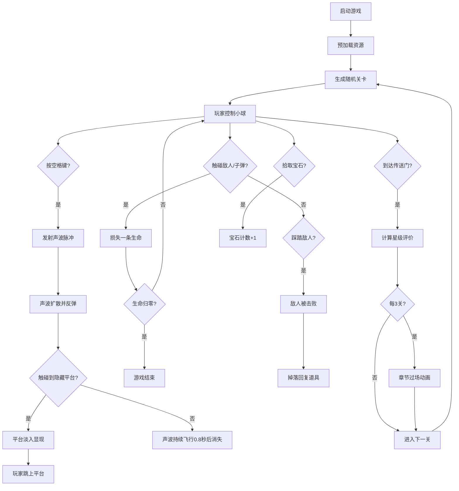

## 1. 产品概述

EchoLedge 是一款以"回声"为核心玩法的2D平台跳跃游戏，玩家控制一个能发射声波的小球在随机生成的洞穴关卡中探索。通过声波回弹探测隐藏平台，结合策略性的平台跳跃、敌人规避与宝石收集，为玩家带来独特的探索体验。

- **核心玩法**：利用声波探测机制发现隐藏路径，结合传统平台跳跃元素
- **目标用户**：休闲游戏玩家、喜欢探索解谜类游戏的用户
- **产品价值**：创新的回声探测机制为平台跳跃品类带来新鲜感，随机生成的关卡保证了游戏的重玩价值

---

## 2. 核心功能

### 2.1 用户角色

| 角色 | 注册方式 | 核心权限 |
|------|----------|----------|
| 玩家 | 无需注册 | 完整游戏体验，关卡进度本地存储 |

### 2.2 功能模块

1. **游戏主场景**：物理世界渲染、玩家控制、关卡生成、碰撞检测
2. **声波探测系统**：声波发射、反弹路径计算、隐藏平台显现
3. **敌人AI系统**：炮台射击、蝙蝠巡逻、碰撞伤害判定
4. **收集与计分系统**：宝石拾取、生命值管理、星级评价
5. **关卡进度系统**：关卡生成、难度递增、章节过场、存档管理
6. **HUD界面**：生命值显示、宝石计数、技能冷却、UI动画

### 2.3 页面详情

| 页面名称 | 模块名称 | 功能描述 |
|----------|----------|----------|
| 预加载场景 | 资源加载 | 进度条动画、资源预加载、自动跳转游戏场景 |
| 游戏主场景 | 物理世界 | 平台生成、碰撞检测、重力模拟 |
| 游戏主场景 | 玩家控制 | 左右移动、二段跳、声波发射 |
| 游戏主场景 | 声波系统 | 120度张角扩散、最多3次反弹、隐藏平台显现 |
| 游戏主场景 | 敌人系统 | 炮台射击、蝙蝠巡逻、踩踏判定 |
| 游戏主场景 | 收集系统 | 宝石自动拾取、生命回复道具 |
| 游戏主场景 | 关卡切换 | 传送门触发、难度递增、章节过场 |
| HUD界面 | 状态显示 | 生命值心形图标、宝石计数、技能冷却 |
| 结算界面 | 成绩展示 | 总得分、通关用时、星级评价 |

---

## 3. 核心流程

---

## 4. 用户界面设计

### 4.1 设计风格

- **主色调**：深灰色 (#2a2a2a)、棕色 (#5a3d2b)、翡翠绿 (#2ecc71)
- **强调色**：亮白色 (玩家小球)、浅蓝色光晕、红色心形 (生命值)、金色 (宝石计数)
- **整体风格**：深色调洞穴探险风格，神秘而富有探索感
- **动画风格**：平滑淡入淡出、粒子拖尾效果、脉冲动画
- **字体**：使用像素风格或简洁无衬线字体，保持游戏质感

### 4.2 页面设计概述

| 页面名称 | 模块名称 | UI元素 |
|----------|----------|--------|
| 预加载场景 | 加载界面 | 居中游戏标题、动态进度条、百分比显示 |
| 游戏主场景 | 游戏画面 | 洞穴背景(双层视差)、平台、隐藏平台(翡翠绿)、敌人、宝石、传送门 |
| 游戏主场景 | 玩家角色 | 白色小球带浅蓝色光晕、移动轨迹 |
| 游戏主场景 | 声波效果 | 半透明翡翠绿圆弧、120度张角、粒子拖尾 |
| HUD | 左上角 | 3个红色心形图标 (16px)，间距4px |
| HUD | 右上角 | 金色宝石图标 + 数字 (18px)，发光描边 |
| HUD | 右下角 | 声波技能图标，冷却时灰色覆盖，就绪时脉冲动画 |
| 章节过场 | 过场画面 | 洞穴深度描述、新区域发现、3秒后自动继续 |
| 结算界面 | 成绩面板 | 总得分、通关用时、星级评价(1-3星) |

### 4.3 响应式设计

- **设计策略**：桌面优先，基于Canvas的scale模式适配窗口缩放
- **游戏区域**：固定逻辑分辨率 960x540，自动缩放适应屏幕
- **内边距**：所有UI元素距离屏幕边界8px
- **触控支持**：移动端可添加虚拟摇杆和按键

### 4.4 性能约束

- **帧率**：全程保持60FPS，使用Phaser3固定时间步长
- **声波限制**：同时存在的声波脉冲不超过5个
- **粒子限制**：粒子效果总数限制在200个以内
- **纹理优化**：使用精灵图集(不超过1024x1024)减少绘制调用
