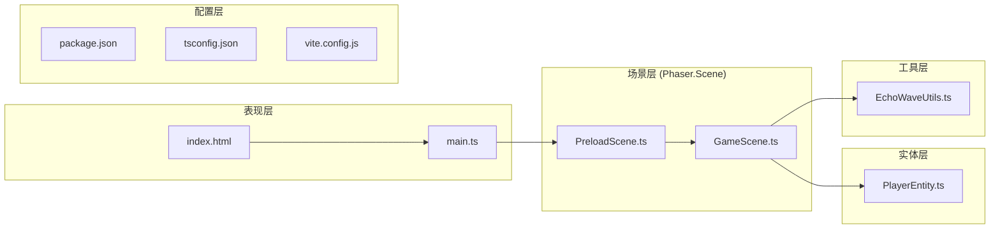
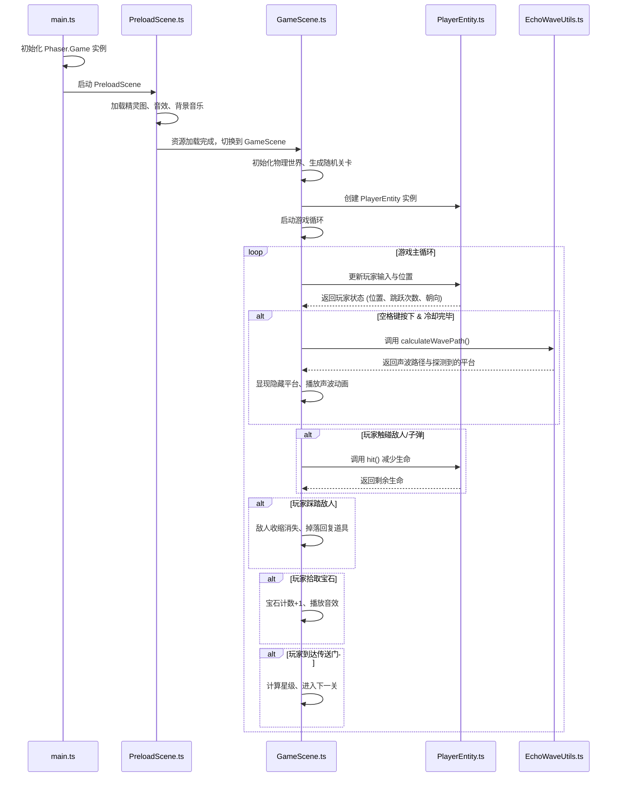

## 1. 架构设计



### 数据流与调用关系



---

## 2. 技术描述

### 2.1 核心技术栈

| 层级 | 技术选型 | 版本 | 用途 |
|------|----------|------|------|
| 游戏引擎 | Phaser 3 | ^3.80.0 | 2D游戏框架，提供物理引擎、场景管理、动画系统 |
| 开发语言 | TypeScript | ^5.4.0 | 类型安全的JavaScript超集 |
| 构建工具 | Vite | ^5.2.0 | 快速开发服务器与构建工具 |
| 类型定义 | @types/phaser | ^3.80.0 | Phaser的TypeScript类型声明 |

### 2.2 构建与运行

- **初始化命令**：`npm install`
- **开发启动**：`npm run dev` (Vite开发服务器)
- **生产构建**：`npm run build` (输出到 dist 目录)
- **预览构建**：`npm run preview`

### 2.3 目录结构

```
EchoLedge/
├── index.html                    # 入口HTML，全屏渲染容器
├── package.json                  # 项目依赖与脚本
├── tsconfig.json                 # TypeScript配置 (严格模式)
├── vite.config.js                # Vite构建配置
├── public/                       # 静态资源目录
│   ├── assets/
│   │   ├── sprites/              # 精灵图集 (1024x1024)
│   │   ├── audio/                # 音效与背景音乐
│   │   └── textures/             # 背景纹理
└── src/
    ├── main.ts                   # 应用入口，Phaser初始化
    ├── scenes/
    │   ├── PreloadScene.ts       # 资源预加载场景
    │   └── GameScene.ts          # 游戏主场景
    ├── entities/
    │   └── PlayerEntity.ts       # 玩家实体类
    └── utils/
        └── EchoWaveUtils.ts      # 声波计算工具
```

---

## 3. 核心模块设计

### 3.1 声波工具模块 (EchoWaveUtils.ts)

**核心职责**：计算声波发射方向、反弹路径、碰撞检测

```typescript
interface WavePoint {
    x: number;
    y: number;
    angle: number;  // 入射/反射角度
}

interface EchoResult {
    path: WavePoint